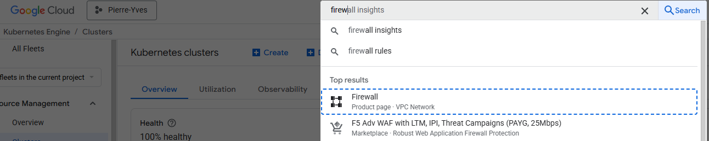

# Multi-region scaling

The multi region cluster is created on Google

# Cluster creation

1. Create two clusters on Google, named `blue-west` and `green-east`

To switch between region, use the

```shell
$ kubectl config get-contexts
````

This give the list of context. Switch to a specific context via

```shell
$ kubectl config use-context gke_pierre-yves_us-east1_green-east
````


# DNS

## Dns Load balancer

** On region 0 (blue-west)**

```shell
$ kubectl apply -f zeebegateway-loadbalancer.yaml
$ kubectl apply -f internal-dns-lb.yaml
$ kubectl get svc -n kube-system
kube-dns-lb            LoadBalancer   34.118.235.184   34.26.200.157   53:30624/UDP    22h
```
** On region 1 (green-east)**

same command.
```shell
$ kubectl apply -f zeebegateway-loadbalancer.yaml
$ kubectl apply -f internal-dns-lb.yaml
$ kubectl get svc -n kube-system
kube-dns-lb            LoadBalancer   34.118.235.184   35.237.32.136   53:30624/UDP    22h
```


Get the list of IP

| region     | Public IP      |
|------------|----------------| 
| blue-west  | 34.26.200.157  |
| green-east | 35.237.32.136  |

## Register each other DNS

**BLUE west cluster**
In the `blue-west`, the `green-east` must be registered.

Execute
```shell
kubectl edit configmap kube-dns -n kube-system
```

Set the file:

``` 
data:
  stubDomains: |
    {"green-east.svc.cluster.local": ["35.237.32.136"], "green-east-failover.svc.cluster.local": ["35.237.32.136"]}
metadata:
  annotations:
    kubectl.kubernetes.io/last-applied-configuration: |
      {"apiVersion":"v1","data":{"stubDomains":"{\"green-east.svc.cluster.local\": [\"35.237.32.136\"], \"green-east-failover.svc.cluster.local\": [\"35.237.32.136\"]}\n"},"kind":"ConfigMap","metadata":{"annotations":{},"name":"kube-dns","namespace":"kube-system"}}

```

The file must be
```yaml
apiVersion: v1
data:
  stubDomains: |
    {"green-east.svc.cluster.local": ["34.26.200.157"], "green-east-failover.svc.cluster.local": ["34.26.200.157"]}
kind: ConfigMap
metadata:
  annotations:
    kubectl.kubernetes.io/last-applied-configuration: |
      {"apiVersion":"v1","data":{"stubDomains":"{\"green-east.svc.cluster.local\": [\"34.26.200.157\"], \"green-east-failover.svc.cluster.local\": [\"34.26.200.157\"]}\n"},"kind":"ConfigMap","metadata":{"annotations":{},"name":"kube-dns","namespace":"kube-system"}}
  creationTimestamp: "2025-11-19T16:04:52Z"
  labels:
    addonmanager.kubernetes.io/mode: EnsureExists
  name: kube-dns
  namespace: kube-system
  resourceVersion: "1763596440927791001"
  uid: 7b874140-f6ac-46f4-9bba-9e35442964a3

```

Restart the service

```shell
$ kubectl get pods -n kube-system | grep kube-dns
$ kubectl delete pod kube-dns…-n kube-system
```


**GREEN east cluster**
In the `green-east`, the `green-east` must be registered.

Execute
```shell
$ kubectl edit configmap kube-dns -n kube-system
```

Add the file:

``` 
data:
  stubDomains: |
    {"blue-west.svc.cluster.local": ["34.26.200.157"], "blue-west-failover.svc.cluster.local": ["34.26.200.157"]}
metadata:
  annotations:
    kubectl.kubernetes.io/last-applied-configuration: |
      {"apiVersion":"v1","data":{"stubDomains":"{\"blue-west.svc.cluster.local\": [\"34.26.200.157\"], \"blue-west-failover.svc.cluster.local\": [\"34.26.200.157\"]}\n"},"kind":"ConfigMap","metadata":{"annotations":{},"name":"kube-dns","namespace":"kube-system"}}

```

At the end the file must be
```yaml
apiVersion: v1
data:
  stubDomains: |
    {"green-east.svc.cluster.local": ["34.168.93.206"], "green-east-failover.svc.cluster.local": ["34.168.93.206"]}
kind: ConfigMap
metadata:
  annotations:
    kubectl.kubernetes.io/last-applied-configuration: |
      {"apiVersion":"v1","data":{"stubDomains":"{\"green-east.svc.cluster.local\": [\"34.168.93.206\"], \"green-east-failover.svc.cluster.local\": [\"34.168.93.206\"]}\n"},"kind":"ConfigMap","metadata":{"annotations":{},"name":"kube-dns","namespace":"kube-system"}}
  creationTimestamp: "2025-09-22T17:37:45Z"
  labels:
    addonmanager.kubernetes.io/mode: EnsureExists
  name: kube-dns
  namespace: kube-system
  resourceVersion: "1758568538175839001"
  uid: 0f26ea0e-6f6a-4849-bacd-82571b23fefd
```

Restart the service

```shell
$ kubectl get pods -n kube-system | grep kube-dns
$ kubectl delete pod kube-dns…-n kube-system
```

# Google Firewall

In GKE, select the firewall and create a rule to allow cluster `blue` to communicate to cluster `green` in both direction.



Create a Firewall rule:


Set 

| Parameter            | name                        |
|----------------------|-----------------------------|
| Name                 | bluegreencommunication      |
| Priority             | 999                         | 
| Direction of traffic | ingress                     |
| Targets              | All instance in the network |
| Source IPv4 ranges   | 0.0.0.0/0                   | 
| Protocols and ports  | Allow all                   | 


Result is 


Click on `Create`

# Test the configuration

On `green-east`

```shell
$ kubectl config use-context gke_pierre-yves_us-east1_green-east
$ kubectl run dns-test --rm -it --image=busybox -- sh
/# ping 34.26.200.157
PING 34.26.200.157 (34.26.200.157): 56 data bytes
64 bytes from 34.26.200.157: seq=0 ttl=114 time=0.379 ms
/# exit
```

The firewall is open.

```shell
$ kubectl run dns-test --rm -it --image=busybox -- nslookup blue-west.svc.cluster.local
```

On `blue-west`

```shell
$ kubectl config use-context gke_pierre-yves_us-east1_blue-west
$ kubectl run dns-test --rm -it --image=busybox -- sh
/ # ping 35.237.32.136
PING 35.237.32.136 (35.237.32.136): 56 data bytes
64 bytes from 35.237.32.136: seq=0 ttl=114 time=0.435 ms
```


```shell
$ kubectl run dns-test --rm -it --image=busybox -- nslookup green-east.svc.cluster.local
```

> the communication failed, but the cluster is working correctly, so can communicate.

# Create Camunda clusters

Attention, each cluster must be in different namespace: the namespace must be different. Do not use `camunda`


1. Edit camunda-value.yaml

Add the multi region setting

```yaml
global:
  multiregion:
    # number of regions that this Camunda Platform instance is stretched across
    regions: 2
    # unique id of the region. Should start at 0 for easy computation. With 2 regions, you would have region 0 and 1.
    regionId: 0
```

In blue, set the regionId to 0, in Green, to 1.

2. Add the list of Initial Contact points


```yaml
orchestration:
  clusterSize: "4"
  partitionCount: "3"
  replicationFactor: "4"

  env:
    - name: ZEEBE_BROKER_DATA_SNAPSHOTPERIOD
      value: "5m"
    - name: ZEEBE_BROKER_DATA_DISKUSAGECOMMANDWATERMARK
      value: "0.85"
    - name: ZEEBE_BROKER_DATA_DISKUSAGEREPLICATIONWATERMARK
      value: "0.87"
    - name: ZEEBE_BROKER_CLUSTER_INITIALCONTACTPOINTS
      value: "camunda-zeebe-0.camunda-zeebe.green-east.svc.cluster.local:26502,
      camunda-zeebe-1.camunda-zeebe.green-east.svc.cluster.local:26502,
      camunda-zeebe-0.camunda-zeebe.blue-west.svc.cluster.local:26502,
      camunda-zeebe-1.camunda-zeebe.blue-west.svc.cluster.local:26502"
    - name: ZEEBE_BROKER_EXPORTERS_ELASTICSEARCH0_CLASSNAME
      value: io.camunda.zeebe.exporter.ElasticsearchExporter
    - name: ZEEBE_BROKER_EXPORTERS_ELASTICSEARCH0_ARGS_URL
      value: http://camunda-elasticsearch-master-hl.green-east.svc.cluster.local:9200
    - name: ZEEBE_BROKER_EXPORTERS_ELASTICSEARCH1_CLASSNAME
      value: io.camunda.zeebe.exporter.ElasticsearchExporter
    - name: ZEEBE_BROKER_EXPORTERS_ELASTICSEARCH1_ARGS_URL
      value: http://camunda-elasticsearch-master-hl.blue-west.svc.cluster.local:9200
    - name: ZEEBE_BROKER_CLUSTER_MEMBERSHIP_PROBETIMEOUT
      value: 2s
    - name: ZEEBE_BROKER_CLUSTER_MEMBERSHIP_PROBEINTERVAL
      value: 10s
```

Create the cluster in Region 0/ `blue-west`. The name blue-west is used in the INITIAL_CONTACT point so, this is the name of the namespace.

```shell
$ kubectl config use-context gke_pierre-yves_us-east1_blue-west
$ kubectl create namespace blue-west
$ kubens blue-west
$ helm upgrade --install --namespace blue-west camunda camunda/camunda-platform -f region0/camunda-value-88.yaml --skip-crds --version 13.1.2
```

Create the cluster in Region 1/ `green-east`. The name green-east is used in the INITIAL_CONTACT point so, this is the name of the namespace.

```shell
$ kubectl config use-context gke_pierre-yves_us-east1_green-east
$ kubectl create namespace green-east
$ kubens green-east
$ helm upgrade --install --namespace green-east camunda camunda/camunda-platform -f region1/camunda-value-88.yaml --skip-crds --version 13.1.2
```

# Check health

1. Port forward port 8080 and 26500 

Technically, 26500 is needed only if you want to deploy a BPMN process and start a process instance

```shell
$ kubectl config use-context gke_pierre-yves_us-east1_green-east
$ kubectl port-forward -n green-east service/camunda-zeebe-gateway 8080:8080 &
$ kubectl port-forward -n green-east service/camunda-zeebe-gateway 26500:26500 &
$ kubectl port-forward -n green-east service/camunda-zeebe-gateway 9600:9600 &

```

2. Run a topology command

Rebalance the cluster

```shell
curl -X POST http://localhost:9600/actuator/rebalance
```


```shell
$ curl  -c cookies.txt -X POST "http://localhost:8080/login" \
-H "Content-Type: application/x-www-form-urlencoded" \
-d "username=demo" \
-d "password=demo"

$ curl -b cookies.txt http://localhost:8080/v2/topology
```

This command return the topology command

````json
{
  "brokers": [
    {
      "nodeId": 1,
      "host": "camunda-zeebe-0.camunda-zeebe.green-east.svc",
      "port": 26501,
      "partitions": [
        {
          "partitionId": 1,
          "role": "follower",
          "health": "healthy"
        },
        {
          "partitionId": 2,
          "role": "follower",
          "health": "healthy"
        },
        {
          "partitionId": 3,
          "role": "follower",
          "health": "healthy"
        }
      ],
      "version": "8.8.3"
    },
    {
      "nodeId": 2,
      "host": "camunda-zeebe-1.camunda-zeebe.blue-west.svc",
      "port": 26501,
      "partitions": [
        {
          "partitionId": 1,
          "role": "follower",
          "health": "hea\r\nlthy"
        },
        {
          "partitionId": 2,
          "role": "follower",
          "health": "healthy"
        },
        {
          "partitionId": 3,
          "role": "follower",
          "health": "healthy"
        }
      ],
      "version": "8.8.3"
    },
    {
      "nodeId": 3,
      "host": "camunda-zeebe-1.camunda-zeebe.green-east.svc",
      "port": 26501,
      "partitions": [
        {
          "partitionId": 1,
          "role": "leader",
          "health": "healthy"
        },
        {
          "partitionId": 2,
          "role": "leader",
          "health": "healthy"
        },
        {
          "partitionId": 3,
          "role": "leader",
          "health": "healthy"
        }
      ],
      "version": "8.8.3"
    },
    {
      "nodeId": 0,
      "host": "c\r\namunda-zeebe-0.camunda-zeebe.blue-west.svc",
      "port": 26501,
      "partitions": [
        {
          "partitionId": 1,
          "role": "follower",
          "health": "healthy"
        },
        {
          "partitionId": 2,
          "role": "follower",
          "health": "healthy"
        },
        {
          "partitionId": 3,
          "role": "follower",
          "health": "healthy"
        }
      ],
      "version": "8.8.3"
    }
  ],
  "clusterSize": 4,
  "partitionsCount": 3,
  "replicationFactor": 4,
  "gatewayVersion": "8.8.3",
  "lastCompletedChangeId": "-1"
}
````

We analyse the cluster

| Parameter  | Value | Status                    |
|------------|-------|---------------------------| 
| Partitions | 3     | 3 partitions as expected  |

Distribution:

| Partition | 0/blue | 1/green | 2/blue | 3/green |
|-----------|--------|---------|--------|---------|
| 1         | F      | F       | F      | L       |
| 2         | F      | F       | F      | L       |     
| 3         | F      | F       | F      | L       |


> On a cluster 2, one pod may have all Leaders. Investigation in progress.


> Why all leaders are on the same node?
 

# Add partition

Add two new partitions

```shell
curl -X 'PATCH' \
   'http://localhost:9600/actuator/cluster' \
   -H 'accept: application/json' \
   -H 'Content-Type: application/json' \
   -d '{
        "partitions": {
          "count": 5
        }
      }'
```
In the result, check the `plannedChanges` section
```json
{
"operation": "START_PARTITION_SCALE_UP",
"brokerId": 0,
"brokers": []
}
```

then query the status
```shell
curl --request GET 'http://localhost:9600/actuator/cluster'
```

# Scale up


Four new brokers will be added in the cluster, one in each region

All regions

1. Add initial contacts points in the helm chart

Add in both value.yaml the corresponding initial contact point, pod 3 and 4

``
    - name: ZEEBE_BROKER_CLUSTER_INITIALCONTACTPOINTS
      value: "camunda-zeebe-0.camunda-zeebe.green-east.svc.cluster.local:26502,
      camunda-zeebe-1.camunda-zeebe.green-east.svc.cluster.local:26502,
      camunda-zeebe-2.camunda-zeebe.green-east.svc.cluster.local:26502,  
      camunda-zeebe-0.camunda-zeebe.blue-west.svc.cluster.local:26502,
      camunda-zeebe-1.camunda-zeebe.blue-west.svc.cluster.local:26502,
      camunda-zeebe-2.camunda-zeebe.blue-west.svc.cluster.local:26502,
      camunda-zeebe-3.camunda-zeebe.blue-west.svc.cluster.local:26502"
``

2. Move the cluster size to 8
```yaml
orchestration:
  clusterSize: "8"
```

3. Upgrade the first region (blue)


```shell
$ kubectl config use-context gke_pierre-yves_us-east1_blue-west
$ helm upgrade --namespace blue-west camunda camunda/camunda-platform -f region0/camunda-value-88.yaml --skip-crds --version 13.1.2
$ kubectl get pods 
NAME                             READY   STATUS    RESTARTS   AGE
camunda-elasticsearch-master-0   1/1     Running   0          98m
camunda-zeebe-0                  1/1     Running   0          86m
camunda-zeebe-1                  1/1     Running   0          98m
camunda-zeebe-2                  0/1     Pending   0          14s
camunda-zeebe-3                  0/1     Pending   0          14s
````

Check via a `kubectl describe pod camunda-zeebe-0` that the INITIALCONTACTPOINTS are correctly updated. They must contains the new names

```
  ZEEBE_BROKER_CLUSTER_INITIALCONTACTPOINTS: "camunda-zeebe-0.camunda-zeebe.green-east.svc.cluster.local:26502, 
     camunda-zeebe-1.camunda-zeebe.green-east.svc.cluster.local:26502, 
     camunda-zeebe-2.camunda-zeebe.green-east.svc.cluster.local:26502, 
     camunda-zeebe-3.camunda-zeebe.green-east.svc.cluster.local:26502, 
     camunda-zeebe-0.camunda-zeebe.blue-west.svc.cluster.local:26502, 
     camunda-zeebe-1.camunda-zeebe.blue-west.svc.cluster.local:26502, 
     camunda-zeebe-2.camunda-zeebe.blue-west.svc.cluster.local:26502, 
     camunda-zeebe-3.camunda-zeebe.blue-west.svc.cluster.local:26502"

```

Two pods will start
When the pods are running, they are in Kubernetes, but not in the Camunda cluster.

4. Upgrade the second region ()

```shell
$ kubectl config use-context gke_pierre-yves_us-east1_green-east
$ helm upgrade --namespace green-east camunda camunda/camunda-platform -f region1/camunda-value-88.yaml --skip-crds --version 13.1.2
$ kubectl get pods 
NAME                             READY   STATUS    RESTARTS   AGE

```

At this moment, message are visible, because brokers are added in the Initial point, but not in the Camunda cluster.

5. Add brokers in the Camunda cluster


```shell
$ curl -X 'PATCH' \
  'http://localhost:9600/actuator/cluster' \
  -H 'accept: application/json' \
  -H 'Content-Type: application/json' \
  -d '{
       "brokers": {
         "add": [4,5,6,7]
       }
     }'
```

Using the actuator request to get the status of progress

```shell
curl --request GET http://localhost:9600/actuator/cluster
```

Result is under `pendingChange`, under section `completed` and `pending`

```
 "pendingChange": {
    "id": 2,
    "status": "IN_PROGRESS",
    "completed": [
      {
        "operation": "BROKER_ADD",
        "brokerId": 4,
        "brokers": [],
        "completedAt": "2025-11-21T23:28:13.000+0000"
      },
      {
        "operation": "BROKER_ADD",
        "brokerId": 5,
        "brokers": [],
        "completedAt": "2025-11-21T23:28:33.000+0000"
      }
      .....
    ],
    "pending": [
      {
        "operation": "PARTITION_JOIN",
        "brokerId": 4,
        "partitionId": 2,
        "priority": 1,
        "brokers": []
      },

```

# Uninstall

```shell
$ kubectl config use-context gke_pierre-yves_us-east1_blue-west
$ helm uninstall --namespace blue-west camunda

$ kubectl config use-context gke_pierre-yves_us-east1_green-east
$ helm uninstall --namespace green-east camunda

```
