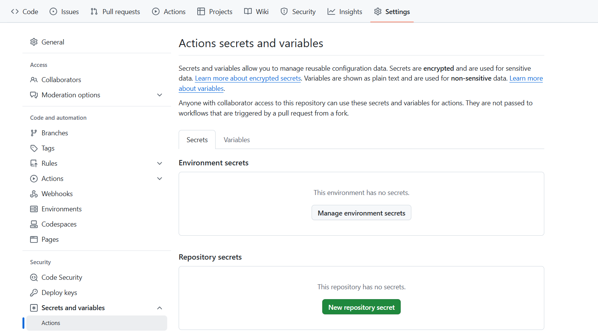
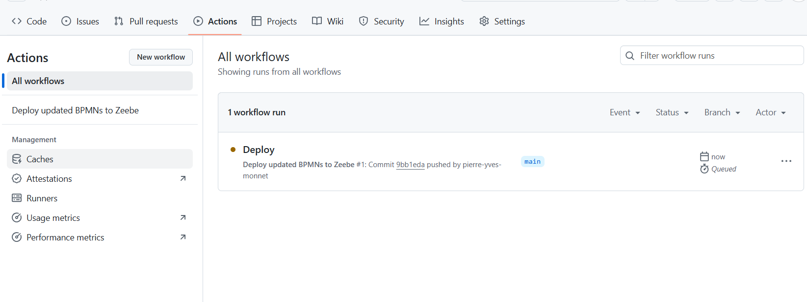
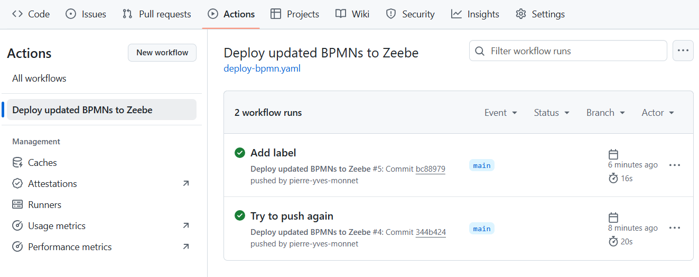

# GitHub action: deploy BPMN on SaaS

# Introduction

Note: check the Preparation in the README. A GitHub repository is ready

# 1. Create a client 

Create a client that has access to `Zeebe API`. Take note of the environment variables

then

Get the values

For example

| Variable                       | Value                                      |
|--------------------------------|--------------------------------------------| 
| ZEEBE_CLIENT_ID                | <ZeebeId                                   |
| ZEEBE_CLIENT_SECRET            | <ZeebeSecret>                              |
| ZEEBE_REST_ADDRESS             | https://dsm-1.zeebe.camunda.io/5..         |
| ZEEBE_TOKEN_AUDIENCE           | zeebe.camunda.io                           |                                   
| CAMUNDA_CLUSTER_ID             | <ClusterId>                                |                                    
| CAMUNDA_CLIENT_ID              | <ClientId>                                 |                                         
| CAMUNDA_CLIENT_SECRET          | <ClientSecret>                             |     
| CAMUNDA_CLUSTER_REGION         | dsm-1                                      |                             
| CAMUNDA_CREDENTIALS_SCOPES     | Zeebe                                      |                              
| CAMUNDA_OAUTH_URL              | https://login.cloud.camunda.io/oauth/token |                               

# 2. Create action secrets in the repository
Go to `Settings`, then search `Secrets and Variables`. Click on `Actions`.

Click on `New repository secrets`
Give as `Name`: `CLUSTER_ID`  and for the value, `CAMUNDA_CLUSTER_ID` value

Create these secrets:

| name                | Value from              |
|---------------------|-------------------------| 
| CLUSTER_ID          | CAMUNDA_CLUSTER_ID      |
| CLUSTER_REGION      | CAMUNDA_CLUSTER_REGION  | 
| ZEEBE_CLIENT_ID     | CAMUNDA_CLIENT_ID       |
| ZEEBE_CLIENT_SECRET | CAMUNDA_CLIENT_SECRET   | 

At the end, you should have this:

# 3. Add a workflow

Create a directory `.github`, then a folder `workflows` on the root of the project

Create a file name `saas-deploy-bpmn.yaml` inside

Use the [saas-deploy-bpmn.yaml](saas-deploy-bpmn.yaml) file provided.

# 4. Change something in the workflow and push it

On the desktop modeler, change something in the process (a label, an icon). Save and commit.

# 5. Check the workflow
On the GitHub repository, the workflow should start. Go to `Actions` and check

Action was exectued

 
Check the last step, which deploy the artifact

