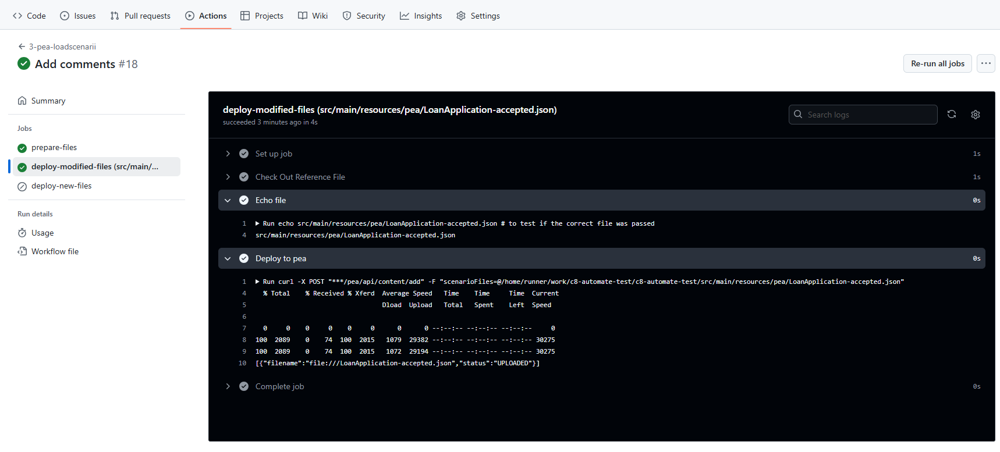
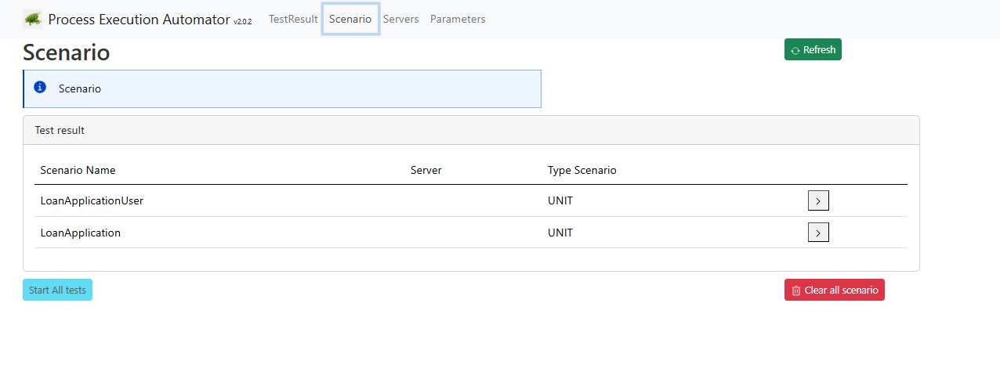

# Unit test

# Principe
 The cluster is deployed, and workers are deployed. Next step is to execute unit test on the cluster via a GitHub action.
 
The tool process-execution-automator is used for that purpose.

Steps are:
* deploy scenario on the process execution automator
* run the scenario

The process execution automator tool must be deployed on the cluster.

# Deploy process execution automator

Check the command on the project https://github.com/camunda-community-hub/process-execution-automator?tab=readme-ov-file#simple-usage

> PEA access different component: Zeebe, Operate, Tasklist. Component may need a ClientId/Client Secret access. Check the PEA configuration to configure the UI correctly

## Simple access
By default, the pea.yaml contains the default configuration to access components in the same cluster.

```shell
$ kubectl create -f k8s/pea.yaml
```

## ClientId/ClientSecret

Use the `pea-identity.yaml`file to access component using client Id / Client secret. This file must be adapted to contain the correct information

Check the section [GitHubActionBPMNSelfManage.md](../bpmn/GitHubActionBPMNSelfManage.md) to see how to access ClientId, ClientSecret and Authorization URL 
```shell
$ kubectl create -f k8s/pea-identity.yaml
```
Access in the same way the Operate ClientID/ Client Secret


And the TaskList ClientId/ClientSecret


The PEA-identity.yaml is something like

```
          env:
            - name: JAVA_TOOL_OPTIONS
              value: >-
                -Dautomator.startup.serverName=Camunda8Calcair
                -Dautomator.servers.camunda8.name=Camunda8Calcair
                -Dautomator.servers.camunda8.zeebeGrpcAddress=http://camunda-zeebe-gateway:26500
                -Dautomator.servers.camunda8.zeebeClientId=zeebe
                -Dautomator.servers.camunda8.zeebeClientSecret=F....6
                -Dautomator.servers.camunda8.zeebeAudience=zeebe
                -Dautomator.servers.camunda8.zeebePlainText=true
                -Dautomator.servers.camunda8.authenticationUrl=http://35.237.139.124:8080/auth/realms/camunda-platform/protocol/openid-connect/token
                -Dautomator.servers.camunda8.operateUrl=http://camunda-operate:80
                -Dautomator.servers.camunda8.operateUserName=demo
                -Dautomator.servers.camunda8.operateUserPassword=demo
                -Dautomator.servers.camunda8.operateClientId=operate
                -Dautomator.servers.camunda8.operateClientSecret=X....B
                -Dautomator.servers.camunda8.taskListUrl=http://camunda-tasklist:80
                -Dautomator.servers.camunda8.taskListUserName=demo
                -Dautomator.servers.camunda8.taskListUserPassword=demo
                -Dautomator.servers.camunda8.taskListClientId=tasklist
                -Dautomator.servers.camunda8.taskListClientSecret=y....z
                -Dautomator.servers.camunda8.workerExecutionThreads=2000
                -Dautomator.startup.logLevel=MAIN
```

## Open the Pea to GitHub

GitHub action accesses the PEA from the outside of the cluster. Connection information is not shared at this level.

```shell
$ kubectl create -f k8s/pea-public-core-zeebe-loadbalancer.yaml
```

This command deploys a service with a public address. THis is mandatory then GitHub can access PEA to deploy and execute scenario
```shell
$ kubectl get svc
pea-public                          LoadBalancer   34.118.231.236   35.229.70.3       8381:30440/TCP                 4m31s
```

# Add the pea address

The goal of this action is to allow 

In the GitHub project, navigate to `Settings`  / `Secrets and variables` / `Actions`


Then click on `New repository secret`

Add the key `PEA_REST_ADDRESS`  and the value from the public address. Use `http`or `https` and the port number is 8381


# Access the PEA UI
Using the PEA public address, the UI can be accessed
Access `http://35.229.70.3:8381/`


# Deploy workflows on the project

Deploy these two workflows. 
[3-pea-loadscenarii.yaml](3-pea-loadscenarii.yaml) and

[4-pea-run-scenarii.yaml](4-pea-run-scenarii.yaml)

The first one will detect any scenario file `json` and deploy them
```yaml
name: '3-pea-loadscenarii'

on:
  push:
    paths:
      - 'src/main/resources/pea/*.json' # match '*.json' files (created or updated)
      - 'src/test/resources/pea/*.json' # match '*.json' files (created or updated)


jobs:
  prepare-files:
    runs-on: ubuntu-latest
    outputs:
      matrix-added: ${{ steps.file-changes.outputs.files_added }}
      matrix-modified: ${{ steps.file-changes.outputs.files_modified }}
    steps:
      - id: file-changes
        uses: trilom/file-changes-action@v1.2.4

  deploy-modified-files:
    if: ${{ needs.prepare-files.outputs.matrix-modified != '[]' }}
    needs: [prepare-files]
    runs-on: ubuntu-latest
    strategy:
      matrix:
        file: ${{ fromJSON(needs.prepare-files.outputs.matrix-modified) }}
    steps:
      - name: Check Out Reference File
        uses: Bhacaz/checkout-files@v2
        with:
          files: ${{ matrix.file }}

      - name: Echo file
        run: |
          echo ${{ matrix.file }} # to test if the correct file was passed


      - name: Deploy to pea
        run: |
          curl -X POST "${{ secrets.PEA_REST_ADDRESS }}/pea/api/content/add" -F "scenarioFiles=@${{ github.workspace }}/${{ matrix.file }}"

  deploy-new-files:
    if: ${{ needs.prepare-files.outputs.matrix-added != '[]' }}
    needs: [prepare-files]
    runs-on: ubuntu-latest
    strategy:
      matrix:
        file: ${{ fromJSON(needs.prepare-files.outputs.matrix-added) }}
    steps:
      - name: Check Out Reference File
        uses: Bhacaz/checkout-files@v2
        with:
          files: ${{ matrix.file }}

      - name: Echo file
        run: |
          echo ${{ matrix.file }} # to test if the correct file was passed

      - name: Deploy to Pea
        run: |
          curl -X POST ${{ secrets.PEA_REST_ADDRESS }}/pea/api/content/add -F "scenarioFile=@${{ github.workspace }}/${{ matrix.file }}"

```


The second action runs all tests present on the server
````yaml
name: '4-pea-run-scenarii'

on:
  workflow_run:
    workflows:
      - sm-deploy-bpmn
      - 2-worker-deploy-on-cluster
      - 3-pea-loadscenarii
    types:
      - completed

jobs:
  execute-test:
    runs-on: ubuntu-latest
    steps:

      - name: run all scenarii
        run: |
          STATUS=$(curl -s -o response.txt -w "%{http_code}" -X POST "${{ secrets.PEA_REST_ADDRESS }}/pea/api/unittest/runall?wait=true&failonerror=true&server=Camunda8Topaz")
          echo "HTTP Status: $STATUS"

          if [[ "$STATUS" -ge 400 ]]; then
            echo "❌ API call failed with status $STATUS"
            cat response.txt
            exit 1
          fi
````

# Push the first scenario

Go to `src/main/resources/pea/LoanApplication-accepted.json` and change something in the file. Commit/push the change.

Check out the GitHub Action: the workflow started:


After some seconds, a status is visible


Check the first action (Load Scenarii)

All scenarii are loaded. 
It's possible to check the PEA server to see the result.

> Process-Execution-Automator (PEA) offers a public REST API, so it is accessible via a browser or via postman, or an UI


The scenario is loaded. This scenario does not specify any server type.


Via the PEA-UI, it's possible to check the deployment


Check the second action (Run All Scenarii)


> Process-Execution-Automator connects a Camunda Engine to execute the scenario. Multiple engine defintion are pre-positionned in the server. 
> Camunda8Topaz is the server to use when Process-execution-automator are deployed in the same cluster. 

The url returns a status 200.

It is possible to ask the PEA server for the result. The URL is http://35.229.70.3:8381/pea/api/unittest/list


Using the test ID `"id": "1745610463742.LoanApplication"` and the URL http://35.229.70.3:8381/pea/api/unittest/get?id=1745610463742.LoanApplication
the result is accessible.


Via the Pea UI, the test is visible, mark as started


When it's finished, the content can be accessed


# Change the process: Unit test detects and fail

Open the process and change the condition.
```
score > 2800
```


Commit and push

GitHub action detects the change, and runs


The action fail:


Check the detail


Access the Pea UI: the first test failed, because the task `AcceptLoan` never show up. 


Take advantage of the fact PEA display the process instance, to have a look in Operate: the process instance moved in the human task.


# Change the worker

In the worker get-score, change the sleep time

```
  try {
        Thread.sleep(2000);
    } catch (InterruptedException e) {
        logger.error("Ask to interrupt the sleep");
        Thread.currentThread().interrupt();
    }
```


From 150 to 2000. The worker needs now 2 seconds to complete. The performance test will fail.

Commit and push

The action deploys the new worker, and the test failed


Check in the Pea application for the result: the performance test failed!


# Add a new test

1. Create a new scenario

Build a new scenario test, or rename the file `src/main/resources/pea/LoadApplication-user.txt` to `src/main/resources/pea/LoadApplication-user.json|.

2. Commit and push it

3. Check Actions
In GitHub, action "load" is started.
 


4. Check in PEA: the new scenario must be loaded



5. After a while, Action is executed with success on GitHub


5. Check on the PEA page, on test results

