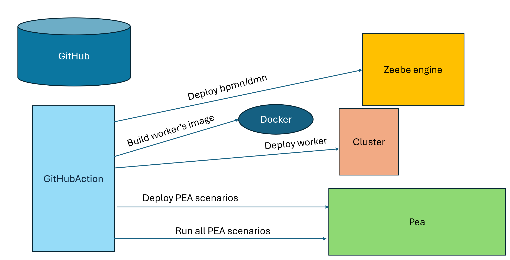

 # Different solution
 
Different solutions are explained here, based on different tools. Each solution explore two targets: a SaaS environment and a Self Manage environment

# Different tool
## GitHub action
A GitHub repository contains an internal mechanism call GitAction. Via this method, an action can be trigger on an event. The event may be a push in the repository, or the creation of a new release.

Check [README.md](GitHubAction/README.md) GitHub for different steps

## Jenkins
Jenkins is a very popular tool to automate operation.

# Preparation
To prepare the challenge, create a Git Repository from the folder, and copy the src directory and the pom.xml file

Create a GitHub project and copy into it
*   pom.xml
*   src directory

This is the base for all solutions. 

# Chapter 1: BPMN Continuous deployment

When you push a new version of a BPMN process, or a new process, this process is deployed on the server.

| Solution      | Saas                                               | Self Manage                                                     |
|---------------|----------------------------------------------------|-----------------------------------------------------------------|
| GitHub action | [Saas](GitHubAction/bpmn/GitHubActionBPMNSaaS.md)  | [Self Manage](GitHubAction/bpmn/GitHubActionBPMNSelfManage.md)  |
| Jenkins       |                                                    |                                                                 |
| Process       |                                                    |                                                                 |

# Chapter 2: Worker Continuous deployment

A worker is part of the GitHub under `src/main/java` . When a piece of code is pushed, then the environment
* compile the new version and create a JAR file. The jar car be saved under the GitHub release.
* deploy it on a Connector runtime (maybe the Connector Runtime or Cherry Runtime)

| Solution      | Self Manage                                                        |
|---------------|--------------------------------------------------------------------|
| GitHub action | [SelfManage](GitHubAction/worker/GitHubActionWorkerSelfManage.md)  |
| Jenkins       |                                                                    |                                                                         
| Process       |                                                                    |                                                                         

# Chapter 3: Continuous Integration

When something changed (new process, new worker), tests must run on it.

The Process Execution Automator (PEA) is used to run scenarii on the platorm.

The Process Execution Automator (PEA) must be deployed first somewhere.
The action will
* deploy any PEA scenario
* ask Process Execution Automator (PEA) to execute them

| Solution      | Self Manage                                                            |
|---------------|------------------------------------------------------------------------|
| GitHub action | [PEA execution](GitHubAction/process-execution-automator/UnitTest.md)  |
| Jenkins       |                                                                        |                                                                         
| Process       |                                                                        |                                                                         

# Chapter 4: use different branches

The GitHub repository contains two branches: main and development name `chicago`
The `chigago` contains a GitHub deployment to push on the validation project.
Web Modeler is connected to `chicago`. At a moment, development is finish, and the version is merge in the `main`.

| Solution      | Self Manage |
|---------------|-------------|
| GitHub action |             |
| Jenkins       |             |                                                                         
| Process       |             |                                                                         
