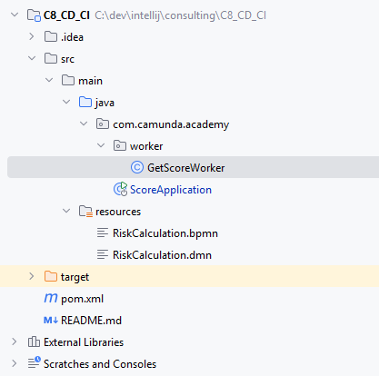

# CD CI
This challenge is to build a CD-CI

# C8-cd-ci-challenge

The goal of this challenge is to build a CD on a Self Manage and a SaaS.

Then, second, a CI can be set up.

# Preparation

Create a GitHub repository, and use the content of the directory `loadapplication`
The repository contains:
* src/main/java contains the code for the worker.
* src/main/resources/RiskCalculation.bpmn: the process to deploy
* src/main/resources/RiskCalculation.dmn : the DMN table used in the process
* pom.xml is the pom used to compile the project, which contains a worker
* Dockerfile is used to rebuild the image

Result is

Option 1: Start a Self Manage cluster.

Option 2: Use the SaaS connection

# Chapter 1: BPMN Continuous deployment

## Operation

When you push a new version of a BPMN process, or a new process, this process is deployed on the server.

## Different solutions

### Build a solution based on a Jenkins server

### Build a solution on GitHub action

### Build a solution based on a different product

### Build a solution based on a process.

# Chapter 2: Connector Continuous deployment

## Operation

A connector is part of the GitHub under `src/main/java` . When a piece of code is pushed, then the environemnt
* compile the new version and create a JAR file. The jar car be savec under the GitHub release.
* deploy it on a Connector runtime (maybe the ConnectorRuntime or Cherry Runtime)

## Different solutions

# Chapter 3: Continuous Integration

## Operation

When a new process is deployed, it must be deployed and a test must run on it.

Different tools can be used to run this time.

As an option: if the test is successful, then deploy the process on a second cluster, simulating a UA cluster when you run the test, and a productive cluster where you deploy it if the test is successfull.

# Chapter 4: use different branches

The Github repository contains two branches: main and development name `chicago`
The `chigago` contains a Github deployment to push on the validation project.
Web Modeler is connected to `chicago`. At a moment, development is finish, and the version is merge in the `main`.
