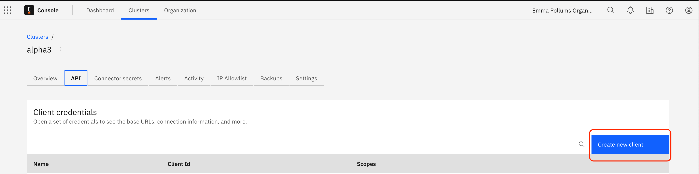
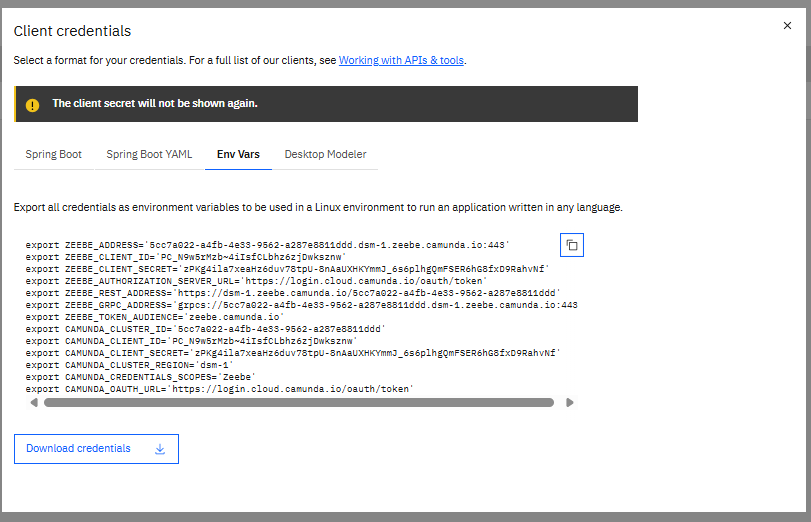
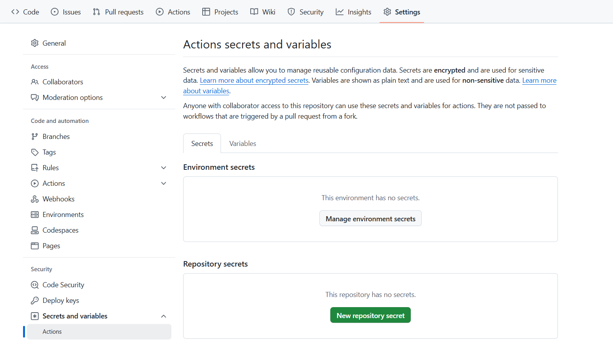
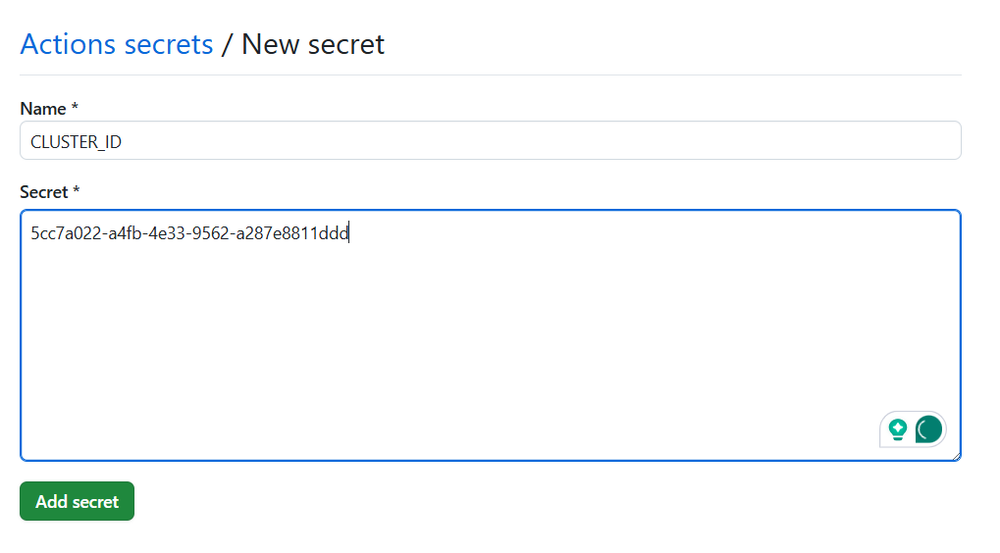
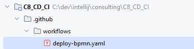
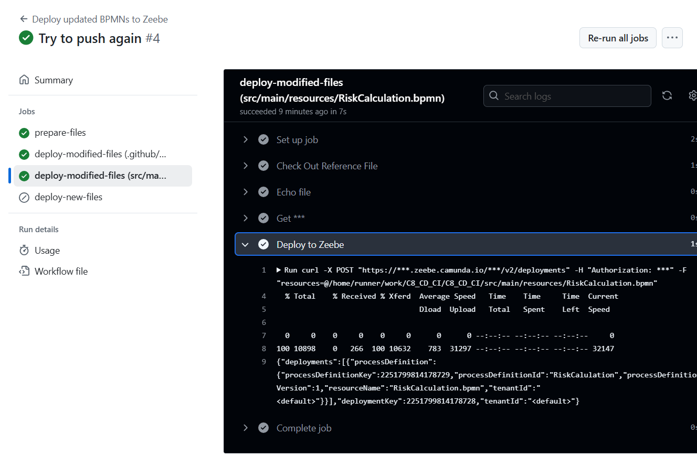

# GitHub action

# Introduction

Note: check the Preparation in the README. A GitHub repository is ready

# 1. Create a client 

Create a client that has access to `Zeebe API`. Take note of the environment variables

then

Get the values

For example

| Variable                       | Value                                                                   |
|--------------------------------|-------------------------------------------------------------------------| 
| ZEEBE_CLIENT_ID                | PC_N9...ksznw                                                           |
| ZEEBE_CLIENT_SECRET            | zPKg4....hvNf                                                           |
| ZEEBE_REST_ADDRESS             | https://dsm-1.zeebe.camunda.io/5cc7a022-a4fb-4e33-9562-a287e8811ddd     |
| ZEEBE_TOKEN_AUDIENCE           | zeebe.camunda.io                                                        |                                   
| CAMUNDA_CLUSTER_ID             | 5cc7a02......811ddd                                                     |                                    
| CAMUNDA_CLIENT_ID              | PC_N9w5......jDwksznw                                                   |                                         
| CAMUNDA_CLIENT_SECRET          | zPKg4il......D9RahvNf                                                   |     
| CAMUNDA_CLUSTER_REGION         | dsm-1                                                                   |                             
| CAMUNDA_CREDENTIALS_SCOPES     | Zeebe                                                                   |                              
| CAMUNDA_OAUTH_URL              | https://login.cloud.camunda.io/oauth/token                              |                               

# 2. Create action secrets in the repository
Go to `Settings`, then search `Secrets and Variables`. Click on `Actions`.

Click on `New repository secrets`
Give as `Name`: `CLUSTER_ID`  and for the value, `CAMUNDA_CLUSTER_ID` value

Create these secrets:

| name                | Value from              |
|---------------------|-------------------------| 
| CLUSTER_ID          | CAMUNDA_CLUSTER_ID      |
| CLUSTER_REGION      | CAMUNDA_CLUSTER_REGION  | 
| ZEEBE_CLIENT_ID     | CAMUNDA_CLIENT_ID       |
| ZEEBE_CLIENT_SECRET | CAMUNDA_CLIENT_SECRET   | 

At the end, you should have this:

# 3. Add a workflow

Create a directory `.github`, then a folder `workflows` on the root of the project

Create a file name `deploy-bpmn.yaml` inside

Use the [deploy-bpmn.yaml](deploy-bpmn.yaml) file provided.

# 4. Change something in the workflow and push it

On the desktop modeler, change something in the process (a label, an icon). Save and commit.

# 5. Check the workflow
On the GitHub repository, the workflow should start. Go to `Actions` and check

Action was exectued

 
Check the last step, which deploy the artefact

