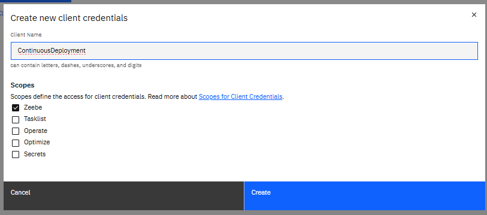

# GitHub action

# Introduction

Note: check the Preparation in the README. A GitHub repository is ready

# 1. Create a client 

Create a client that has access to `Zeebe API`. Take note of the environment variables

then

Get the values

For example

| Variable                       | Value                                                                   |
|--------------------------------|-------------------------------------------------------------------------| 
| ZEEBE_ADDRESS                  | 5cc7a022-a4fb-4e33-9562-a287e8811ddd.dsm-1.zeebe.camunda.io:443         | 
| ZEEBE_CLIENT_ID                | PC_N9w5rMzb~4iIsfCLbhz6zjDwksznw                                        |
| ZEEBE_CLIENT_SECRET            | zPKg4ila7xeaHz6duv78tpU-8nAaUXHKYmmJ_6s6plhgQmFSER6hG8fxD9RahvNf        |
| ZEEBE_AUTHORIZATION_SERVER_URL | https://login.cloud.camunda.io/oauth/token                              |
| ZEEBE_REST_ADDRESS             | https://dsm-1.zeebe.camunda.io/5cc7a022-a4fb-4e33-9562-a287e8811ddd     |
| ZEEBE_GRPC_ADDRESS             | grpcs://5cc7a022-a4fb-4e33-9562-a287e8811ddd.dsm-1.zeebe.camunda.io:443 | 
| ZEEBE_TOKEN_AUDIENCE           | zeebe.camunda.io                                                        |                                   
| CAMUNDA_CLUSTER_ID             | 5cc7a022-a4fb-4e33-9562-a287e8811ddd                                    |                                    
| CAMUNDA_CLIENT_ID              | PC_N9w5rMzb~4iIsfCLbhz6zjDwksznw                                        |                                         
| CAMUNDA_CLIENT_SECRET          | zPKg4ila7xeaHz6duv78tpU-8nAaUXHKYmmJ_6s6plhgQmFSER6hG8fxD9RahvNf        |     
| CAMUNDA_CLUSTER_REGION         | dsm-1                                                                   |                             
| CAMUNDA_CREDENTIALS_SCOPES     | Zeebe                                                                   |                              
| CAMUNDA_OAUTH_URL              | https://login.cloud.camunda.io/oauth/token                              |                               

# 2. Create action secrets in the repository
Go to `Settings`, then search `Secrets and Variables`. Click on `Actions`.

Click on `New repository secrets`
Give as `Name`: `CLUSTER_ID`  and for the value, `CAMUNDA_CLUSTER_ID` value

Create these secrets:

| name                | Value from              |
|---------------------|-------------------------| 
| CLUSTER_ID          | CAMUNDA_CLUSTER_ID      |
| CLUSTER_REGION      | CAMUNDA_CLUSTER_REGION  | 
| ZEEBE_CLIENT_ID     | CAMUNDA_CLIENT_ID       |
| ZEEBE_CLIENT_SECRET | CAMUNDA_CLIENT_SECRET   | 

At the end, you should have this:

# 3. Add a worflow

Create a directory `.github`, then a folder `workflows` on the root of the project

Create a file name `deploy-bpmn.yaml` inside

# 4. Change someting in the workflow and push it

On the desktop modeler, change something in the process (a label, an icon). Save and commit.

# 5. Check the workflow
On the GitHub repository, the workflow should start. Go to `Actions` and check

2. 