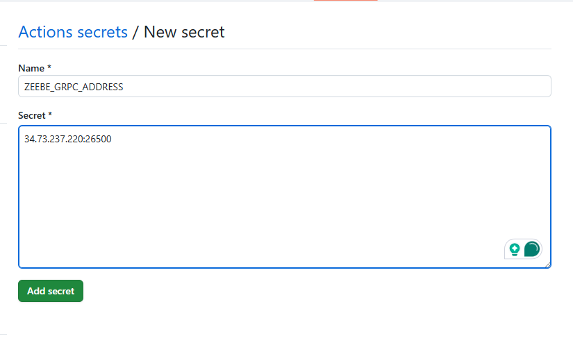
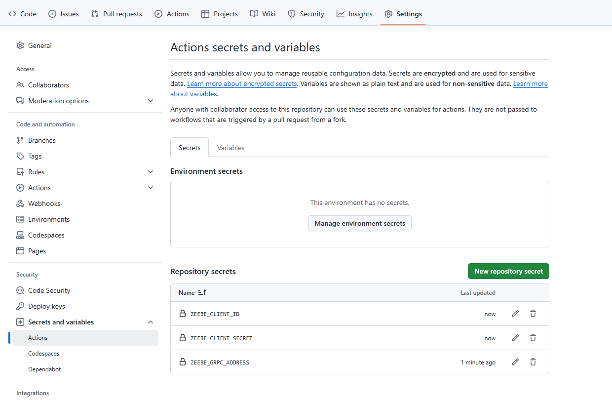
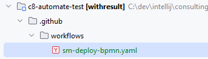
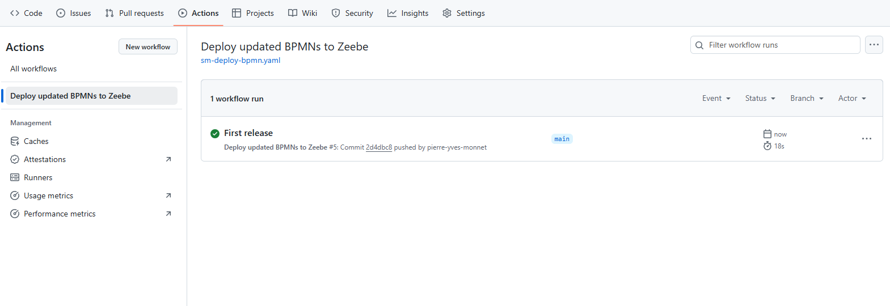
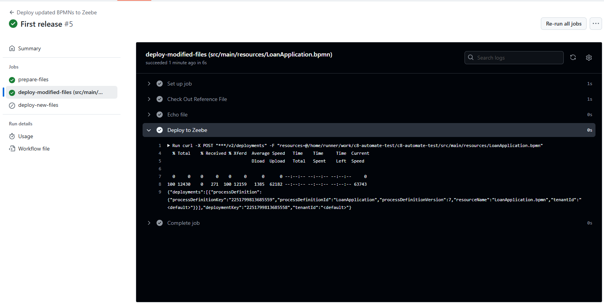

# GitHub action: deploy BPMN on Self manage

# Introduction

Note: check the Preparation in the README. A GitHub repository is ready

# 1. The Cluster must be accessible from GitHub

The best approach for this is to have a public IP address.
Create a public service, using the `PublicZeebeGateway.yaml` file.

````shell
kubectl create -f PublicZeebeGateway.yaml
````

Check the service:

```shell
$ kubectl get svc
NAME                                TYPE           CLUSTER-IP       EXTERNAL-IP       PORT(S)                        AGE
camunda-elasticsearch               ClusterIP      34.118.238.185   <none>            9200/TCP,9300/TCP              7d2h
camunda-elasticsearch-master-hl     ClusterIP      None             <none>            9200/TCP,9300/TCP              7d2h
camunda-operate                     ClusterIP      34.118.237.171   <none>            80/TCP,9600/TCP                7d2h
camunda-optimize                    ClusterIP      34.118.233.141   <none>            80/TCP,8092/TCP                7d2h
camunda-tasklist                    ClusterIP      34.118.235.203   <none>            80/TCP,9600/TCP                7d2h
camunda-zeebe                       ClusterIP      None             <none>            9600/TCP,26502/TCP,26501/TCP   7d2h
camunda-zeebe-gateway               ClusterIP      34.118.226.231   <none>            9600/TCP,26500/TCP,8080/TCP    7d2h
camunda-rest-zeebe-gateway-public   LoadBalancer   34.118.227.68    34.23.115.65      8080:31276/TCP                 17m
camunda-grpc-zeebe-gateway-public   LoadBalancer   34.118.239.224   104.196.165.146   26500:30198/TCP                17m
```
Two public service are accessible. One for REST and one for GRPC.

The yaml file is

```yaml
apiVersion: v1
kind: Service
metadata:
  name: camunda-grpc-zeebe-gateway-public
spec:
  type: LoadBalancer
  selector:
    app.kubernetes.io/component: zeebe-gateway
    app.kubernetes.io/instance: camunda

  ports:
    - port: 26500
      targetPort: 26500
---
apiVersion: v1
kind: Service
metadata:
  name: camunda-rest-zeebe-gateway-public
spec:
  type: LoadBalancer
  selector:
    app.kubernetes.io/component: zeebe-gateway
    app.kubernetes.io/instance: camunda

  ports:
    - port: 8080
      targetPort: 8080
```


# 2. Create action secrets in the repository
Go to `Settings`, then search `Secrets and Variables`. Click on `Actions`.


Click on `New repository secrets`
Give as `Name`: `ZEEBE_REST_ADDRESS` and for the value, the IP address you created plus the protocol and `8080` as port (we access the REST port)

```
http://34.23.115.65:8080

```



Create these secrets:

| name                | Value from                  |
|---------------------|-----------------------------| 
| ZEEBE_CLIENT_ID     | <CLIENT_ID>                 |
| ZEEBE_CLIENT_SECRET | <CLIENT_SECRET>             | 
| ZEEBE_REST_ADDRESS  | http://34.23.115.65:8080    | 
| ZEEBE_GRPC_ADDRESS  | http://34.118.239.224:26500 | 

> Note 1: the protocol (http or https) is included in the address, to address more use cases.

> Note 2: add the CLIENT_ID and CLIENT_SECRET in the secret, if you defined one.

At the end, you should have this:



# 3. Add a workflow

Create a directory `.github`, then a folder `workflows` on the root of the project

Create a file name `sm-deploy-bpmn.yaml` inside




Use the [sm-deploy-bpmn.yaml](saas-deploy-bpmn.yaml) file provided.

Adapt the file if you used a Client ID / CLient Secret
TODO

# 4. Change something in a process and push it

On the desktop modeler, change something in the process (a label, an icon). Save and commit.

# 5. Check the workflow
On the GitHub repository, the workflow should start. Go to `Actions` and check



Action was executed.

Check the last step, which deploy the artefact


