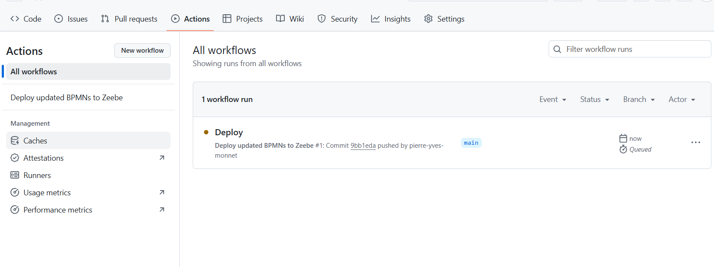
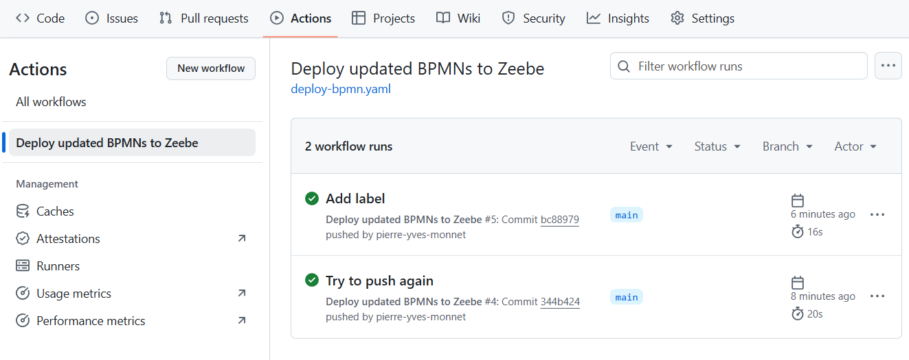

# GitHub action: deploy BPMN on Self manage

# Introduction

Note: check the Preparation in the README. A GitHub repository is ready

# 1. The Cluster must be accessible from GitHub

The best approach for this is to have a public IP address.
Create a public service, using the `PublicZeebeGateway.yaml` file.

````shell
kubectl create -f PublicZeebeGateway.yaml
````

Check the service:

```shell
$ kubectl get svc
NAME                              TYPE           CLUSTER-IP       EXTERNAL-IP     PORT(S)                        AGE
camunda-elasticsearch             ClusterIP      34.118.238.185   <none>          9200/TCP,9300/TCP              7d
camunda-elasticsearch-master-hl   ClusterIP      None             <none>          9200/TCP,9300/TCP              7d
camunda-operate                   ClusterIP      34.118.237.171   <none>          80/TCP,9600/TCP                7d
camunda-optimize                  ClusterIP      34.118.233.141   <none>          80/TCP,8092/TCP                7d
camunda-tasklist                  ClusterIP      34.118.235.203   <none>          80/TCP,9600/TCP                7d
camunda-zeebe                     ClusterIP      None             <none>          9600/TCP,26502/TCP,26501/TCP   7d
camunda-zeebe-gateway             ClusterIP      34.118.226.231   <none>          9600/TCP,26500/TCP,8080/TCP    7d
camunda-zeebe-gateway-public      LoadBalancer   34.118.234.116   34.73.237.220   26500:31824/TCP                115s
```

The yaml file is

```yaml
apiVersion: v1
kind: Service
metadata:
  name: camunda-zeebe-gateway-public
spec:
  type: LoadBalancer
  selector:
    app.kubernetes.io/component: zeebe-gateway
    app.kubernetes.io/instance: camunda

  ports:
    - port: 26500
      targetPort: 26500
```


# 2. Create action secrets in the repository
Go to `Settings`, then search `Secrets and Variables`. Click on `Actions`.


Click on `New repository secrets`
Give as `Name`: `ZEEBE_GRPC_ADDRESS` and for the value, the IP address you created


Create these secrets:

| name                | Value from          |
|---------------------|---------------------| 
| ZEEBE_CLIENT_ID     | <CLIENT_ID>         |
| ZEEBE_CLIENT_SECRET | <CLIENT_SECRET>     | 
| ZEEBE_GRPC_ADDRESS  | 34.73.237.220:26500 | 

Create the Client ID and CLient Secret only if you have one.

At the end, you should have this:


# 3. Add a workflow

Create a directory `.github`, then a folder `workflows` on the root of the project

Create a file name `deploy-bpmn.yaml` inside


Use the [sm-deploy-bpmn.yaml](saas-deploy-bpmn.yaml) file provided.

# 4. Change something in the workflow and push it

On the desktop modeler, change something in the process (a label, an icon). Save and commit.

# 5. Check the workflow
On the GitHub repository, the workflow should start. Go to `Actions` and check



Action was exectued


Check the last step, which deploy the artefact

