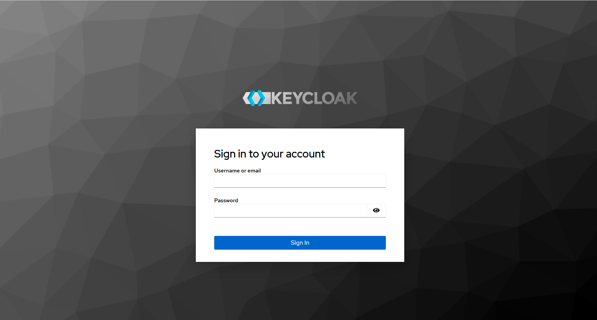
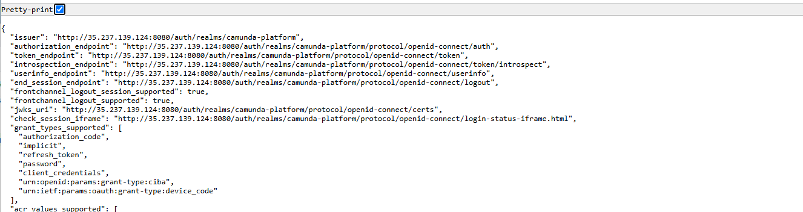
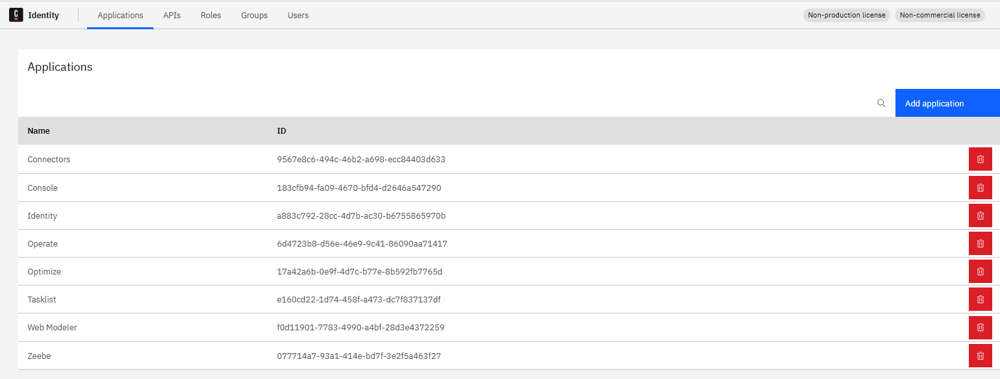
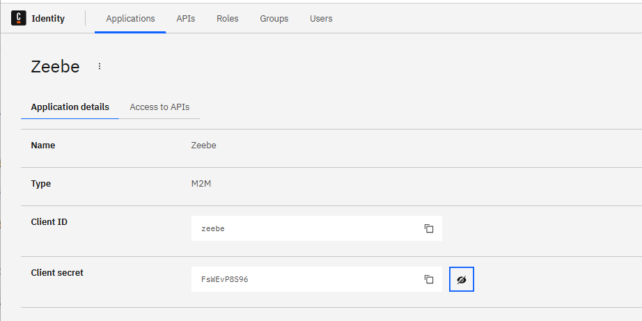

# GitHub action: deploy BPMN on Self manage

# Introduction

Note: check the Preparation in the README. A GitHub repository is ready

# 1. The Cluster must be accessible from GitHub

The best approach for this is to have a public IP address.
Create a public service, using the `PublicZeebeGateway.yaml` file.

````shell
kubectl create -f PublicZeebeGateway.yaml
````

Check the service:

```shell
$ kubectl get svc
NAME                                TYPE           CLUSTER-IP       EXTERNAL-IP       PORT(S)                        AGE
camunda-elasticsearch               ClusterIP      34.118.238.185   <none>            9200/TCP,9300/TCP              7d2h
camunda-elasticsearch-master-hl     ClusterIP      None             <none>            9200/TCP,9300/TCP              7d2h
camunda-operate                     ClusterIP      34.118.237.171   <none>            80/TCP,9600/TCP                7d2h
camunda-optimize                    ClusterIP      34.118.233.141   <none>            80/TCP,8092/TCP                7d2h
camunda-tasklist                    ClusterIP      34.118.235.203   <none>            80/TCP,9600/TCP                7d2h
camunda-zeebe                       ClusterIP      None             <none>            9600/TCP,26502/TCP,26501/TCP   7d2h
camunda-zeebe-gateway               ClusterIP      34.118.226.231   <none>            9600/TCP,26500/TCP,8080/TCP    7d2h
camunda-rest-zeebe-gateway-public   LoadBalancer   34.118.227.68    34.23.115.65      8080:31276/TCP                 17m
camunda-grpc-zeebe-gateway-public   LoadBalancer   34.118.239.224   104.196.165.146   26500:30198/TCP                17m
```
Two public services are accessible. One for REST and one for GRPC.

The YAML file is

```yaml
apiVersion: v1
kind: Service
metadata:
  name: camunda-grpc-zeebe-gateway-public
spec:
  type: LoadBalancer
  selector:
    app.kubernetes.io/component: zeebe-gateway
    app.kubernetes.io/instance: camunda

  ports:
    - port: 26500
      targetPort: 26500
---
apiVersion: v1
kind: Service
metadata:
  name: camunda-rest-zeebe-gateway-public
spec:
  type: LoadBalancer
  selector:
    app.kubernetes.io/component: zeebe-gateway
    app.kubernetes.io/instance: camunda

  ports:
    - port: 8080
      targetPort: 8080
```
# 2. Keycloak must be accessible (only if using a protected cluster)

If your cluster uses Identity and enables the identification, Keycloak must be accessible

1. Create a public access
```shell
kubectl create -f PublicKeycloak.yaml
```
2. Get the IP address

```shell
kubectl  k get svc | grep camunda-keycloak-public
camunda-keycloak-public             LoadBalancer   34.118.236.103   35.237.139.124   8080:30687/TCP                 45s
````
3. Retrieve the Keycloak `admin` password:
Execute:
```shell
kubectl get secret --namespace $(namespace) "camunda-keycloak" -o jsonpath="{.data.admin-password}" | base64 --decode
```

4. Access Keycloak by the url `http://<publicAdress>:8080` like http://35.237.139.124:8080
The administration page is visible


5. To connect to Keycloak, use the user `admin` and the password

6. Check the token issuer
Access the URL:
http://35.237.139.124:8080/auth/realms/camunda-platform/.well-known/openid-configuration
You should have a JSON answer.


7. Check the `token_endpoint`answer: this is the OAUTH_TOKEN_URL. In this example,
it's http://35.237.139.124:8080/auth/realms/camunda-platform/protocol/openid-connect/token


7. Access Identity. 
It may be necessary to `port-forward` identity.  

```shell
kubectl port-forward svc/camunda-identity 8080:80 -n camunda
```


8. Get the Client ID / Client Secret

The Client ID is `zeebe`and the client secret is `FsWEvP8S96` 


8. In Application, click on the list

# 3. Create action secrets in the repository
Go to `Settings`, then search `Secrets and Variables`. Click on `Actions`.


Click on `New repository secrets`
Give as `Name`: `ZEEBE_REST_ADDRESS` and for the value, the IP address you created plus the protocol and `8080` as port (we access the REST port)

```
http://34.23.115.65:8080
```


Create these secrets:

| name                | Value from                   |
|---------------------|------------------------------| 
| ZEEBE_CLIENT_ID     | <CLIENT_ID: zeebe>           |
| ZEEBE_CLIENT_SECRET | <CLIENT_SECRET: FsWEvP8S96>  | 
| OAUTH_TOKEN_URL     | <URL from Keycloak>          | 
| ZEEBE_REST_ADDRESS  | http://34.23.115.65:8080     | 
| ZEEBE_GRPC_ADDRESS  | http://34.118.239.224:26500  | 

> Note 1: the protocol (http or https) is included in the address, to address more use cases.

> Note 2: add the CLIENT_ID and CLIENT_SECRET in the secret if you defined one.

At the end, you should have this:


# 3. Add a workflow

Create a directory `.github`, then a folder `workflows` on the root of the project

Create a file name `sm-deploy-bpmn.yaml` inside


Use the [sm-deploy-bpmn.yaml](saas-deploy-bpmn.yaml) file provided.

Adapt the file if you use a Client ID / CLient Secret

There are two sections in the file. Uncomment / comment the section, according to your platform

```yaml
 # cluster with Identity + Client Secret/ClientID
 #      - name: Get Bearer Token
 #        id: get-bearer-token
 #        run: |
 #          token=$(curl -s ""${{ secrets.OAUTH_TOKEN_URL }}"" --header 'Content-Type: application/x-www-form-urlencoded' --data-urlencode 'grant_type=client_credentials' --data-urlencode "client_id=${{ secrets.ZEEBE_CLIENT_ID}}" --data-urlencode "client_secret=${{ secrets.ZEEBE_CLIENT_SECRET }}" --data-urlencode 'audience=zeebe.camunda.io' | jq -r '.access_token')
 #          echo $token
 #          echo "token=$token" >> $GITHUB_OUTPUT

 #      - name: Deploy to Zeebe
 #        id: deploy-to-zeebe
 #        run: |
 #          response=$(curl -s -X POST "${{ secrets.ZEEBE_URL }}/v2/deployments" -H "Authorization: Bearer ${{ steps.get-bearer-token.outputs.token }}" -F "resources=@${{ github.workspace }}/${{ matrix.file }}")
 #          echo "$response"
 #          echo "response=$response" >> $GITHUB_OUTPUT
```

# 4. Change something in a process and push it

On the desktop modeler, change something in the process (a label, an icon). Save and commit.

# 5. Check the workflow
On the GitHub repository, the workflow should start. Go to `Actions` and check


Action was executed.

Check the last step, which deploy the artifact.


