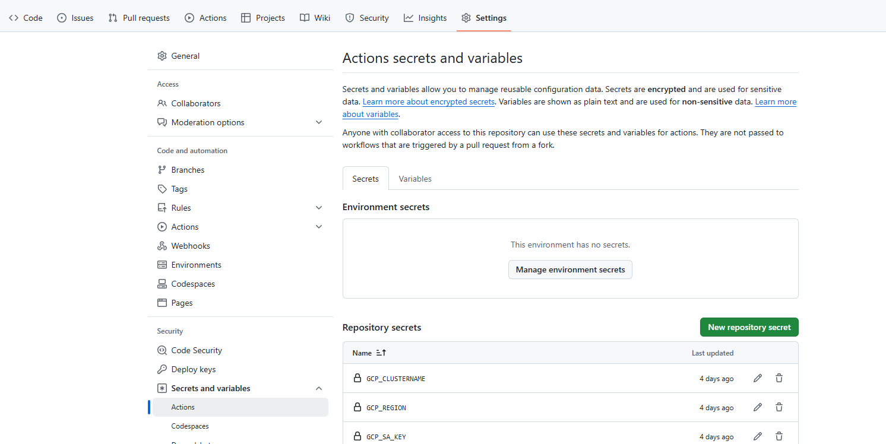
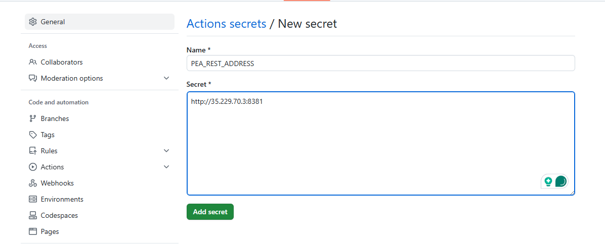
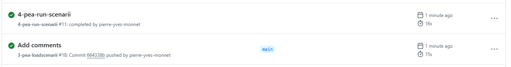
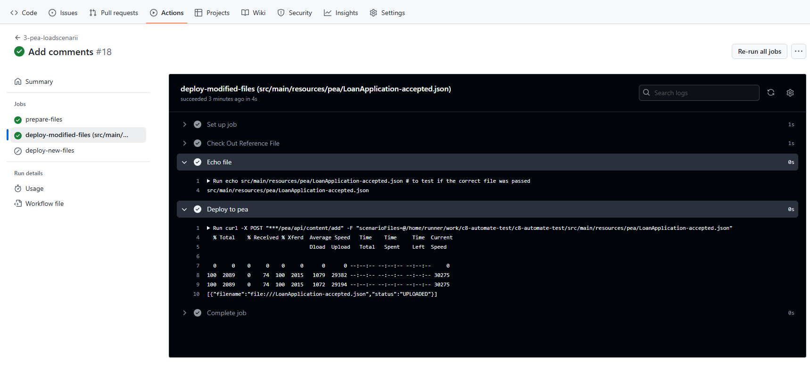
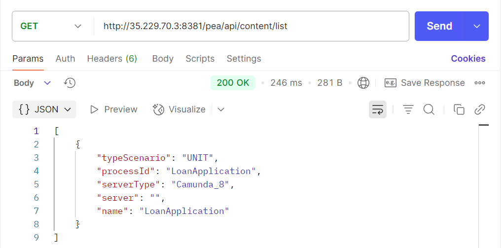
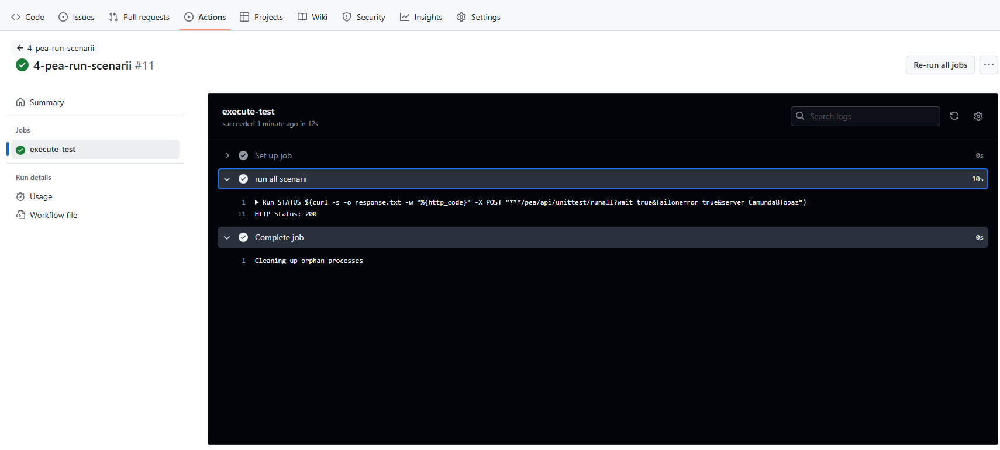
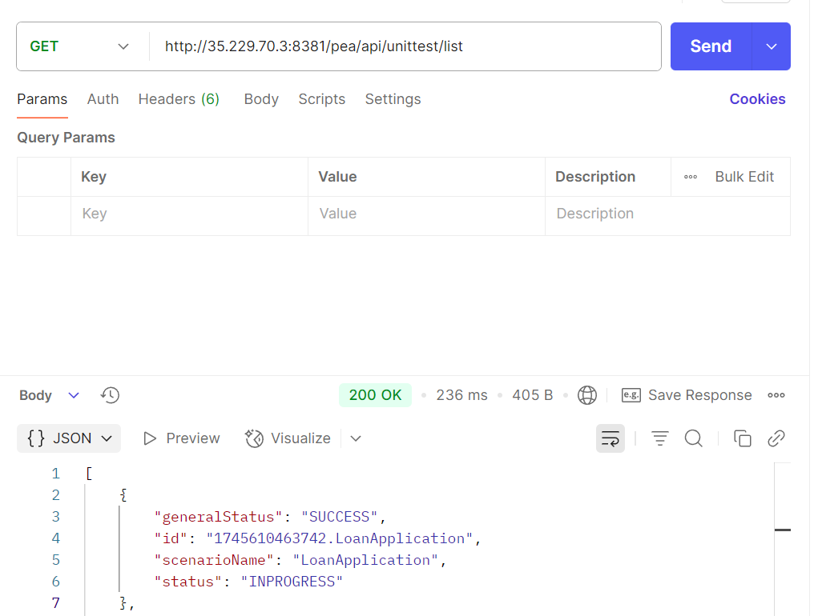
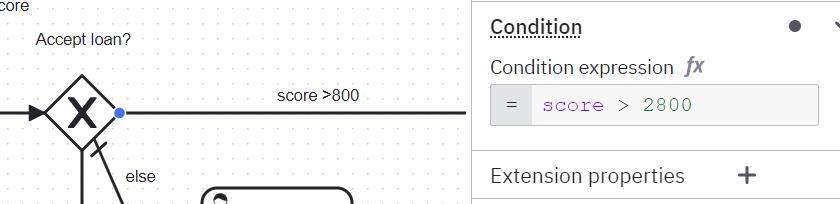

# Unit test

# Principe
 The cluster is deployed, and workers are deployed. Next step is to execute unit test on the cluster via a GitHub action.
 
The tool process-execution-automator is used for that purpose.

Steps are:
* deploy scenario on the process execution automator
* run the scenario

The process execution automator tool must be deployed on the cluster.

# Deploy process execution automator

Check the command on the project https://github.com/camunda-community-hub/process-execution-automator?tab=readme-ov-file#simple-usage

```shell
$ kubectl create -f k8s/process-execution-automator.yaml
```
This command deploy a service with a public address
```shell
$ kubectl get svc
pea-public                          LoadBalancer   34.118.231.236   35.229.70.3       8381:30440/TCP                 4m31s
```

# Add the pea address

In the GitHub project, navigate to `Settings`  / `Secrets and variables` / `Actions`



Then click on `New repository secret`

Add the key `PEA_REST_ADDRESS`  and the value from the public address. Use `http`or `https` and the port number is 8381



# Deploy workflows on the project

Deploy these two workflows. 
[3-pea-loadscenarii.yaml](3-pea-loadscenarii.yaml) and

[4-pea-run-scenarii.yaml](4-pea-run-scenarii.yaml)

The first one will detect any scenario file `json` and deploy them
```yaml
name: '3-pea-loadscenarii'

on:
  push:
    paths:
      - 'src/main/resources/pea/*.json' # match '*.json' files (created or updated)
      - 'src/test/resources/pea/*.json' # match '*.json' files (created or updated)


jobs:
  prepare-files:
    runs-on: ubuntu-latest
    outputs:
      matrix-added: ${{ steps.file-changes.outputs.files_added }}
      matrix-modified: ${{ steps.file-changes.outputs.files_modified }}
    steps:
      - id: file-changes
        uses: trilom/file-changes-action@v1.2.4

  deploy-modified-files:
    if: ${{ needs.prepare-files.outputs.matrix-modified != '[]' }}
    needs: [prepare-files]
    runs-on: ubuntu-latest
    strategy:
      matrix:
        file: ${{ fromJSON(needs.prepare-files.outputs.matrix-modified) }}
    steps:
      - name: Check Out Reference File
        uses: Bhacaz/checkout-files@v2
        with:
          files: ${{ matrix.file }}

      - name: Echo file
        run: |
          echo ${{ matrix.file }} # to test if the correct file was passed


      - name: Deploy to pea
        run: |
          curl -X POST "${{ secrets.PEA_REST_ADDRESS }}/pea/api/content/add" -F "scenarioFiles=@${{ github.workspace }}/${{ matrix.file }}"

  deploy-new-files:
    if: ${{ needs.prepare-files.outputs.matrix-added != '[]' }}
    needs: [prepare-files]
    runs-on: ubuntu-latest
    strategy:
      matrix:
        file: ${{ fromJSON(needs.prepare-files.outputs.matrix-added) }}
    steps:
      - name: Check Out Reference File
        uses: Bhacaz/checkout-files@v2
        with:
          files: ${{ matrix.file }}

      - name: Echo file
        run: |
          echo ${{ matrix.file }} # to test if the correct file was passed

      - name: Deploy to Pea
        run: |
          curl -X POST ${{ secrets.PEA_REST_ADDRESS }}/pea/api/content/add -F "scenarioFile=@${{ github.workspace }}/${{ matrix.file }}"
```

The second action run all tests present on the server
````yaml
name: '4-pea-run-scenarii'

on:
  workflow_run:
    workflows:
      - sm-deploy-bpmn
      - 2-worker-deploy-on-cluster
      - 3-pea-loadscenarii
    types:
      - completed

jobs:
  execute-test:
    runs-on: ubuntu-latest
    steps:

      - name: run all scenarii
        run: |          
          STATUS=$(curl -s -o response.txt -w "%{http_code}" -X POST "${{ secrets.PEA_REST_ADDRESS }}/pea/api/unittest/runall?wait=true&failonerror=true&server=Camunda8Topaz")
          echo "HTTP Status: $STATUS"
          
          if [[ "$STATUS" -ge 400 ]]; then
            echo "❌ API call failed with status $STATUS"
            cat response.txt
            exit 1
          fi
````

# Push the first scenario

Go to `src/main/resources/pea/LoanApplication-accepted.json` and change something in the file. Commit/push the change.

Check on the GitHub Action: the workflow started


After some seconds, a status is visible



Check the first action (Load Scenarii)

All scenarii are loaded. 
It's possible to check the PEA server to see the result.

> Process-Execution-Automator (PEA) offer a public REST API, so it is accessible via a brower or via postman
 
The scenario are loaded. This scenario does not specify any server type.



Check the second action (Run All Scenarii)



> Process-Execution-Automator connects a Camunda Engine to execute the scenario. Multiple engine defintion are pre-positionned in the server. 
> Camunda8Topaz is the server to use when Process-execution-automator are deployed in the same cluster. 

The url return a status 200.

It is possible to ask the PEA server for the result. The URL is http://35.229.70.3:8381/pea/api/unittest/list



Using the test ID `"id": "1745610463742.LoanApplication"` and the URL http://35.229.70.3:8381/pea/api/unittest/get?id=1745610463742.LoanApplication
the result is accessible.


# Change the process

Open the process and change the condition.
```
score > 2800
```




Commit and push

