# Deploy workers in a self manage cluster

This action have two steps:
* rebuild the image and save it in a package repository (for example, GitHub package)
* deploy the image on a cluster, to validate it

# Rebuild the image
Create a directory .github, and inside a directory workflows


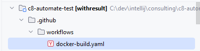

Add the docker-build.yaml file

```yaml
name: Build and Push Docker Image

on:
  push:
    branches: [ "main" ]  # or your branch name

jobs:
  build:
    runs-on: ubuntu-latest

    permissions:
      contents: read
      packages: write  # to publish to GHCR

    steps:
      - name: Checkout code
        uses: actions/checkout@v4


      - name: Log in to GitHub Container Registry
        uses: docker/login-action@v3
        with:
          registry: ghcr.io
          username: ${{ github.actor }}
          password: ${{ secrets.GITHUB_TOKEN }}

      - name: Checkout code
        uses: actions/checkout@v4

      - name: Log in to GitHub Container Registry
        uses: docker/login-action@v3
        with:
          registry: ghcr.io
          username: ${{ github.actor }}
          password: ${{ secrets.GITHUB_TOKEN }}

      - name: Build Docker image
        run: |
          docker build -t ghcr.io/${{ github.repository }}:latest .

      - name: Push Docker image
        run: |
          docker push ghcr.io/${{ github.repository }}:latest

```

With this configuration, Docker recompile the project to build the image.

At the end, the image is present in the package
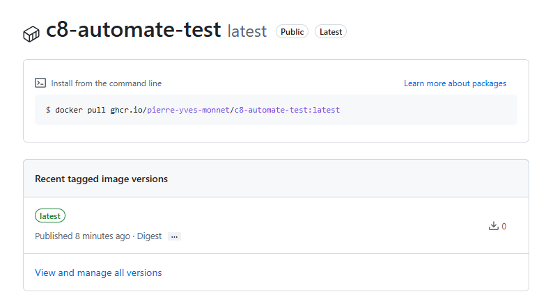

# Deploy the image on a Kubernetes cluster

## Adapt the kubernetes deployment file

Retrieve the full image name of the worker. Go to the tab `packages` 

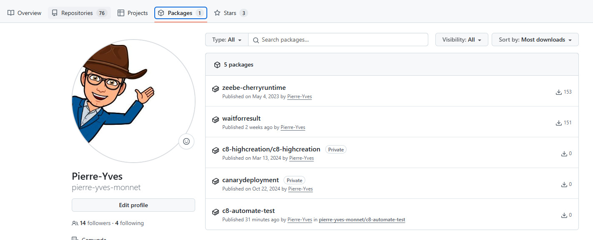

Access the package of your worker:
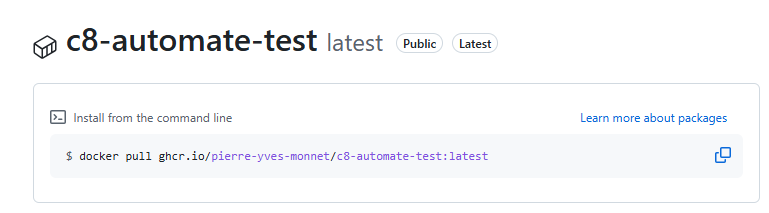

The information is located after the `docker pull` : the name is `ghcr.io/pierre-yves-monnet/c8-automate-test:latest`

In the file `deployment-worker.yaml`, reference this name on the `image` line:

```
          image: ghcr.io/pierre-yves-monnet/c8-automate-test:latest
```

## Collect the connection

### On Google
 
For Google Cloud, create a service account.

Access to IAM, and select `service account`

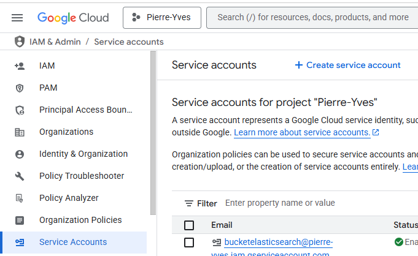

Click on `Create service account`
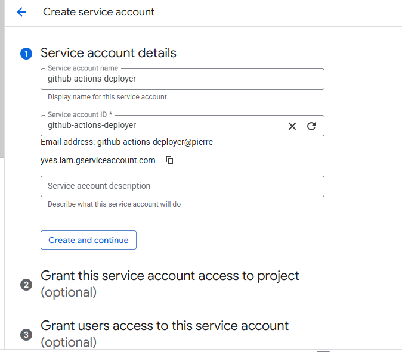

Click Create and continue

Give roles `Kubernetes Engine Developer` and `Kubernetes Engine Cluster Viewer`

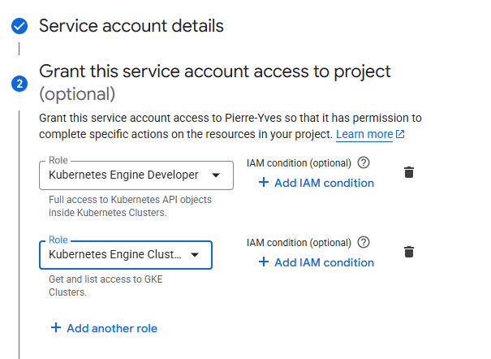

Click on Done.

On the list of all service account, find the new service, and click on it. On the first page, click on `Keys`

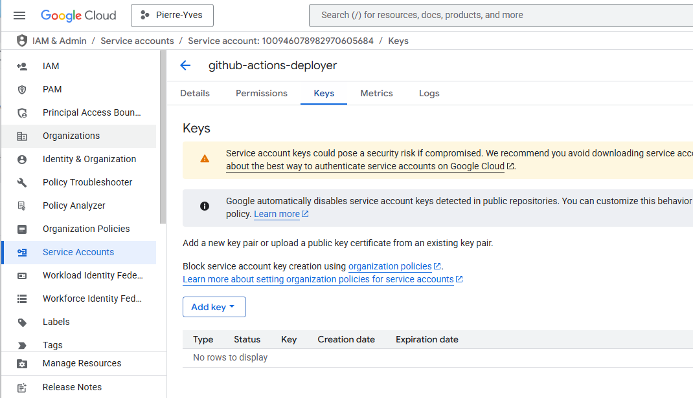

Click on `Create New key` and select `Json`

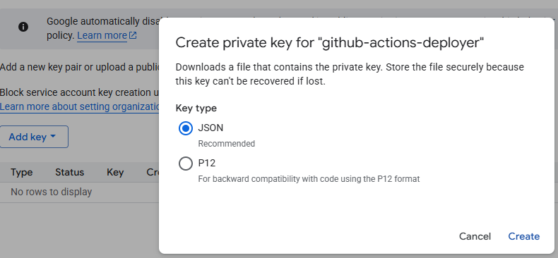

A key is generated, and downloaded on your machine.


On GitHub go to `Settings`, then `Secrets and variables` and 

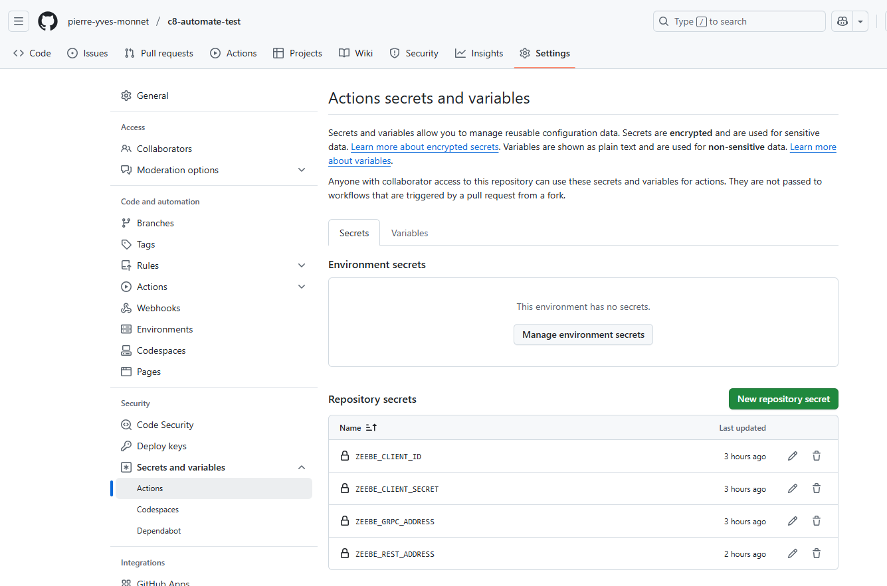

Click on `New repository secret`, and add the variable `GCP_SA_KEY` and the value generated before.

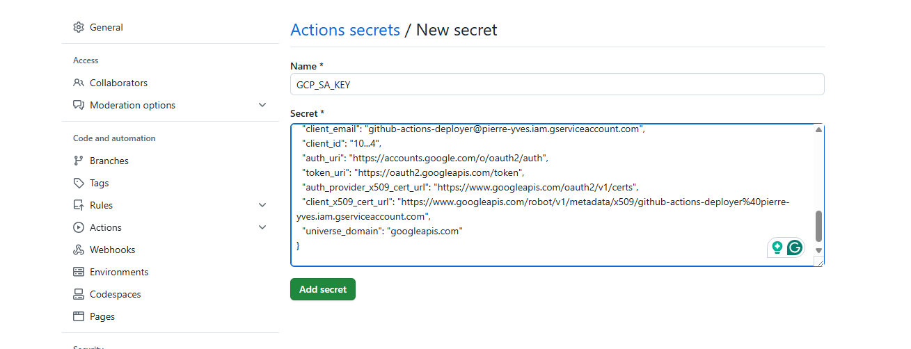

Add a variable `GCP_REGION` and give the region of the cluster

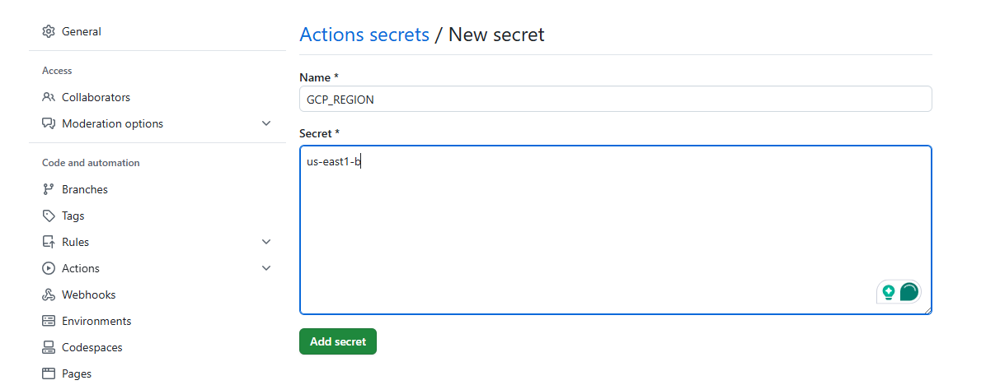

Add a variable `GCP_CLUSTERNAME` and give the name of the cluster

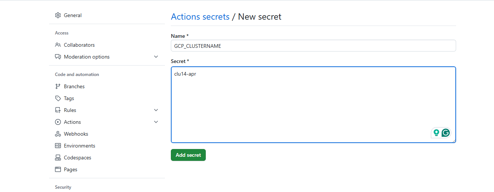
## Create a new workflow
Create this workflow in the repository (under .github/worklows). Name it `publish worker on cluster`

```yaml
name: Deploy In Cluster

on:
  workflow_run:
    workflows: ["Build and Push Docker Image"]  # Name of the workflow to depend on
    types:
      - completed

jobs:
  deploy:
    runs-on: ubuntu-latest

    steps:
      - name: Checkout source
        uses: actions/checkout@v4

      - name: Set up Kubeconfig
        run: |
          mkdir -p $HOME/.kube
          echo "${{ secrets.KUBECONFIG_DATA }}" | base64 -d > $HOME/.kube/config

      - name: Deploy to Kubernetes
        run: |
          kubectl delete -f deployment-worker.yaml
          kubectl apply -f deployment-worker.yaml
```