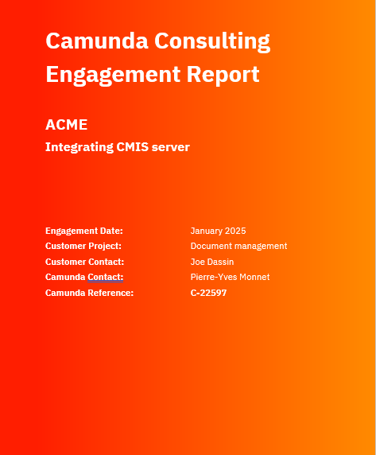

# IDP Challenge


# Use Case
The company Camunda wants to build a document repository for managing and storing consulting reports.

## Submission Sources
Users can submit PDF reports through multiple channels:

* A web form (single or multiple file uploads)
* Email (PDFs as attachments)
* A shared folder (e.g., on Google Drive)

## Document Structure
Each consulting report is a PDF with a cover page containing the following metadata:

* Engagement date
* Customer name
* Engagement title
* Customer project
* Customer contact
* Camunda reference



## Processing Pipeline
Once a document is submitted, the system performs the following steps:

1. Extract Metadata
From the first page of the PDF.

2. Create an Index File
Generates a JSON file named: "<Customer>-<Camunda Reference>-<Title>.json" and save inside the information with this format
```json
{
  "title" : "Integrating CMIS Server",
  "customer" : "ACME",
  "engagementDate" : "01/2025",
  "project" : "Document management",
  "contact": "Joe Dassin",
  "Damun" : "Pierre-Yves Monnet",
  "reference": "C-22597"
}
```

3. Save to Reference Drive
   Both the PDF and the JSON index are stored in a structured folder hierarchy:

<First Letter of Customer>/
└── <Customer>/
└── <Project>/
├── <Customer>-<Reference>-<Title>.pdf
└── <Customer>-<Reference>-<Title>.json


Using the example above, the files would be saved as:


```
A/ACME/DocumentManagement/ACME-C-22597-Integrating CMIS Server.pdf
A/ACME/DocumentManagement/ACME-C-22597-Integrating CMIS Server.json
```


# Implementation
The implementation is done
* on SaaS
* on Self Manage

# Next steps
The document is saved on a CMIS server, and the indexation is used to index the document.
