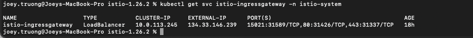
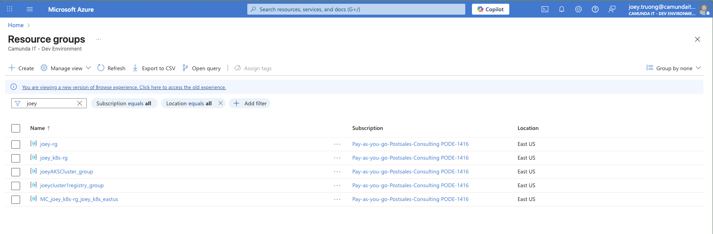
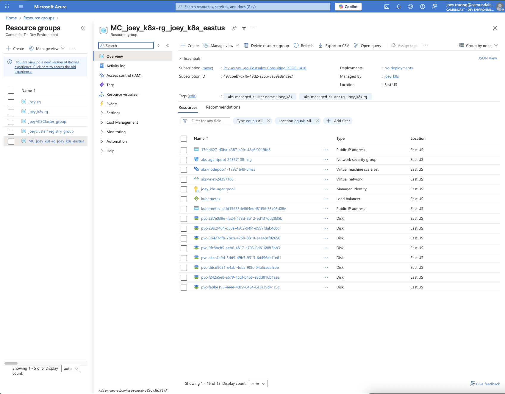
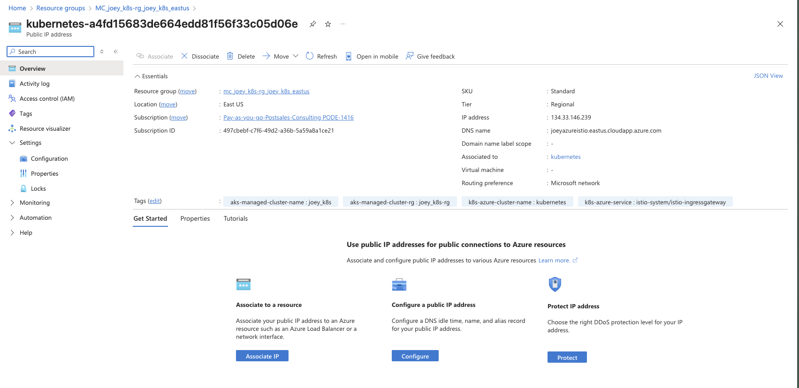
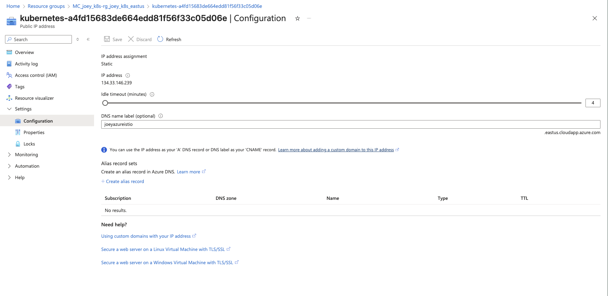
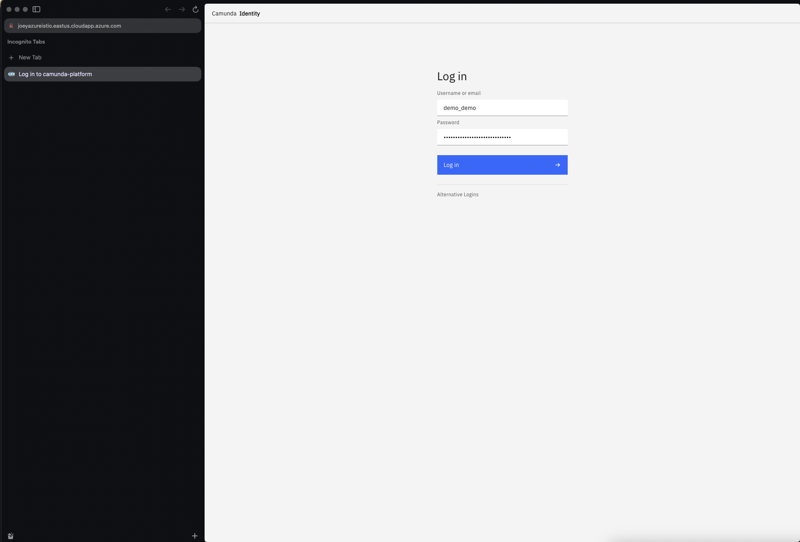
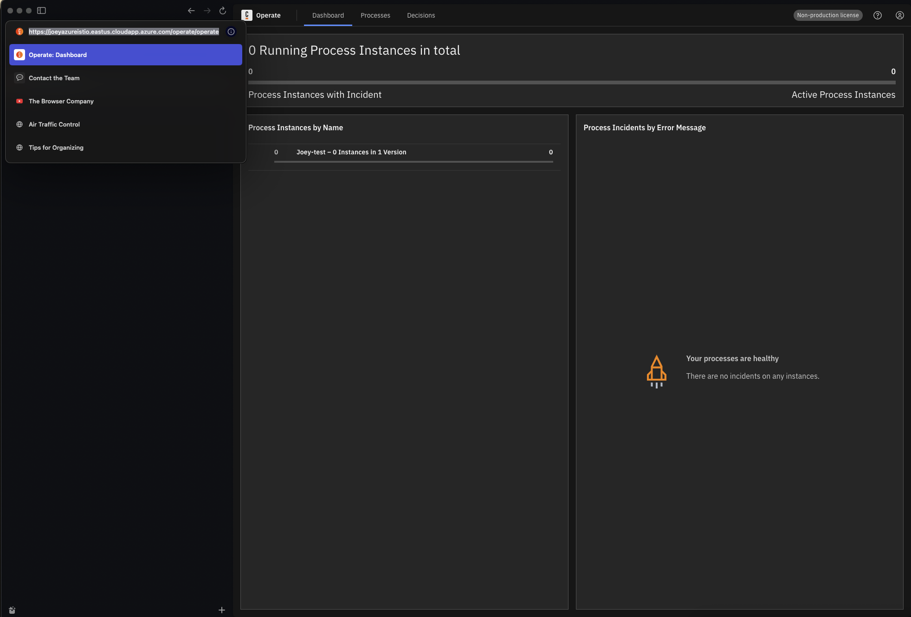
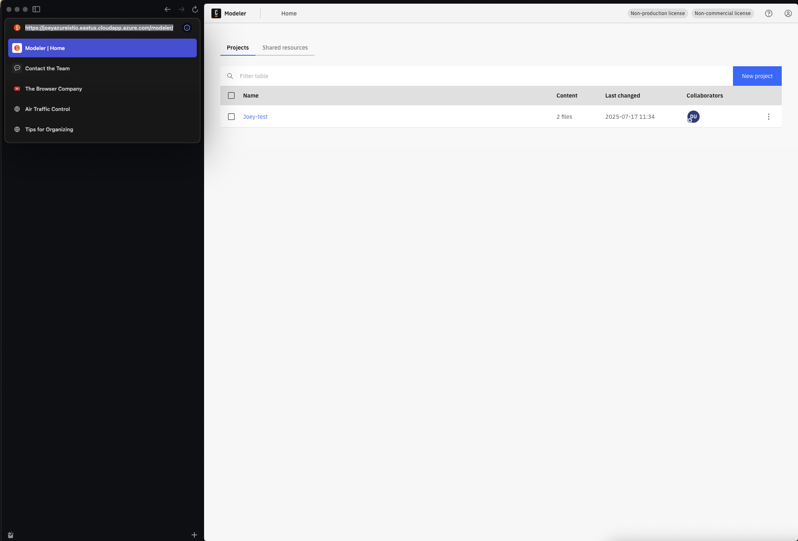
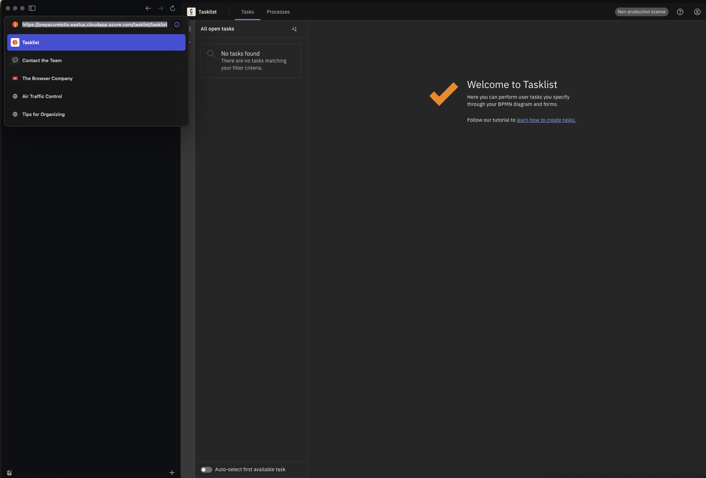
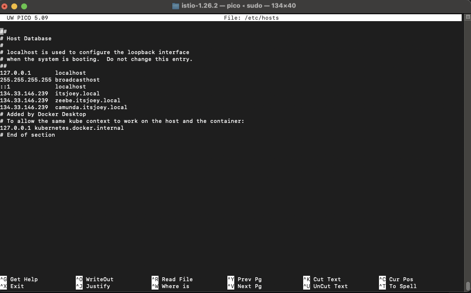

# Camunda Istio Integration
Integrate Istio service mesh with Camunda Platform 8 in a Kubernetes (AKS) environment.

# Specification

This project aims to expose the full Camunda Platform 8 stack behind an Istio ingress gateway. You'll route HTTP and gRPC traffic through Istio, enable TLS with Let's Encrypt, and validate end-to-end access to Operate, Tasklist, Identity, and Zeebe Gateway.

The goal is to securely access Camunda services through a unified HTTPS endpoint, and enable Zeebe model deployment via gRPC over port 26500.

# Tooling

This setup leverages the following tools:

* **Istio** - Service mesh layer for routing, TLS termination, and protocol management
* **Cert-Manager** - Automatic TLS certificate provisioning using Let’s Encrypt
* **Camunda Platform 8 Helm Chart** - Self-managed deployment of the Camunda components
* **Azure Kubernetes Service (AKS)** - Managed Kubernetes cluster
* **Camunda Modeler** - For model deployment via gRPC
* **kubectl + Helm** - Kubernetes management and deployment

# Prerequisite
Make sure to have a standard Kubernetes cluster. 

For help setup your Kubernetes cluster, please go to:
* [**Helm profile**](https://github.com/camunda-community-hub/camunda-8-helm-profiles)
* [**Camunda-Platform-local**](https://github.com/camunda/camunda-platform-local)

In this challenge I will be using Azure Kubernetes.
# Methodology

## 1. Provision CRD 
Install CRD command in cluster:

```bash
kubectl get crd gateways.gateway.networking.k8s.io &> /dev/null || \
kubectl apply -f https://github.com/kubernetes-sigs/gateway-api/releases/download/v1.3.0-rc.1/standard-install.yaml
```

## 2. Install Istio
Install ```istioctl```, this will be our command line tool and offer diagnose settings.

On Mac OS just run ```brew install istioctl```

Once ```istioctl``` installed, run command:
```bash
istioctl install --set profile="default" -y
```

This will install a simple default istio profile which contains the istio gateway and istiod
The Gateway is our proxy while the istiod is the backend (Reference: [Introducing istiod: simplifying the control plane
](https://istio.io/latest/blog/2020/istiod/))

## 3. Verify Istio IngressGateway 
Verify Istio IngressGateway  is Running and Has External IP

```bash
kubectl get pods -n istio-system -l app=istio-ingressgateway
kubectl get svc istio-ingressgateway -n istio-system
```
### 🖼️ Example Screenshot:

## 4. ✅ DNS Configuration (Azure Only)

> ⚠️ **Warning**: These instructions are specific to **Microsoft Azure**.

To set up DNS for your Istio Gateway:

1. Go to the [Azure Portal](https://portal.azure.com/).
2. Navigate to **Resource Groups**.
3. Select the resource group associated with your AKS cluster. (Usually started with MC_***,```MC_joey_k8s-rg_joey_k8s_eastus```)

4. Locate the ```Public IP address``` that has your ```External IP```.
   
   
5. Click on ```Configuration```, under ```DNS name label(optional)```, provide a custom name.
   This will create a public DNS name like ```yourlabel.region.cloudapp.azure.com```
   
   ✅ Congratulations! Your DNS is now created and ready.

## 5. Cert Manager
Install a cert manager (version can be difference depending on your needs)

```bash
helm repo update
helm upgrade --install cert-manager jetstack/cert-manager \
        --namespace cert-manager \
        --create-namespace \
        --version v1.17.2 \
        --set crds.enabled=true
```
Apply a Certificate for your [Certificate](solution/istio-cert.yaml)

```yaml
apiVersion: cert-manager.io/v1
kind: Certificate
metadata:
  name: itsjoey-cert
  namespace: istio-system # Ensure this is the same namespace as your Istio Ingress Gateway
spec:
  secretName: itsjoey-cert # <--- CHANGE THIS LINE to match your Gateway's credentialName
  commonName: joeyazureistio.eastus.cloudapp.azure.com
  dnsNames:
    - joeyazureistio.eastus.cloudapp.azure.com
    - www.joeyazureistio.eastus.cloudapp.azure.com
  issuerRef:
    name: letsencrypt-prod-01
    kind: ClusterIssuer
  duration: 2160h  # 90 days
  renewBefore: 360h  # 15 days
```
## 5.1 Install TLS Certificate (Optional)

This is optional if you want to opt for self-signed
```bash
openssl req -x509 -nodes -days 365 \
  -newkey rsa:2048 \
  -keyout tls.key \
  -out tls.crt \
  -subj "/CN=camunda.itsjoey.local" \
  -addext "subjectAltName=DNS:camunda.itsjoey.local,DNS:zeebe.itsjoey.local"
```
This will generate: 
* tls.crt (certificate)
* tls.key (private key)

Now apply it to your cluster:
```bash
kubectl create secret tls tls-secret \
  --cert=tls.crt \
  --key=tls.key \
  -n camunda-platform
```
You should now see:
```bash
kubectl get secret tls-secret -n camunda-platform
```
✅ If it's there, TLS will now work for the gateway!

## 6. Prepare cluster for Camunda
Create a namespace for Camunda cluster:
```bash
kubectl create ns camunda-platform
```
Enables automatic Istio sidecar injection for all pods created in the camunda-platform namespace.
```bash
kubectl label namespace camunda-platform istio-injection=enabled
```


## 7. Camunda installation
> ⚠️ **Warning**: Please review file and adjust [camunda-values.yaml](solution/camunda-values.yaml), 
[camunda-virtualservices.yaml](solution/camunda-virtualservices.yaml), 
[destinationrule.yaml](solution/destinationrule.yaml), [istio-gateway.yaml](solution/istio-gateway.yaml)
 
Do the used to know helm install with your hostname and camunda.
This will be used as our [camunda-values.yaml](solution/camunda-values.yaml)
```bash
kubectl apply -f camunda-secrets.yaml
helm upgrade --install camunda camunda/camunda-platform -f camunda-values-istio.yaml  -n camunda-platform --version 12.0.2
```

## 8. Gateway, VirtualService and DestinationRule
Looking into following istio documentation will explain everything you will need for the [gateway](https://istio.io/latest/docs/reference/config/networking/gateway/) and [service](https://istio.io/latest/docs/reference/config/networking/virtual-service/)

> TLDR: In Istio, the Gateway Custom Resource Definition (CRD) is a Kubernetes resource that defines how external traffic should enter the service mesh. The Gateway CRD allows users to configure and manage the behavior of the Istio Ingress Gateway. A VirtualService is a Custom Resource Definition (CRD) that allows users to configure how network traffic is routed to different services within the service mesh.

Apply the istio Gateway, VirtualService and DestionRule
```bash
kubectl apply -f istio-gateway.yaml
kubectl apply -f camunda-virtualservices.yaml
kubectl apply -f destinationrule.yaml
```

Example of Istio Gateway:
```yaml
apiVersion: networking.istio.io/v1beta1
kind: Gateway
metadata:
  name: camunda-gateway
  annotations:
    networking.istio.io/managed-certificates: "true"
    cert-manager.io/cluster-issuer: letsencrypt-prod-1
  namespace: camunda-platform
spec:
  selector:
    istio: ingressgateway
  servers:
    # HTTP server for easy testing without TLS
    - port:
        number: 80
        name: http
        protocol: HTTP
      hosts:
        - "joeyazureistio.eastus.cloudapp.azure.com"
    # HTTPS server with TLS
    - port:
        number: 443
        name: https
        protocol: HTTPS
      tls:
        mode: SIMPLE
        credentialName: tls-secret
      hosts:
        - "joeyazureistio.eastus.cloudapp.azure.com"
```
Example of VirtualService:
```yaml
apiVersion: networking.istio.io/v1
kind: VirtualService
metadata:
  name: camunda-virtualservice
  namespace: camunda-platform
spec:
  hosts:
    - joeyazureistio.eastus.cloudapp.azure.com
  gateways:
    - camunda-gateway
  http:
    - name: "console-service"
      match:
        - uri:
            prefix: "/console"
      route:
        - destination:
            host: camunda-console
            port:
              number: 80
      #same with other services
```
Example of DestinationRule:
```yaml
---
# https://istio.io/latest/docs/reference/config/networking/destination-rule/
apiVersion: networking.istio.io/v1beta1
kind: DestinationRule
metadata:
  name: camunda-zeebe-gateway-dr
  namespace: camunda-platform
spec:
  host: camunda-zeebe-gateway.camunda-platform.svc.cluster.local
  trafficPolicy:
    portLevelSettings:
      - port:
          number: 26500
        connectionPool:
          http:
            h2UpgradePolicy: UPGRADE
            # https://istio.io/latest/docs/reference/config/networking/destination-rule/#ConnectionPoolSettings-HTTPSettings-H2UpgradePolicy
```
# 9 Goal Screenshots
### 🖼️ Identity Screenshot:

### 🖼️ Operate Screenshot:

### 🖼️ Modeler Screenshot:

### 🖼️ Tasklist Screenshot:

# Troubleshooting
1. If you get a 404 error, on Mac you can add the external IP address to your Local Self-signed.
```bash
sudo nano /etc/hosts
```
Provide password of your PC login.
Add ```External IP Address``` and your ```self.host```


2. If whatever reason appear that your application does not do the correct redirect and it appear http, because of keycloak, please force keycloak to use https:

```bash
  extraEnvVars:
  - name: KC_HOSTNAME
    value: "https://itsphmn.com/auth"
  - name: KC_PROXY_HEADERS
    value: "xforwarded"
  - name: KC_HOSTNAME_STRICT
    value: "true"
```

3. Debugging Gateway
```bash
istioctl proxy-config log istio-ingressgateway-d445bb446-2mcwl.istio-system --level http:debug
istioctl proxy-config log istio-ingressgateway-d445bb446-bfrsb.istio-system --level http2:debug
```
```bash
kubectl exec -it istio-ingressgateway-d445bb446-bfrsb -n istio-system -c istio-proxy -- curl http://localhost:15000/config_dump

kubectl exec -it istio-ingressgateway-d445bb446-bfrsb -n istio-system -c istio-proxy -- curl http://localhost:15000/clusters

istioctl proxy-status

istioctl proxy-config route camunda-zeebe-gateway-5fc4bbc57b-7d4c4.camunda-platform

istioctl proxy-config listener camunda-zeebe-gateway-5fc4bbc57b-7d4c4.camunda-platform

istioctl proxy-config cluster camunda-zeebe-gateway-5fc4bbc57b-7d4c4.camunda-platform

istioctl proxy-config rbac camunda-zeebe-gateway-5fc4bbc57b-7d4c4.camunda-platform
```

# Resource
* **c8-kpt-kustomize**: https://github.com/camunda-community-hub/c8-kpt-kustomize/blob/main/docs/shared-services.md
* **Minh's Istio sample**: https://github.com/camunda-consulting/c8-minh-playground/tree/main/istio-sample
* **HTTP gateway protocol selection**: https://istio.io/latest/docs/ops/configuration/traffic-management/protocol-selection/?utm_source=chatgpt.com#http-gateway-protocol-selection
* **Destination Rule**:  https://istio.io/latest/docs/reference/config/networking/destination-rule/
