# Solution


# 1. Create a process instance synchronously

The perimeter is the following:

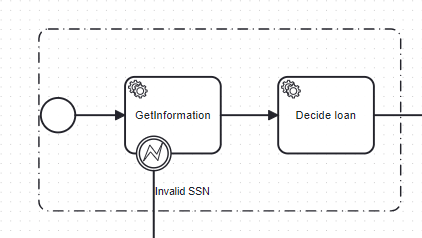

The application creates the process instance, and want to execute the two first tasks, to return to the user a status (loan accepted, rejected, in review). 
After, the process instance will do different steps, but the application does not need to wait. 


# 1.1 Application review

Under the class ServiceLoan, search for the cartouche

```
    /* ******************************************************************** */
    /*                                                                      */
    /*  Game start here                                                     */
    /*                                                                      */
    /*  Rewrite this method to synchronously run the call.                  */
    /* As a solution, withResultC8Impl and withResultAPIImpl implement the  */
    /* code                                                                 */
    /* ******************************************************************** */
```

Methods to write are declared after:


# 1.2 Using the Zeebe withResult API

Use the Zeebe API with Result API:

```java
 /**
 * Using the withResult() API
 * @param loan to populate
 */
protected void createProcessInstanceSynchronousExecution(Loan loan){
    try {
        ProcessInstanceResult loanApplication = zeebeClient.newCreateInstanceCommand()
                .bpmnProcessId("LoanApplication")
                .latestVersion()
                .variables(loan.getMap())
                .withResult()
                .requestTimeout(Duration.ofSeconds(30))
                .send().join();
        loan.loanId = (String) loanApplication.getVariablesAsMap().get("loanId");
        loan.loanAcceptance=(String) loanApplication.getVariablesAsMap().get("loanAcceptance");
        loan.age=(Integer) loanApplication.getVariablesAsMap().get("age");
        loan.creditScore=(Integer) loanApplication.getVariablesAsMap().get("creditScore");
        loan.messageCustomer=(String) loanApplication.getVariablesAsMap().get("messageCustomer");
        loan.dateAcceptance = new Date();
        loan.status= Loan.STATUSLOAN.COMPLETED;
    }catch (Exception e) {
        logger.error("createProcessInstanceWithResult with error ", e);
        loan.status= Loan.STATUSLOAN.NO_COMPLETION;
        loan.info="Can't get Result ProcessInstance";
    }
}
```
Note: this implementation is saved in the class `WithResultC8Impl.java`
So, the call in the class `serviceLoan.java` can be

```java
    public void createProcessInstanceSynchronousExecution(Loan loan) {
        withResultC8Impl.createProcessInstanceWithResult(loan);
    }
```

## 1.3 Rebuild the application

Rebuild the application. Access it on application under http://localhost:8585`

## 1.3 Checks

Run the application.

Let's create a job with values 

| Amount  | SSN         |  
|--------:|-------------|
|    3400 | 114-23-1850 |

Perfect, the application returns immediately the status, and the loan is accepted.

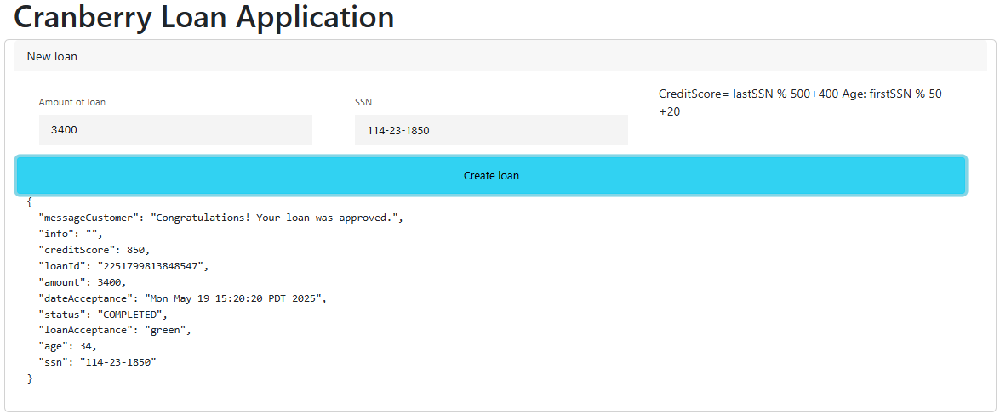

Let's try now with 

| Amount  | SSN         |  
|--------:|-------------|
|    3400 | 114-23-1242 |

Now, the process runs, and the loan is rejected.

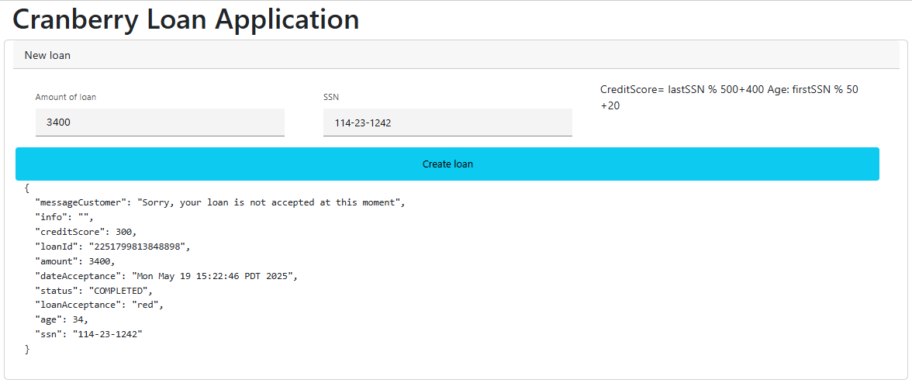

Let's try now with 

| Amount  | SSN         |  
|--------:|-------------|
|    3400 | 114-23-1515 |


Now, the application can't get a result. Even the loanId is not returned.

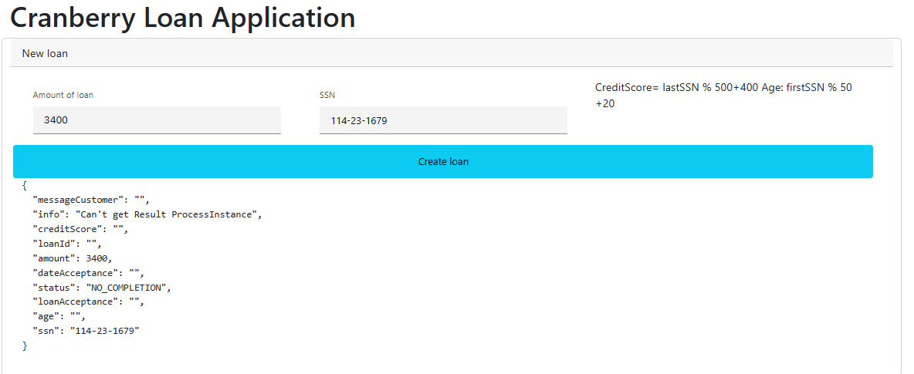

The reason? The process instance is moved to the review task.

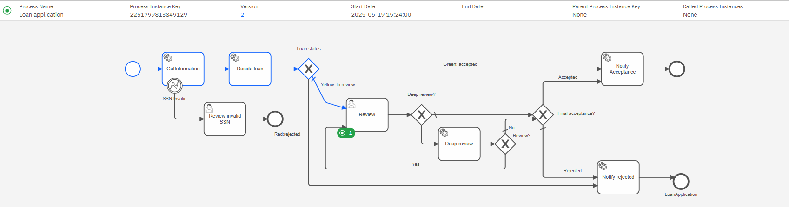


Try now to give the amount `13400` for the SSN `114-23-1830`.

| Amount | SSN          |  
|-------:|--------------|
|  13400 | 114-23-1830  |

We got the same answer:

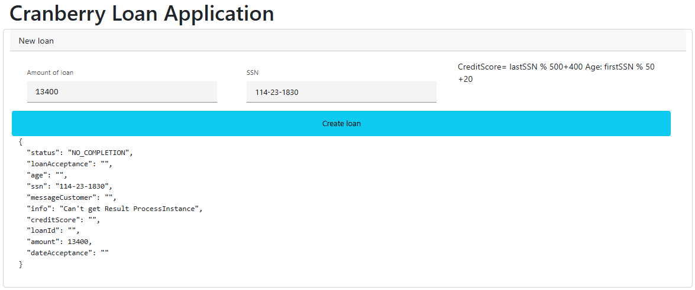

But this time, the process goes normally to the end, and the loan is accepted.

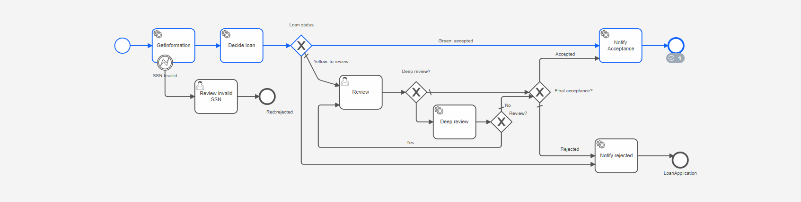

The reason is that the process takes longer than 8 seconds. This is acceptable; however, in such cases, the application should return the created loanId along with the message: 'Need time to process'

In conclusion

| Use case  |   Amount | SSN         | Status                                 | 
|-----------|---------:|-------------|----------------------------------------|
| Accepted  |     3400 | 114-23-1850 | Correct                                |
| Rejected  |     3400 | 114-23-1242 | Correct                                |
| Review    |     3400 | 114-23-1515 | InCorrect: the loanId is not returned  |
| Long time |    13400 | 114-23-1850 | InCorrect: the loanId is not returned  |
| Bad SSN   |     3400 | 3-2-1       | InCorrect: the loanId is not returned  | 


## 1.4 Using the Community WithResult API - Preparation

Add in the pom.xml the link to the library

```xml
    <dependency>
        <groupId>org.camunda.executewithresult</groupId>
        <artifactId>execute-with-result</artifactId>
        <version>2.1.0</version>
  </dependency>
```


### 1.5 Application

Use the API call

```java
 protected void createProcessInstanceSynchronousExecution(Loan loan) {
        try {
            ExecuteWithResult executeWithResult=withResultAPI.processInstanceWithResult("LoanApplication",
                    loan.getMap(),  "cranberry-with-result",Duration.ofSeconds(5)).join();


            loan.loanId = (String) executeWithResult.processVariables.get("loanId");
            loan.loanAcceptance = (String) executeWithResult.processVariables.get("loanAcceptance");
            loan.age = (Integer) executeWithResult.processVariables.get("age");
            loan.creditScore = (Integer) executeWithResult.processVariables.get("creditScore");
            loan.messageCustomer = (String) executeWithResult.processVariables.get("messageCustomer");
            loan.dateAcceptance = new Date();
            loan.status = executeWithResult.timeOut? Loan.STATUSLOAN.IN_PROGRESS : Loan.STATUSLOAN.COMPLETED;
        } catch (Exception e) {
            logger.error("createProcessInstanceWithResult with error ", e);
            loan.status = Loan.STATUSLOAN.NO_COMPLETION;
            loan.info = "Can't get Result ProcessInstance";
        }
    }
```


## 1.6 Process

* in the `DecideLoan`, add an End "execution listeners", type is `topicEndResult`, and it's must be a FEEL expression.


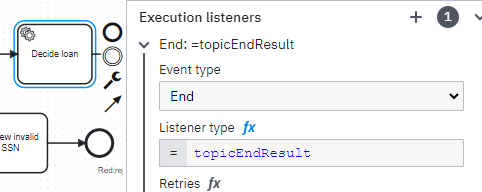


* in the `Review Invalid SSN`, add a Start "execution listeners", with the topic `topicEndResult`, and it's must be a FEEL expression. 

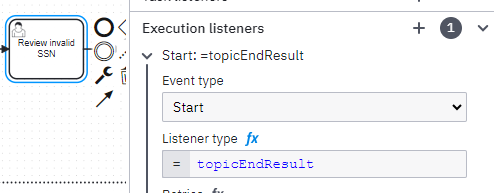

## 1.7 Checks

Check with

| Amount  | SSN         |  
|--------:|-------------|
|    3400 | 114-23-1515 |


The result contains the loanId and the loanAcceptance: `yellow`

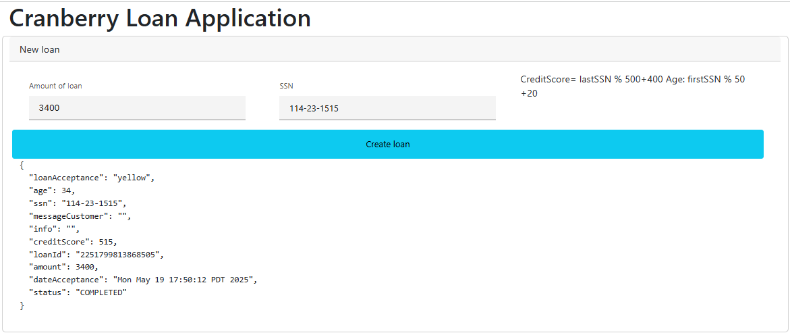

Check with 

| Amount | SSN          |  
|-------:|--------------|
| 13400  | 114-23-1850  |

This time, if the decision is not finish in the 5 seconds, we got an answer, with the LoanId

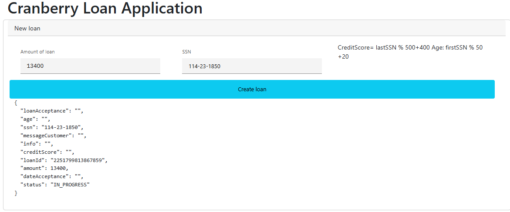

In conclusion

| Use case  |   Amount | SSN         | Status    | 
|-----------|---------:|-------------|-----------|
| Accepted  |     3400 | 114-23-1850 | Correct   |
| Rejected  |     3400 | 114-23-1242 | Correct   |
| Review    |     3400 | 114-23-1515 | Correct   |
| Long time |    13400 | 114-23-1850 | Correct   |
| Bad SSN   |     3400 | 3-2-1       | Correct   | 


# 2 Execute user task


Let's check the User Task now. On the review, the application wants to execute some task and immediately give an answer to the user.

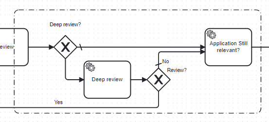

The C8 API does not provide any solution for this use case. The WithResultAPI is the only solution.


## 2.1 Application

Check the method `executeUserTaskSynchronousExecution` in `ServiceLoan` and write the content:   

```
    private Map<String, Object> executeUserTaskSynchronousExecution(Loan loan, Task task, boolean decision) {
        Map variables = new HashMap<>();
        variables.put("deepReview", Boolean.FALSE);
        variables.put("reviewDecision", decision);
        try {
            ExecuteWithResult executeWithResult = (ExecuteWithResult) withResultAPI.executeTaskWithResult(task,
                    true, "demo", variables, "cranberry-with-result", Duration.ofSeconds(5)).join();
            if (! executeWithResult.timeOut) {
                return executeWithResult.processVariables;
            }
            else {
                return Map.of("status", "execution in progress");
            }
        } catch (Exception e) {
            logger.error("executeUserTaskWithResult with error ", e);
            return Map.of("status", "task execution error");
        }

    }
```

### 2.2 Process

Update the process: add an Execution Listeners, "End", with the type `topicEndResult` 

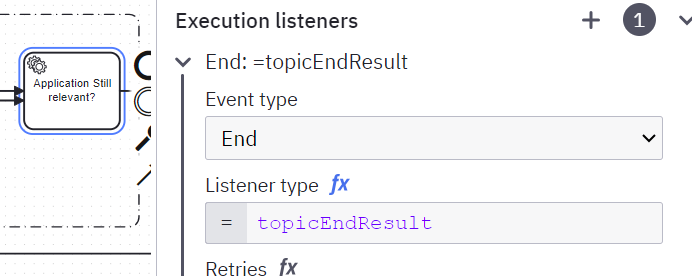

### 2.3 Checks

Check the application now.

First, create a loan with review, using these values


| Use case  |   Amount | SSN         |  
|-----------|---------:|-------------|
| Review    |     3400 | 114-23-1515 |

The loan is ready for the review

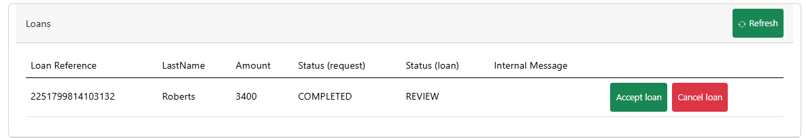

Click on the Accept button. The activity checks the current status of the loan, and return a random message.
The message is visible in the `Internal Message`colum : `Reviewer Approved Internal decision:Disbursed`.
The random part is the internal decision.


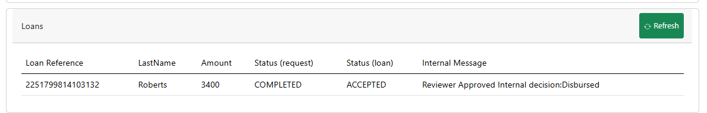

# 3 Publish message

The perimeter for the publication message is to execute the first service task, and return values calculated here.

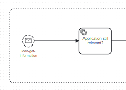

## 3.1 Application

Set this application


```java
 public Map<String,Object> executeMessageSynchronouslyExecution(String ssn) {
        try {
            ExecuteWithResult executeWithResult = (ExecuteWithResult) withResultAPI.publishNewMessageWithResult(
                    "loan-get-information",
                    ssn,
                    Duration.ofMinutes(1), // loan must be here
                    Collections.emptyMap(),
                    "cranberry-with-result",
                    Duration.ofSeconds(5)).join();
            if (! executeWithResult.timeOut) {
                return executeWithResult.processVariables;
            }
            else {
                return Map.of("status", "No answer");
            }
        } catch (Exception e) {
            logger.error("executeMessageWithResult with error ", e);
            return Map.of("status", "Publish message with error");
        }

    }
```

## 3.2 Process

Add an End listener

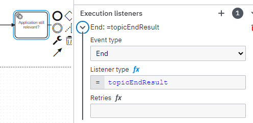


## 3.3 Check

Create a loan to be review, for example with this values

| Amount  | SSN          |  
|--------:|--------------|
|    3400 | 114-23-1515  |

Now, in the Load information tab, set the SSN `114-23-1515` . The application must return a status, with a random message and the current time.

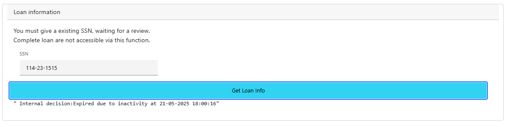

