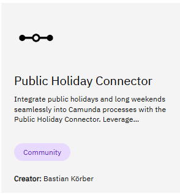
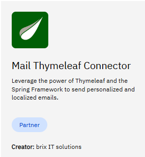

# Cherry Runtime

Connectors can be deployed in the Cherry Runtime

# Public Holiday

Marketplace: [Public Holiday Connector](https://marketplace.camunda.com/en-US/apps/419279/public-holiday-connector)

This connector is available on the Community. To deploy it on Cherry

## Automatic deployment
1/ Download the JAR file

2/ Create a config map

3/ Specify the configmap in parameter

4/ start CherryRuntime

## Via the UI
1/ Download the JAR file

2/ Create a public IP Address, or kubectl the port

3/ Via the UI, deploy the JAR file

# Office to PDF

Marketplace: [office to PDF](https://marketplace.camunda.com/en-US/apps/427521/office-to-pdf)

Exactly the same way as Public holiday.

# Email Thymeleaf

Marketplace: [mail Thymeleaf Connector](https://marketplace.camunda.com/en-US/apps/430240/mail-thymeleaf-connector)

Exactly the same way as Public holiday.

