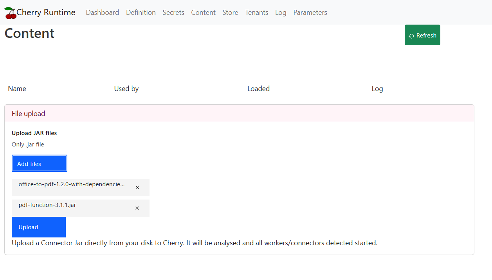
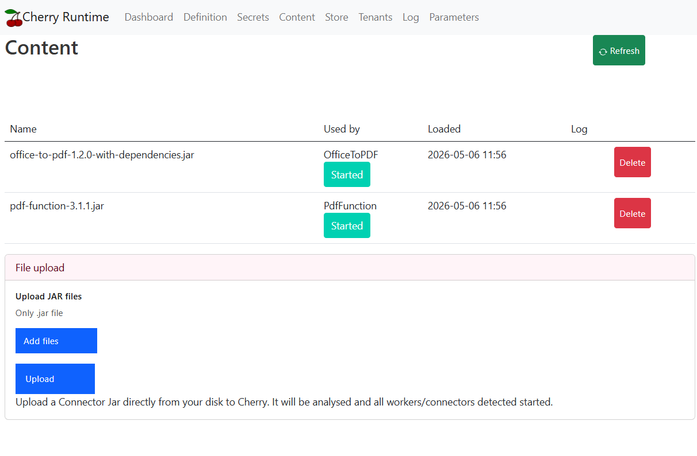

# Cherry Runtime

Connectors can be deployed in the Cherry Runtime

# Public Holiday

Marketplace: [Public Holiday Connector](https://marketplace.camunda.com/en-US/apps/419279/public-holiday-connector)


This connector is available on the Community, and use the Rest API connector. This connector is deploy with the Connector Runtime. There is nothing special to do here.


# Office to PDF

Marketplace: [office to PDF](https://marketplace.camunda.com/en-US/apps/427521/office-to-pdf)


## Automatic deployment
Marketplace: [office to PDF](https://marketplace.camunda.com/en-US/apps/427521/office-to-pdf)


Looking in the release section on the GitHub, a JAR file is present
https://github.com/camunda-community-hub/camunda-8-connector-officetopdf/releases

The release 1.1 exist, and the JAR file can be uploaded at https://github.com/camunda-community-hub/camunda-8-connector-officetopdf/releases/download/1.1.0/office-to-pdf-1.1.0-with-dependencies.jar

The principle is to add an initContainer in the connectorRuntime. The initContainer will upload the JAR file on the local directory

This folder is monitored at startup by the connectorRuntime, and any JAR is loaded, being introspected. and any connector present in the JAR are started.

Visit https://docs.camunda.io/docs/8.6/self-managed/setup/guides/running-custom-connectors/#modify-connectors-config

```yaml
      initContainers:
        - name: download-connectors
          image: curlimages/curl:latest
          command: ["sh", "-c"]
          args:
              - >
                set -eux;
                curl -L -o /usr/local/cherry/upload/office-to-pdf.jar
                https://github.com/camunda-community-hub/camunda-8-connector-officetopdf/releases/download/1.1.0/office-to-pdf-1.1.0-with-dependencies.jar
                &&
                curl -L -o /usr/local/cherry/upload/pdf-function.jar
                https://github.com/camunda-community-hub/camunda-8-connector-pdf/releases/download/3.1.3/pdf-function-3.1.3.jar
                &&
                ls -al /usr/local/cherry/upload

          volumeMounts:
            - name: custom-connectors
              mountPath: /usr/local/cherry/upload
```


Specify in the environment the path
```yaml
      containers:
        - name: cherry-runtime-container
          image: ghcr.io/camunda-community-hub/zeebe-cherry-runtime:latest
          ports:
            - containerPort: 8080
          env:
            - name: CHERRY_CONNECTORSLIB_UPLOADPATH
              value: /usr/local/cherry/upload
            - name:  CHERRY_CONNECTORSLIB_CLASSLOADERPATH
              value: /usr/local/cherry/classloader

```

and add the volum mount
```yaml
      volumes:
        - name: custom-connectors
          emptyDir: {}

```


The complete value.yaml is

```yaml
apiVersion: apps/v1
kind: Deployment
metadata:
  name: cherry-runtime-deployment
spec:
  replicas: 1
  selector:
    matchLabels:
      app: cherry-runtime
  template:
    metadata:
      labels:
        app: cherry-runtime
    spec:
      initContainers:
        - name: download-connectors
          image: curlimages/curl:latest
          command: ["sh", "-c"]
          args:
              - >
                set -eux;
                curl -L -o /usr/local/cherry/upload/office-to-pdf.jar
                https://github.com/camunda-community-hub/camunda-8-connector-officetopdf/releases/download/1.1.0/office-to-pdf-1.1.0-with-dependencies.jar
                &&
                curl -L -o /usr/local/cherry/upload/pdf-function.jar
                https://github.com/camunda-community-hub/camunda-8-connector-pdf/releases/download/3.1.3/pdf-function-3.1.3.jar
                &&
                ls -al /usr/local/cherry/upload

          volumeMounts:
            - name: custom-connectors
              mountPath: /usr/local/cherry/upload
      containers:
        - name: cherry-runtime-container
          image: ghcr.io/camunda-community-hub/zeebe-cherry-runtime:latest
          ports:
            - containerPort: 8080
          env:
            - name: CHERRY_CONNECTORSLIB_UPLOADPATH
              value: /usr/local/cherry/upload
            - name:  CHERRY_CONNECTORSLIB_CLASSLOADERPATH
              value: /usr/local/cherry/classloader
            - name: CAMUNDA_CLIENT_GRPC-ADDRESS
              value: http://camunda-zeebe-gateway:26500
            - name: CAMUNDA_CLIENT_REST-ADDRESS
              value: http://camunda-zeebe-gateway:8080
            - name: CAMUNDA_CONNECTOR_INBOUND_ENABLED
              value: "false"
          volumeMounts:
            - name: custom-connectors
              mountPath: /usr/local/cherry/upload

      volumes:
        - name: custom-connectors
          emptyDir: {}

```


## Via the UI
1/ Download the JAR file as see previously

2/ Create a public IP Address, or kubectl the port 

```shell
kubectl port-forward svc/cherry-runtime-service 9081:9081 -n camunda
```

3/ Via the UI, deploy the JAR file



Files are uploaded, and connectors has started
