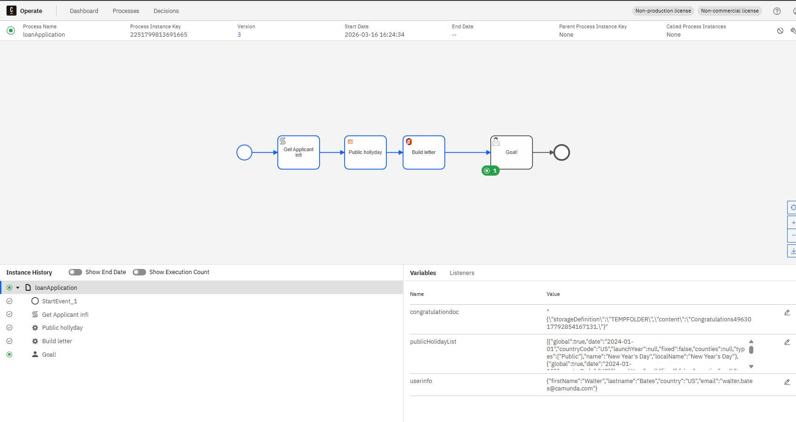

# Using the Connector Runtime

# Introduction
The connector runtime is provided with the Helm Chart, and there is no configuration to specify.

How to connect the three connectors inside?

# Public Holiday
This connector is a template to the REST connector, which is included in the connector runtime. There is no deployment to do.

Marketplace: [Public Holiday Connector](https://marketplace.camunda.com/en-US/apps/419279/public-holiday-connector)

  

# Office to PDF

Marketplace: [office to PDF](https://marketplace.camunda.com/en-US/apps/427521/office-to-pdf)

  

Looking in the realease section on the GitHub, a JAR file is present
https://github.com/camunda-community-hub/camunda-8-connector-officetopdf/releases

The release 1.1 exist, and the JAR file can be uploaded at https://github.com/camunda-community-hub/camunda-8-connector-officetopdf/releases/download/1.1.0/office-to-pdf-1.1.0-with-dependencies.jar

The principle is to add an initContainer in the connectorRuntime. The initContainer will upload the JAR file on the local directory

This folder is monitored at startup by the connectorRuntime, and any JAR is loaded, being introspected. and any connector present in the JAR are started.

Visit https://docs.camunda.io/docs/8.6/self-managed/setup/guides/running-custom-connectors/#modify-connectors-config

```yaml
connectors:
  initContainers:
    - name: office-to-pdf-downloader
      image: appropriate/curl
      securityContext:
        runAsUser: 1000
        runAsNonRoot: true      
      args:
        - "-L"
        - "-o"
        - "/opt/custom/office-to-pdf-1.1.0-with-dependencies.jar"
        - "https://github.com/camunda-community-hub/camunda-8-connector-officetopdf/releases/download/1.1.0/office-to-pdf-1.1.0-with-dependencies.jar"
      volumeMounts:
        - name: custom-connectors
          mountPath: /opt/custom

  extraVolumes:
    - name: custom-connectors
      emptyDir: {}

  extraVolumeMounts:
    - name: custom-connectors
      mountPath: /opt/custom/office-to-pdf-1.1.0-with-dependencies.jar
      subPath: office-to-pdf-1.1.0-with-dependencies.jar
```

# Execute it and verify the result in Operate

Deploy the process LoanApplication, and create a process instance.

