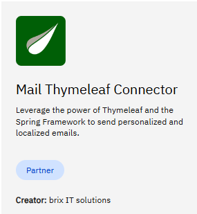

# Using the Connector Runtime

# Introduction
The connector runtime is provided with the Helm Chart, and there is no configuration to specify.

How to connect the three connectors inside?

# Public Holiday
This connector is a template to the REST connector, which is included in the connector runtime. There is no deployment to do.

Marketplace: [Public Holiday Connector](https://marketplace.camunda.com/en-US/apps/419279/public-holiday-connector)

  

# Office to PDF

Marketplace: [office to PDF](https://marketplace.camunda.com/en-US/apps/427521/office-to-pdf)

  

ToDo: how to deploy this in the connectorRuntime.
Connector runtime scan a directory at startup, and if the JAR is deployed in this path, it will be loaded.

1/ the path is not documented, must be search

2/ What is the best way to mount this path? Via a configMap maybe?

# Email Thymeleaf

Marketplace: [mail Thymeleaf Connector](https://marketplace.camunda.com/en-US/apps/430240/mail-thymeleaf-connector)

The way to use the connector is not documented, so how to deploy it and how to use it?

