# Entra ID

This section is common on each installation (8.7 or 8.8).

You need to collect at the end of the installation these parameters


| Name                        | Description                                             |
|-----------------------------|---------------------------------------------------------| 
| Microsoft Entra tenant ID   | Tenant ID in EntraId                                    |                                          
| Client ID                   | Objectid of the Application registration                |          
| Client secret               | Client Secret associate to the Application Registration |
| ObjectId of the first user  | To access the first user to access                      |
| ObjectId of the first group | To access, a groupd may be used instead of a user       | 


# Use an existing EntraId, or create a new one - check

The solution is based on the fact an EntraId already exists, with a Tenant
In your AzureID.

1. Access the Entrat ID


2. Click on `manage tenants`.

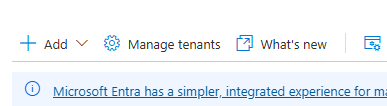

3. A tenant is present.

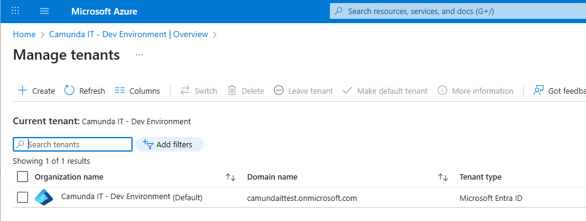

4. Click on it

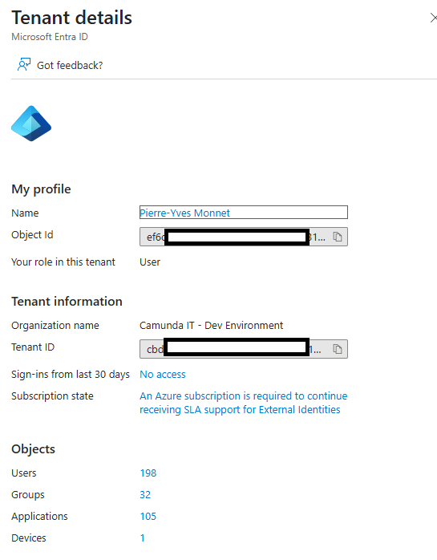

5. Get the tenantId

| Name      | Value      |
|-----------|------------| 
| TenantId  | cbd...a9f  |

Click on Users, and identify one user (for example, Pierre-Yves Monnet will be my user1)

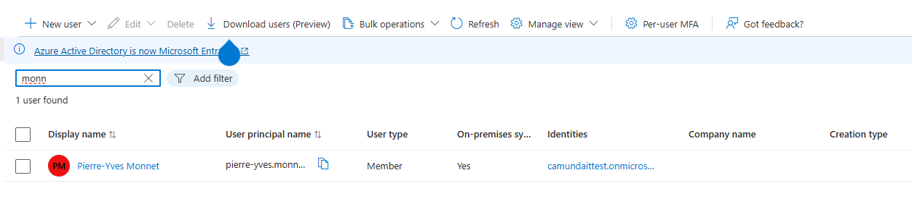

Check if the user is part of a group.
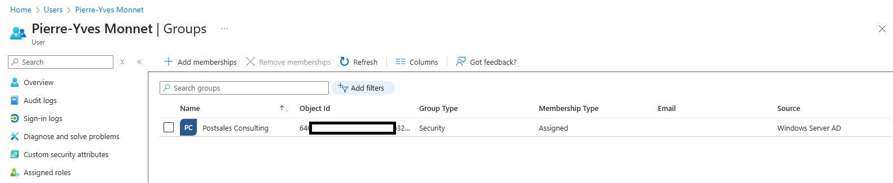

User information:

| Name                | Value                        |
|---------------------|------------------------------| 
| User                | Pierre-Yves Monnet           |
| user Principal Name | pierre-yves.monnet@......com | 
| Group membership    | Postsales Consulting         | 

> The principal name is the login. The password, for a Camunda person, will be the Okta password.


# Get user information

Search for users
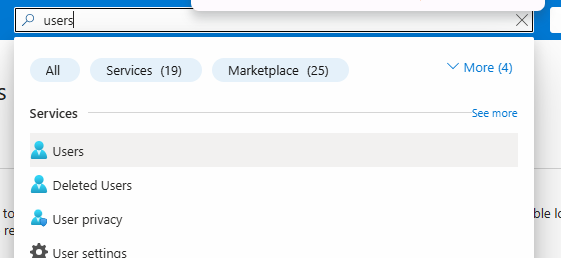

Search for your name

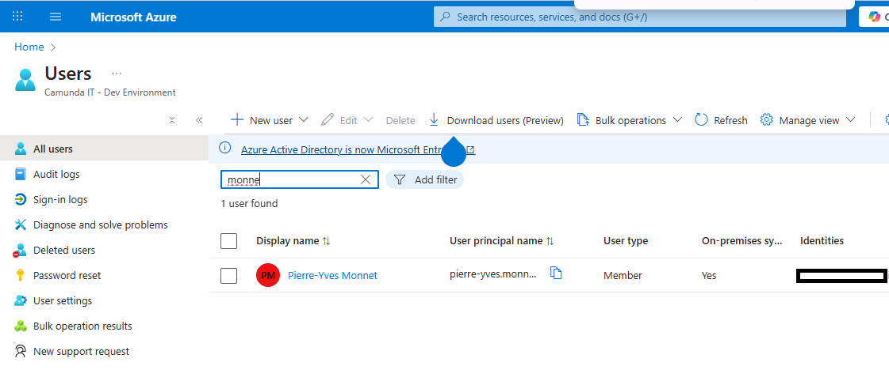

Access the user

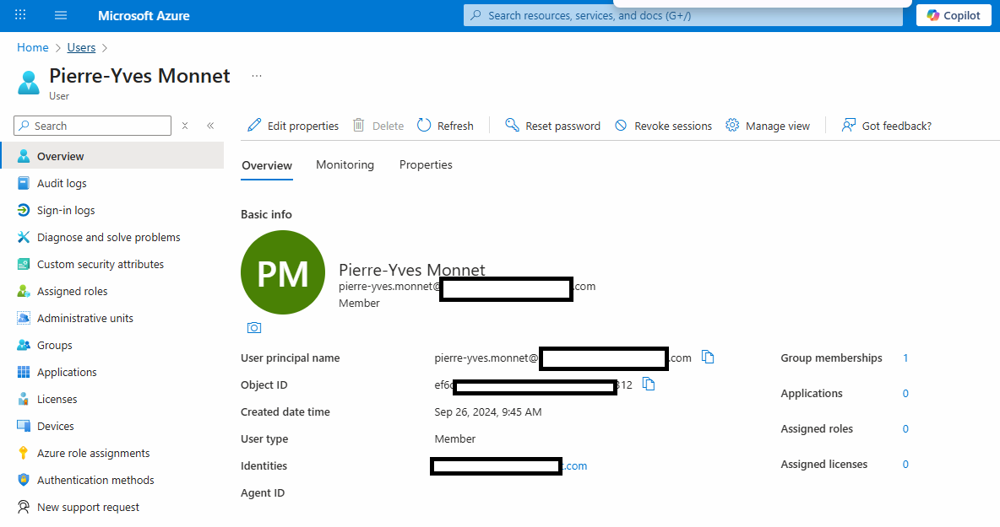

| Name         | Value      |
|--------------|------------|
| UserObjectId | ef6...312  |

> Note: it's possible to configure the application to accept not a user as initial connection, but a group. Then, this access is needed to access identity and configure all other authorization. 


# Application Registration

## Create the application registration

1. Go to App registration

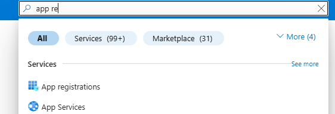

2. Click on `New registration`

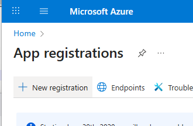

3. Give a name like `pierre-yves-c8-entraid`

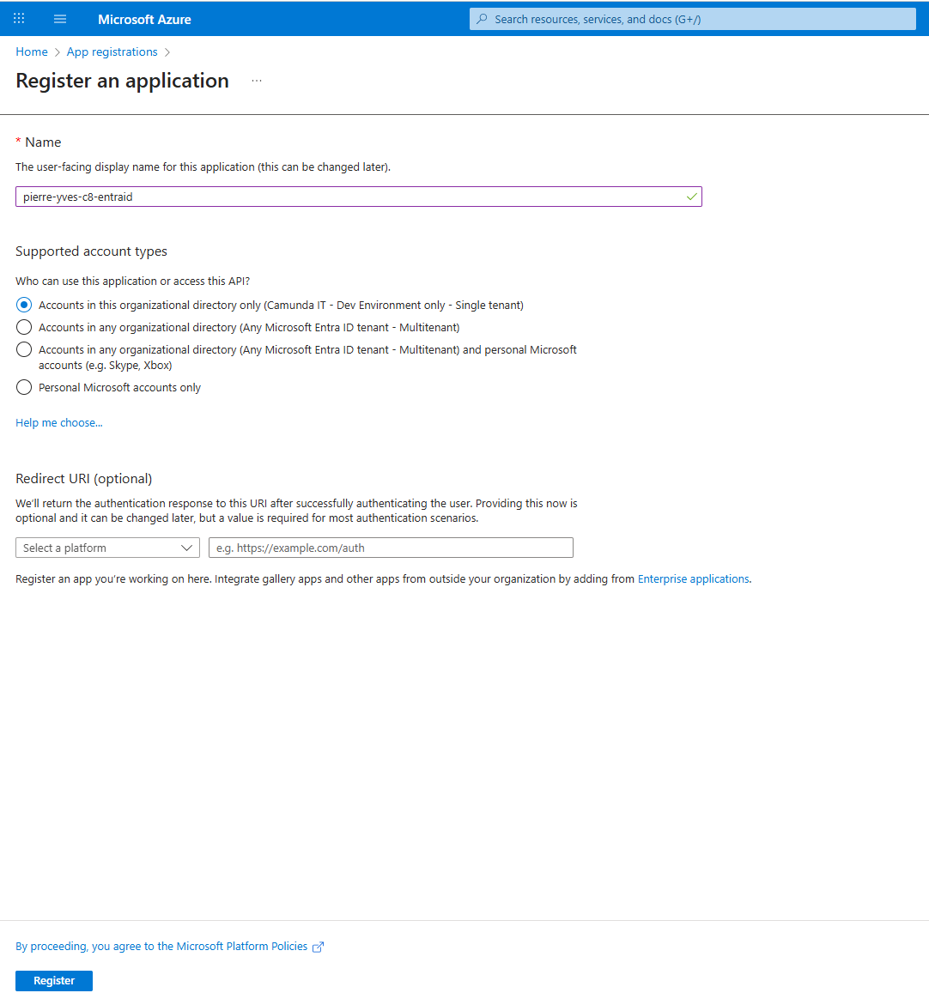

4. Click on `Register`. 

5. Collect the Client ID from overview (`Application (client) ID`)

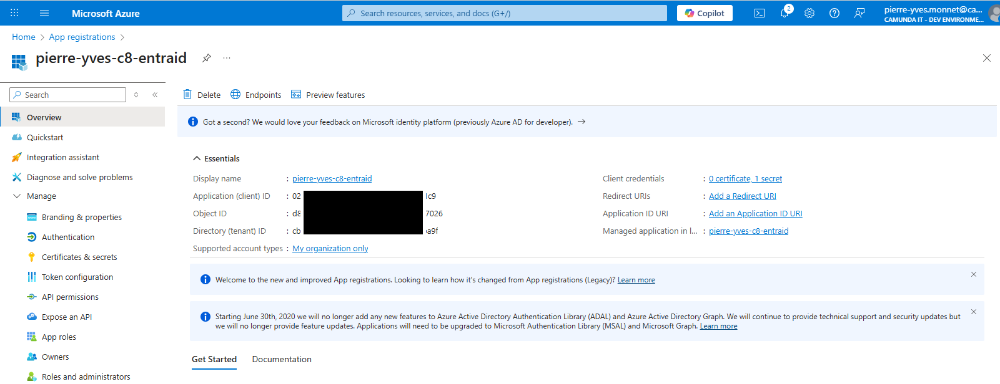

## Create a secret

1. Go to `manage/Certificate and Secret`

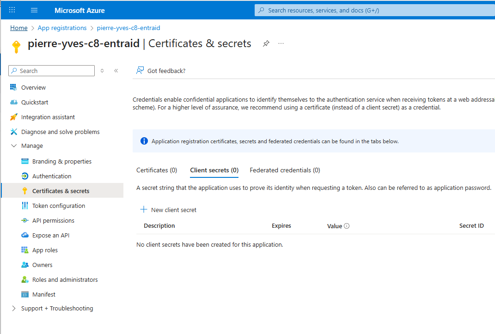

2. Add a client Secret: click on `new client secret`. Give a description and click on Add


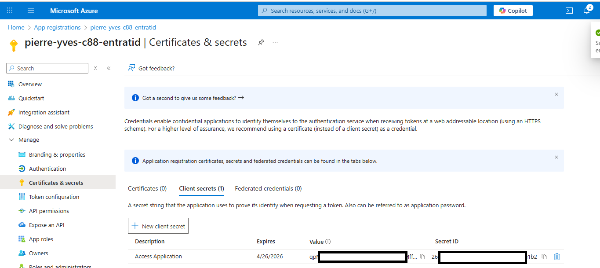

3. Collect the Value (this is the Client Secret) and the Secret ID

| Name                             | Value               |
|----------------------------------|---------------------|
| ClientId (ClientId and audience) | 026...1c9           |
| Value (Client secret)            | fzR...ueP.apy_Kc.7  |
| SecretID                         | f16...0b2           |
| TenantId                         | cbd...a9f           | 


## Add redirect URI (8.7)

Add a redirect URI per components (Identity, Operate, Tasklist, Optimize, WebModeler).

1. Click on `manage/Authentication`.

2. On the first screen, click on `Add a platform` and select `Web`

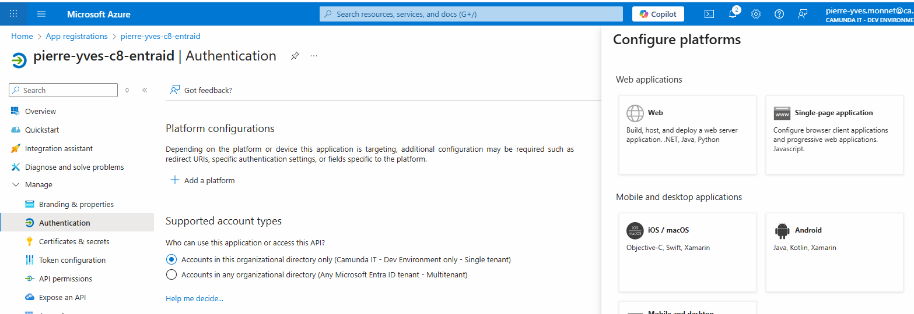

3. For the test, we use "localhost:8080" for Identity, so the URL is `http://localhost:8080/auth/login-callback`

4. Select the `Access tokens`and `Ìd tokens`

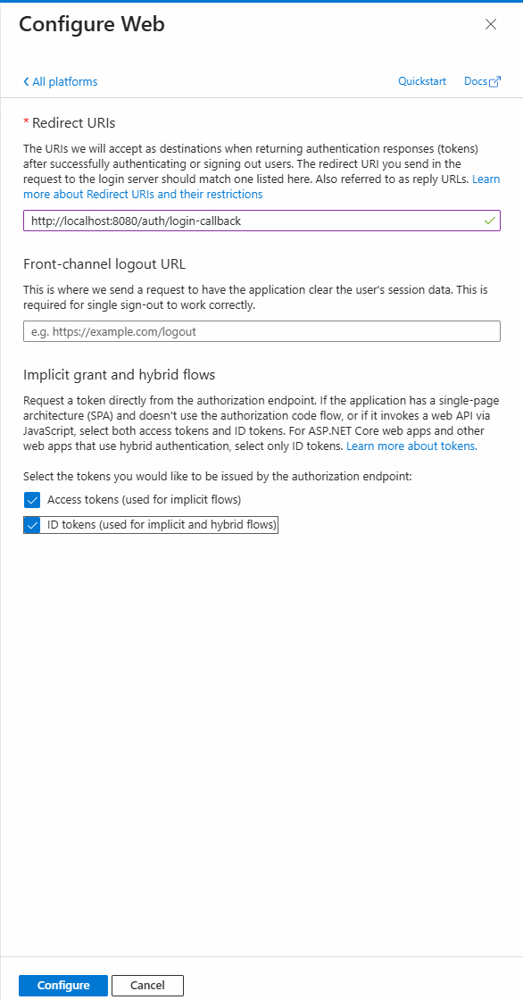


| Component | RedirectURL                               | Helm                            |
|-----------|-------------------------------------------|---------------------------------| 
| Identity  | http://localhost:8080/auth/login-callback | https://localhost:8080/identity |


Do the same for all applications.

> In 8.7, the context path is mandatory, so after each port, let's add the context path for each application.
> For example, the context path for Operate is `operate` so the URL is http://localhost:8081/operate


| Component | RedirectURL                                       | Helm                           |
|-----------|---------------------------------------------------|--------------------------------| 
| Identity  | http://localhost:8080/auth/login-callback         | http://localhost:8080/identity |
| Operate   | http://localhost:8081/identity-callback           | http://localhost:8081/operate  |
| Tasklist  | http://localhost:8082/identity-callback           | http://localhost:8082/tasklist |
| Optimize  | http://localhost:8083/api/authentication/callback | http://localhost:8083/optimize |


5. The final status should be

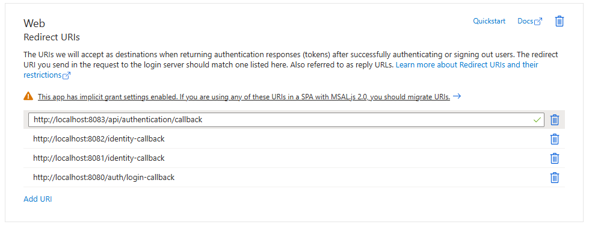


## Add redirect URL (8.8)
Add a redirect URI per components (Identity, Operate, Tasklist, Optimize, WebModeler).

1. Click on `manage/Authentication`.

2. On the first screen, click on `Add a platform` and select `Web`


3. For the test, we use "localhost:8080" for Identity, so the URL is `http://localhost:8080/auth/login-callback`


| Component                | RedirectURL                                       | Helm                            |
|--------------------------|---------------------------------------------------|---------------------------------| 
| Orchestration (identity) | http://localhost:8080/sso-callback                | http://localhost:8080/tasklist  |
| Orchestration (Operate)  | http://localhost:8080/sso-callback                | http://localhost:8080/operate   |
| Orchestration (Tasklist) | http://localhost:8080/sso-callback                | http://localhost:8080/tasklist  |
| Optimize                 | http://localhost:8083/api/authentication/callback | http://localhost:8083/optimize  |


TODO: what about managementIdentity?

4. Final status in 8.8 should be

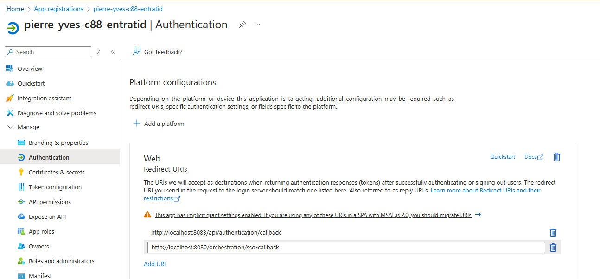

5. For the Web Modeler, a `Single Page application` must be added. Click on `Add a platform`

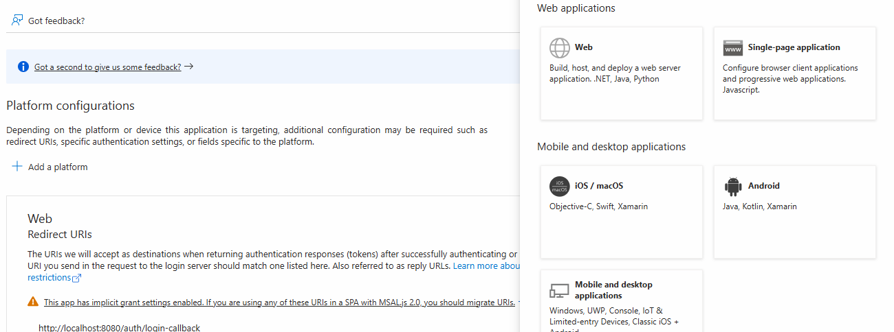


| Component  | RedirectURL                          | Helm                  |
|------------|--------------------------------------|-----------------------| 
| WebModeler | http://localhost:8084/login-callback | http://localhost:8084 |


## Change the manifest

1. Click on Manifest, and search the `requestedAccessTokenVersion` (close to line 30).

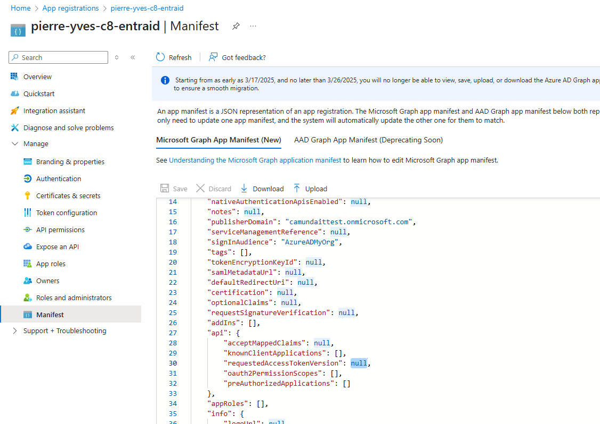

2. Change the value to `2`

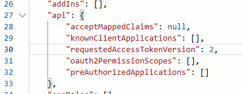

3. Click on the `Save` button.

## Debugging

According to https://docs.camunda.io/docs/8.6/apis-tools/operate-api/operate-api-authentication/

ask for a token via this call

```shell
curl --location --request POST '${TOKENURL}' \
--header 'Content-Type: application/x-www-form-urlencoded' \
--data-urlencode "client_id=${CLIENT_ID}" \
--data-urlencode "client_secret=${CLIENT_SECRET}" \
--data-urlencode "scope=${SCOPE}" \
--data-urlencode 'grant_type=client_credentials'
```
For example

```shell
curl --location --request POST 'https://login.microsoftonline.com/cbd...ba9f/oauth2/v2.0/token' \
--header 'Content-Type: application/x-www-form-urlencoded' \
--data-urlencode "client_id=026...1c9" \
--data-urlencode "client_secret=fzR...ueP.apy_Kc.7" \
--data-urlencode "scope=026...1c9/.default" \
--data-urlencode 'grant_type=client_credentials'
{"token_type":"Bearer","expires_in":3599,"ext_expires_in":3599,"access_token":"eyJ0eXAiO.....xxuH9RS6pH_zscNSMff_wVJE7fvqSkyi_T5pgM3AJj9yuTeYPuJ6HC6_AKkqsA_gVVxPqnKG8GFTn2TXaPYRdhfwBc5DwZIPF3qIbM49xQAq141yTSumfe-1d2f5iZzmdFh32OHLKBr4A_ybj_pfZOjW-Sg"}
```
