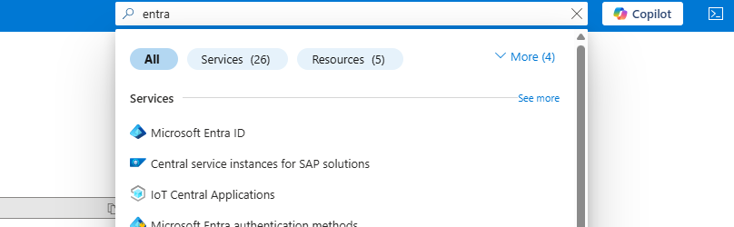

# Entra ID

This section is common on each installation (8.7 or 8.8)

# Use an existing EntraId, or create a new one - check

The solution is based on the fact an EntraId already exists, with a Tenant
In your AzureID.

Click on `manage tenants`.

A tenant is present.

Click on it

Get the tenantId

| Name      | Value      |
|-----------|------------| 
| TenantId  | cbd...a9f  |

Click on Users, and identify one user (for example, Pierre-Yves Monnet will be my user1)

Check if the user is part of a group.

User information:

| Name                | Value                        |
|---------------------|------------------------------| 
| User                | Pierre-Yves Monnet           |
| user Principal Name | pierre-yves.monnet@......com | 
| Group membership    | Postsales Consulting         | 

> The principal name is the login. The password, for a Camunda person, will be the Okta password.

# Get user information

Search for users

Search for your name

Access the user

| Name         | Value      |
|--------------|------------|
| UserObjectId | ef6...312  |

# Application Registration

## Create the application registration

Go to App registration

Click on `New registration`

Give a name like `pierre-yves-c8-entraid`

Click on `Register`. 

Collect the Client ID from overview (`Application (client) ID`)

## Create a secret

Go to `manage/Certificate and Secret`

Add a client Secret: click on `new client secret`. Give a description and click on Add

Collect the Value (this is the Client Secret) and the Secret ID

| Name                             | Value               |
|----------------------------------|---------------------|
| ClientId (ClientId and audience) | 026...1c9           |
| Value (Client secret)            | fzR...ueP.apy_Kc.7  |
| SecretID                         | f16...0b2           |
| TenantId                         | cbd...a9f           | 

## Add redirect URI (8.7)
Add a redirect URI per components (Identity, Operate, Tasklist, Optimize, WebModeler). 
Click on `manage/Authentication`.

On the first screen, click on `Add a platform` and select `Web`

For the test, we use "localhost:8080" for Identity, so the URL is `http://localhost:8080/auth/login-callback`

Select the `Access tokens`and `Ìd tokens`

| Component | RedirectURL                               | Helm                            |
|-----------|-------------------------------------------|---------------------------------| 
| Identity  | http://localhost:8080/auth/login-callback | https://localhost:8080/identity |

Do the same for all applications.

> In 8.7, the context path is mandatory, so after each port, let's add the context path for each application.
> For example, the context path for Operate is `operate` so the URL is http://localhost:8081/operate

| Component | RedirectURL                                       | Helm                           |
|-----------|---------------------------------------------------|--------------------------------| 
| Identity  | http://localhost:8080/auth/login-callback         | http://localhost:8080/identity |
| Operate   | http://localhost:8081/identity-callback           | http://localhost:8081/operate  |
| Tasklist  | http://localhost:8082/identity-callback           | http://localhost:8082/tasklist |
| Optimize  | http://localhost:8083/api/authentication/callback | http://localhost:8083/optimize |

Final status should be

## Add redirect URL (8.8)
Add a redirect URI per components (Identity, Operate, Tasklist, Optimize, WebModeler).
Click on `manage/Authentication`.

On the first screen, click on `Add a platform` and select `Web`

For the test, we use "localhost:8080" for Identity, so the URL is `http://localhost:8080/auth/login-callback`

| Component                | RedirectURL                                       | Helm                            |
|--------------------------|---------------------------------------------------|---------------------------------| 
| Orchestration (identity) | http://localhost:8080/sso-callback                | http://localhost:8080/tasklist  |
| Orchestration (Operate)  | http://localhost:8080/sso-callback                | http://localhost:8080/operate   |
| Orchestration (Tasklist) | http://localhost:8080/sso-callback                | http://localhost:8080/tasklist  |
| Optimize                 | http://localhost:8083/api/authentication/callback | http://localhost:8083/optimize  |

TODO: what about managementIdentity?

Final status in 8.8 should be

For the Web Modeler, a `Single Page application` must be added. Click on `Add a platform`

| Component  | RedirectURL                          | Helm                  |
|------------|--------------------------------------|-----------------------| 
| WebModeler | http://localhost:8084/login-callback | http://localhost:8084 |

## Change the manifest

Click on Manifest, and search the `requestedAccessTokenVersion` (close to line 30).

Change the value to `2`

Click on the `Save` button.
