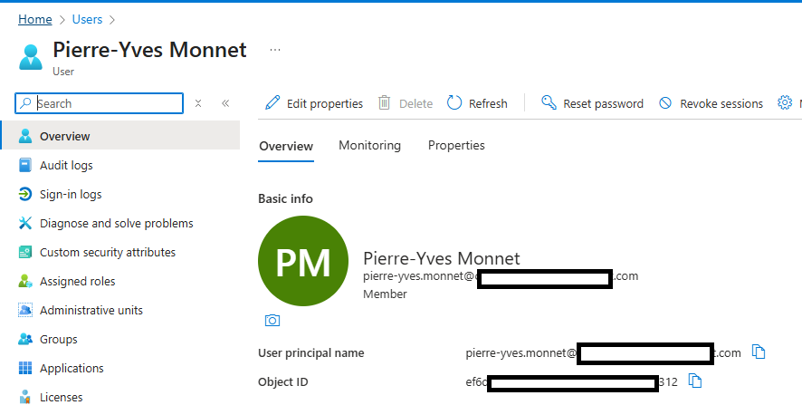
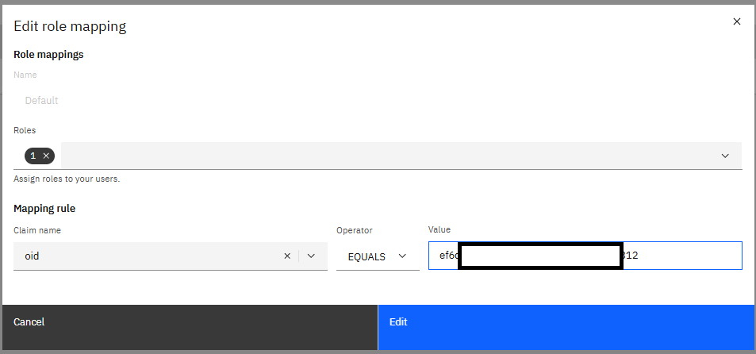
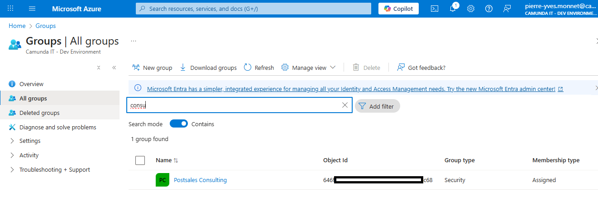
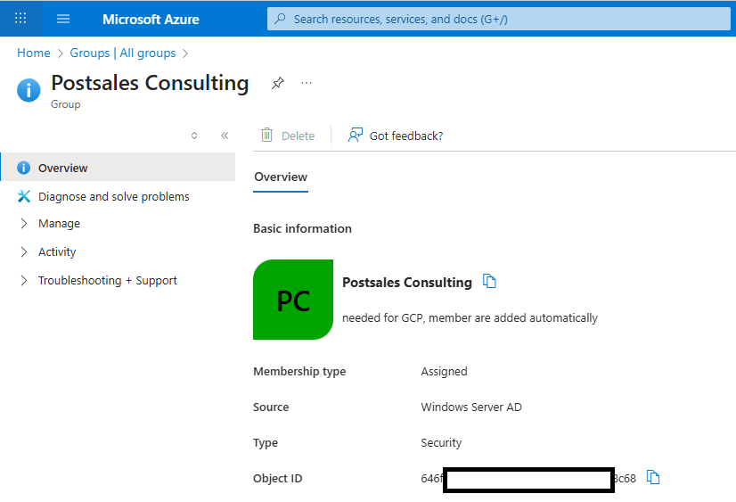
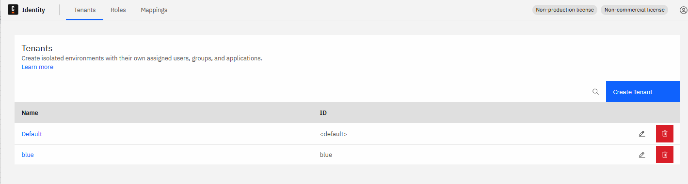

# Installation 8.7.x

This section explain how to install a 8.7 cluster, in mono or multi tenancy


# Configure Helm

Copy the Helm from the template in the documentation
https://docs.camunda.io/docs/8.7/self-managed/identity/configuration/connect-to-an-oidc-provider/


```yaml
global:
  identity:
    auth:
      issuer: https://login.microsoftonline.com/<Microsoft Entra tenant ID>/v2.0
      # this is used for container to container communication
      issuerBackendUrl: https://login.microsoftonline.com/<Microsoft Entra tenant ID>/v2.0
      tokenUrl: https://login.microsoftonline.com/<Microsoft Entra tenant ID>/oauth2/v2.0/token
      jwksUrl: https://login.microsoftonline.com/<Microsoft Entra tenant ID>/discovery/v2.0/keys
      type: "MICROSOFT"
      publicIssuerUrl: https://login.microsoftonline.com/<Microsoft Entra tenant ID>/v2.0
      identity:
        clientId: <Client ID from Step 2>
        existingSecret: <Client secret from Step 5>
        audience: <Audience from Step 2>
        # This is the object ID of the first user. A role mapping in Identity will automatically be generated for this user.
        initialClaimValue: <Initial claim value>
        redirectUrl: <See the Helm value in the table below>
      operate:
        clientId: <Client ID from Step 2>
        audience: <Client ID from Step 2>
        existingSecret: <Client secret from Step 5>
        redirectUrl: <See the Helm value in the table below>
      tasklist:
        clientId: <Client ID from Step 2>
        audience: <Client ID from Step 2>
        existingSecret: <Client secret from Step 5>
        redirectUrl: <See the Helm value in the table below>
      optimize:
        clientId: <Client ID from Step 2>
        audience: <Client ID from Step 2>
        existingSecret: <Client secret from Step 5>
        redirectUrl: <See the Helm value in the table below>
      zeebe:
        clientId: <Client ID from Step 2>
        audience: <Client ID from Step 2>
        existingSecret: <Client secret from Step 5>
        tokenScope: "<Client ID from Step 2>/.default"
      webModeler:
        clientId: <Client ID of Web Modeler's UI from Step 2>
        clientApiAudience: <Client ID of Web Modeler's UI from Step 2>
        publicApiAudience: <Client ID of Web Modeler's API from Step 2>
        redirectUrl: <See the Helm value in the table below>
      console:
        clientId: <Client ID from Step 2>
        audience: <Client ID from Step 2>
        redirectUrl: <See the Helm value in the table below>
        wellKnown: <Found in the "Endpoints" section of the app registrations page>
      connectors:
        clientId: <Client ID from Step 2>
        existingSecret: <Client secret from Step 5>
```

Replace all values

| Value                                        | Origin              | Value               |
|----------------------------------------------|---------------------|---------------------|
| <Microsoft Entra tenant ID>                  | TenantId            | cbd...ba9           |
| <Audience from Step 2>                       | is the ClientId     | 026...1c9           |
| <Initial claim value>                        | ObjectId of user    | ef6...312           |
| <Client ID from Step 2>                      | Client Id           | 026...1c9           |
| <Client secret from Step 5>                  | Value of the secret | fzR...ueP.apy_Kc.7  |
| <Client ID of Web Modeler's API from Step 2> | ClientId            | 026...1c9           |
| <Client ID of Web Modeler's UI from Step 2>  | Value of the secret | fzR...ueP.apy_Kc.7  |


Doing this way, a Mapping rule will be created by Identity, to match this ID with a role to access Identity

# Start the cluster

in 8.7 (helm 12.6.2)

```shell
helm upgrade --install --namespace camunda camunda camunda/camunda-platform -f camunda-values_entraid_87.yaml --skip-crds --version 12.6.2
```


# Connection

port forward identity and operate.
```shell
kubectl port-forward svc/camunda-identity 8080:80 -n camunda
kubectl port-forward svc/camunda-operate 8081:80 -n camunda

```
Try to access Operate via `localhost:8081`

# Identify users in applications

To allow a user in the application (tasklist or operate), two options are possible
* directly map a user
* map a EntraID group where the user is registered

Both are via the Role Mapping function in Indentity


## Default Role mapping per user

You should access Identity. Go to Mappings. Edit the Default mapping.


Edit the mapping to let the user access all applications (operate, tasklist)


The default user can access Operate.

## Role mapping for a user

Identify the Object ID of the User in EntraID


| Value         | Value      |
|---------------|------------|
| User ObjectId | ef6...312  |

Create a role mapping


Connect to Operate.

## Role mapping for a group

First, add the Security check in the application

In the application registration, access `manage/token configuration`


Click on `Add groups claim` and select `Security groups`


Find a group ID. in `Groups`, search a group like `Postsales consulting`



Identify the ObjectId



| Value           | Value      |
|-----------------|------------|
| Group ObjectId  | 646...c68  |

Create a role mapping based on the groupId


## Use a group as Candidate group

The candidate group has no impact on tasklist
https://docs.camunda.io/docs/components/tasklist/api-versions/#candidate-groups-and-users


# Desktop Modeler

Connect via the desktop modeler using the `OAuth` authentication.
The ClientID and Client Secret come from the App Registration.
The OAuthScope comes from the camunda-value.yaml

| Name            | Origin                                 | Value                                                                                    |
|-----------------|----------------------------------------|------------------------------------------------------------------------------------------|
| Authentication  |                                        | OAuth                                                                                    |
| ClientID        | App Registration                       | 026...1c9                                                     |
| ClientSecret    | App Registration                       | fzR...ueP.apy_Kc.7                                                 |
| OAuthTokenURL   | global.identity.auth.tokenUrl          | https://login.microsoftonline.com/cbd...ba9f/oauth2/v2.0/token |
| OAuth audience  |                                        | zeebe-api                                                                                |
| OAuthScope      | global.identity.auth.zeebe.tokenScope  | 026...1c9/.default                                            |


Deploy a process, and create a process instance. Verify both are visible in Operate.

# Worker

Use the scope

| Name           | Origin                                | Value                                                           |
|----------------|---------------------------------------|-----------------------------------------------------------------|
| ClientID       | App Registration.ClientId             | 026...1c9                                                       |
| ClientSecret   | App Registration.Value                | fzR...ueP.apy_Kc.7                                              |
| OAuthTokentURL | global.identity.auth.tokenUrl         | https://login.microsoftonline.com/cbd...ba9f/oauth2/v2.0/token  |
| OAuthScope     | global.identity.auth.zeebe.tokenScope | 026...1c9/.default                                              |


```
camunda:
  client:
    mode: self-managed
    # tenant-id: <default>

    auth:
      client-id: 026...1c9
      client-secret: fzR...ueP.apy_Kc.7
      token-url: https://login.microsoftonline.com/cbd...ba9f/oauth2/v2.0/token

    zeebe:
      scope: 026...1c9/.default
```


# Multi tenancy

```
global:
  multitenancy:
    enabled: true
  
```

## Create tenant in Identity

Create a tenant `blue`




## Deploy process in a tenant


But creation failed

```
Expected to handle gRPC request DeployResource with tenant identifier 'blue', but tenant is not authorized to perform this request [ deploy-error ]
```

Get the Entreprise Application Object ID
When a Application Registration is created, an Entreprise Application with the same name is created.
Search in Entreprise this object


Get the ObjectId from this object

| name                | Value                         |
|---------------------|-------------------------------|
| EntrepriseObjectId  | -7c7a-43c8-bee5-9b0f5740f164  |

Use this objectID to create a Tenant Mapping

Select the tenant (blue) and use `oid` equals <EntrepriseObjectid>


Deployment works

## Operate
Add a Mapping in Identity


This method works in Operate and Tasklist, but give it 30 minutes to see the result


## Worker

Add the tenant in the tenant list

```yaml
camunda:
  client:
    mode: self-managed
    tenant-ids:
      - blue

```

Restart the worker

## Debugging

According to https://docs.camunda.io/docs/8.6/apis-tools/operate-api/operate-api-authentication/

ask for a token via this call

```shell
curl --location --request POST '${TOKENURL}' \
--header 'Content-Type: application/x-www-form-urlencoded' \
--data-urlencode "client_id=${CLIENT_ID}" \
--data-urlencode "client_secret=${CLIENT_SECRET}" \
--data-urlencode "scope=${SCOPE}" \
--data-urlencode 'grant_type=client_credentials'
```
For example

```shell
curl --location --request POST 'https://login.microsoftonline.com/cbd...ba9f/oauth2/v2.0/token' \
--header 'Content-Type: application/x-www-form-urlencoded' \
--data-urlencode "client_id=026...1c9" \
--data-urlencode "client_secret=fzR...ueP.apy_Kc.7" \
--data-urlencode "scope=026...1c9/.default" \
--data-urlencode 'grant_type=client_credentials'
{"token_type":"Bearer","expires_in":3599,"ext_expires_in":3599,"access_token":"eyJ0eXAiOi.....ZzmdFh32OHLKBr4A_ybj_pfZOjW-Sg"}
```

Copy the token in https://www.jwt.io/. See the detail in terms of object used by EntraId


