# 8.8 EntraID

Configure Helm

Copy the Helm from the template in the documentation
https://docs.camunda.io/docs/8.7/self-managed/identity/configuration/connect-to-an-oidc-provider/

> Note: this section is use to connect the orchestration server. The Management Identity is after. 
 
```yaml
global:
  identity:
    auth:
      enabled: true
      issuer: https://login.microsoftonline.com/<Microsoft Entra tenant ID>/v2.0
      # this is used for container to container communication
      issuerBackendUrl: https://login.microsoftonline.com/<Microsoft Entra tenant ID>/v2.0
      tokenUrl: https://login.microsoftonline.com/<Microsoft Entra tenant ID>/oauth2/v2.0/token
      jwksUrl: https://login.microsoftonline.com/<Microsoft Entra tenant ID>/discovery/v2.0/keys
      type: "MICROSOFT"
      publicIssuerUrl: https://login.microsoftonline.com/<Microsoft Entra tenant ID>/v2.0
      
orchestration:
  clusterSize: "1"
  partitionCount: "1"
  replicationFactor: "1"

  security:
    authorizations:
      enabled: true
    authentication:
      method: oidc
      oidc:
        usernameClaim: oid
        clientIdClaim: azp
        groupsClaim: ""
        tokenScope: "<Client ID from Step 2>/.default"
        clientId: <Client ID from Step 2>
        redirectUrl: http://localhost:8080
        secret:
          existingSecret: camunda-client-credentials
          existingSecretKey: client-secret
```

To give directly the secret in the `value.yaml` (not recommended)

```yaml
        secret:
          inlineSecret: <Client secret from Step 5> 
```

Replace all values

| Value                                        | Origin              | Value               |
|----------------------------------------------|---------------------|---------------------|
| <Microsoft Entra tenant ID>                  | TenantId            | cbd...ba9           |
| <Audience from Step 2>                       | is the ClientId     | 026...1c9           |
| <Initial claim value>                        | ObjectId of user    | ef6...312           |
| <Client ID from Step 2>                      | Client Id           | 026...1c9           |
| <Client secret from Step 5>                  | Value of the secret | fzR...ueP.apy_Kc.7  |


# Start the cluster

```shell
helm upgrade --install --namespace camunda camunda camunda/camunda-platform -f camunda-values_entraid_88.yaml --skip-crds --version 13.2.1
```


# Connection

port forward identity and operate.
```shell
kubectl -n camunda port-forward service/camunda-zeebe-gateway 8080:8080
kubectl -n camunda port-forward service/camunda-zeebe-gateway 26500:26500
```
Try to access Operate via `localhost:8080`

# Identify users in applications

To allow a user in the application (tasklist or operate), two options are possible
* directly map a user
* map a EntraID group where the user is registered

Both are via the Role Mapping function in Identity


## Role mapping for a user

Identify the Object ID of the User in EntraID
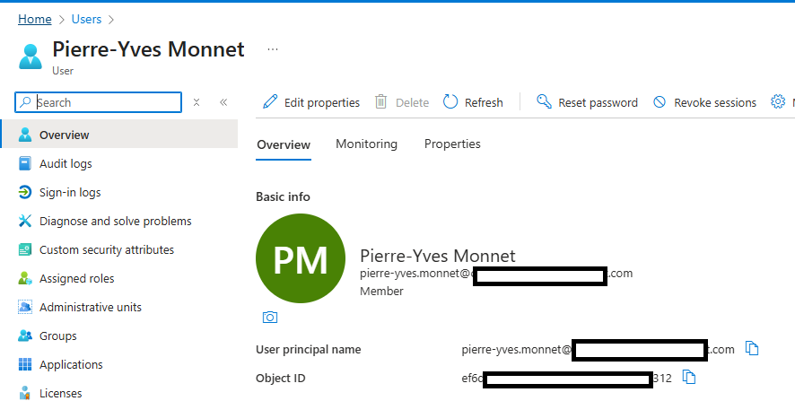

| Value         | Value      |
|---------------|------------|
| User ObjectId | ef6...312  |

Create a role mapping


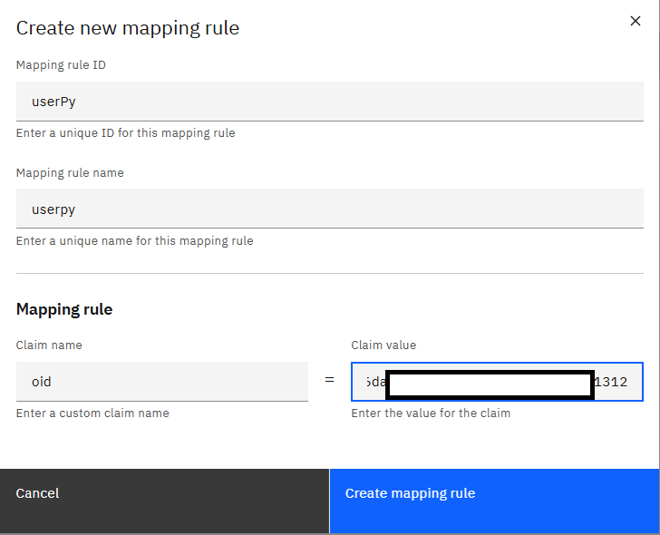

then give the authorisation to the role mapping

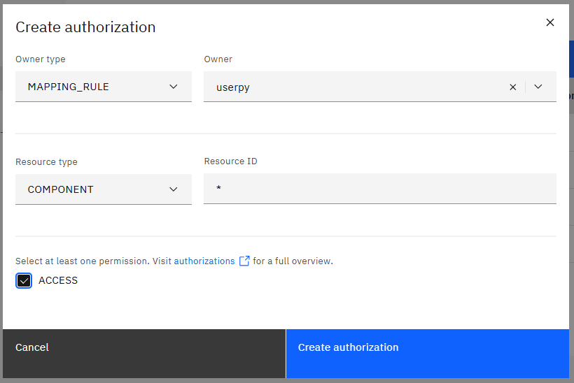

Connect to Operate works.

## Role mapping for a group

> In progress - not working at this moment


First, add the Security check in the application

In the application registration, access `manage/token configuration`

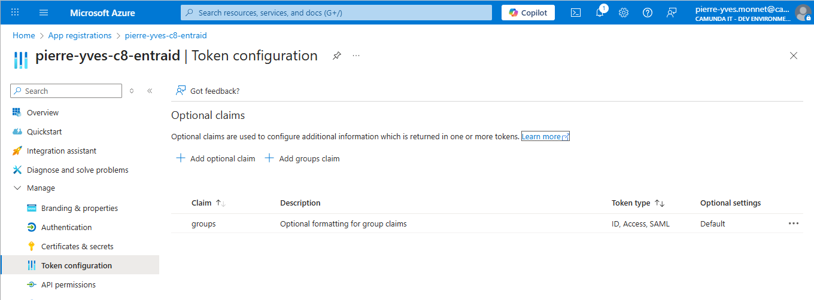

Click on `Add groups claim` and select `Security groups`

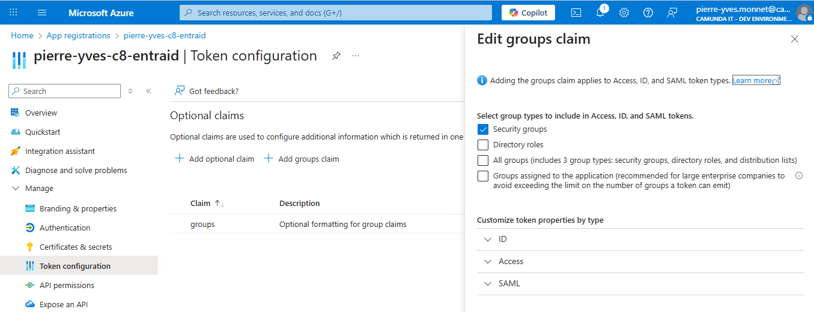

Find a group ID. in `Groups`, search a group like `Postsales consulting`
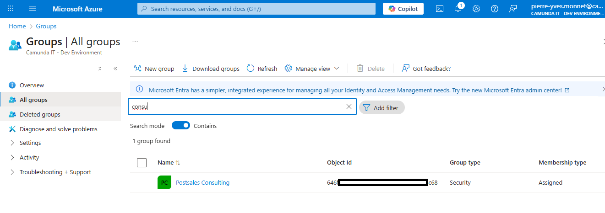

Identify the ObjectId
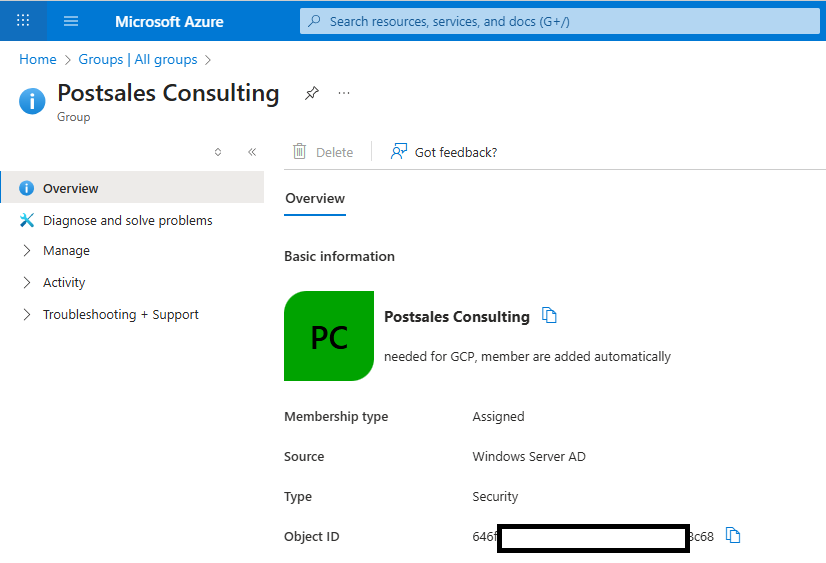

| Value           | Value      |
|-----------------|------------|
| Group ObjectId  | 646...c68  |

Create a role mapping based on the groupId


> In progress


<<< see https://camunda.slack.com/archives/C08MRKHJ0CD/p1761870705602369>>

## Use a group as Candidate group

The candidate group has no impact on tasklist
https://docs.camunda.io/docs/components/tasklist/api-versions/#candidate-groups-and-users


# Desktop Modeler

> In progress


Connect via the desktop modeler using the `OAuth` authentication.
The ClientID and Client Secret come from the App Registration.
The OAuthScope comes from the camunda-value.yaml

| Name           | Origin                                 | Value                                                                                    |
|----------------|----------------------------------------|------------------------------------------------------------------------------------------|
| Authentication |                                        | OAuth                                                                                    |
| ClientID       | App Registration                       | 026...1c9                                                     |
| ClientSecret   | App Registration                       | fzR...ueP.apy_Kc.7                                                 |
| OAuthTokentURL | global.identity.auth.tokenUrl          | https://login.microsoftonline.com/cbd...ba9f/oauth2/v2.0/token |
| OAuth audience |                                        | zeebe-api                                                                                |
| OAuthScope     | global.identity.auth.zeebe.tokenScope  | 026...1c9/.default                                            |

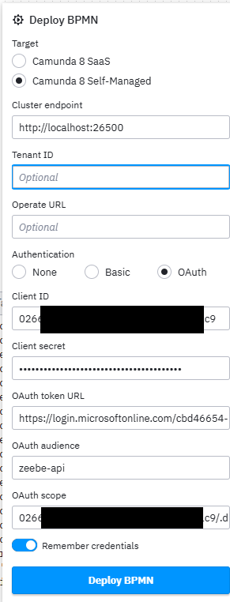

Deploy a process, and create a process instance. Verify both are visible in Operate.

# Worker

> In progress


Use the scope

| Name           | Origin                                | Value                                                                                    |
|----------------|---------------------------------------|------------------------------------------------------------------------------------------|
| ClientID       | App Registration.ClientId             | 026...1c9                                                     |
| ClientSecret   | App Registration.Value                | fzR...ueP.apy_Kc.7                                                 |
| OAuthTokentURL | global.identity.auth.tokenUrl         | https://login.microsoftonline.com/cbd...ba9f/oauth2/v2.0/token |
| OAuthScope     | global.identity.auth.zeebe.tokenScope | 026...1c9/.default                                            |


```
camunda:
  client:
    mode: self-managed
    # tenant-id: <default>

    auth:
      client-id: 026...1c9
      client-secret: fzR...ueP.apy_Kc.7
      token-url: https://login.microsoftonline.com/cbd...ba9f/oauth2/v2.0/token

    zeebe:
      scope: 026...1c9/.default
```


# Multi tenancy

> In progress

```
global:
  multitenancy:
    enabled: true
  
```

## Create tenant in Identity


 
Create a tenant `blue`

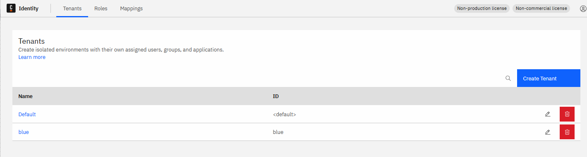


## Deploy process in a tenant

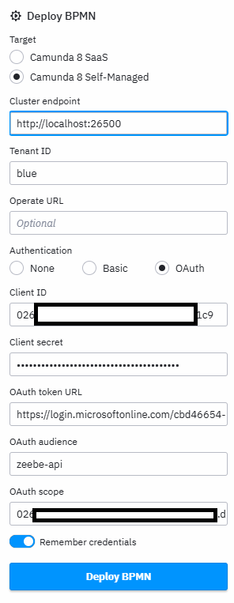

But creation failed

```
Expected to handle gRPC request DeployResource with tenant identifier 'blue', but tenant is not authorized to perform this request [ deploy-error ]
```

Get the Enterprise Application Object ID
When a Application Registration is created, an Enterprise Application with the same name is created.
Search in Entreprise this object
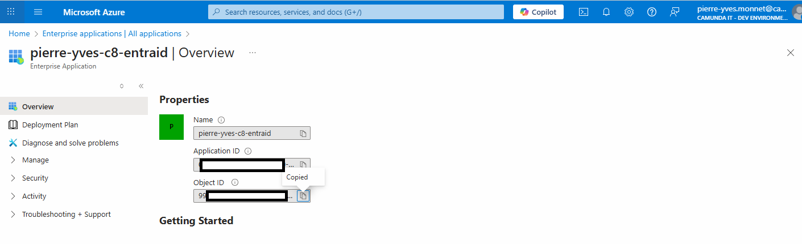

Get the ObjectId from this object

| name                | Value        |
|---------------------|--------------|
| EntrepriseObjectId  | -7c7...164   |

Use this objectID to create a Tenant Mapping

Select the tenant (blue) and use `oid` equals <EntrepriseObjectid>

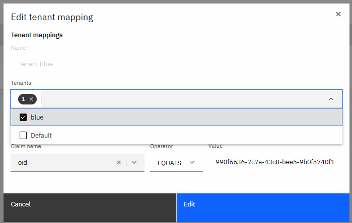

Deployment works

## Operate
Add a Mapping in Identity

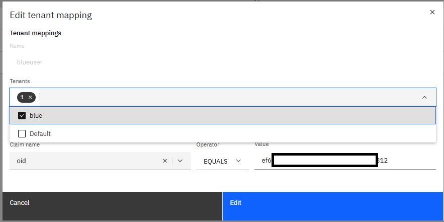

This method works in Operate and Tasklist, but give it 30 minutes to see the result


## Worker

Add the tenant in the tenant list

```yaml
camunda:
  client:
    mode: self-managed
    tenant-ids:
      - blue

```

Restart the worker

## Debugging

According to https://docs.camunda.io/docs/8.6/apis-tools/operate-api/operate-api-authentication/

ask for a token via this call

```shell
curl --location --request POST '${TOKENURL}' \
--header 'Content-Type: application/x-www-form-urlencoded' \
--data-urlencode "client_id=${CLIENT_ID}" \
--data-urlencode "client_secret=${CLIENT_SECRET}" \
--data-urlencode "scope=${SCOPE}" \
--data-urlencode 'grant_type=client_credentials'
```
For example

```shell
curl --location --request POST 'https://login.microsoftonline.com/cbd...ba9f/oauth2/v2.0/token' \
--header 'Content-Type: application/x-www-form-urlencoded' \
--data-urlencode "client_id=026...1c9" \
--data-urlencode "client_secret=fzR...ueP.apy_Kc.7" \
--data-urlencode "scope=026...1c9/.default" \
--data-urlencode 'grant_type=client_credentials'
{"token_type":"Bearer","expires_in":3599,"ext_expires_in":3599,"access_token":"eyJ0eXAiO.....xxuH9RS6pH_zscNSMff_wVJE7fvqSkyi_T5pgM3AJj9yuTeYPuJ6HC6_AKkqsA_gVVxPqnKG8GFTn2TXaPYRdhfwBc5DwZIPF3qIbM49xQAq141yTSumfe-1d2f5iZzmdFh32OHLKBr4A_ybj_pfZOjW-Sg"}
```

Copy the token in https://www.jwt.io/. See the detail in terms of object used by EntraId

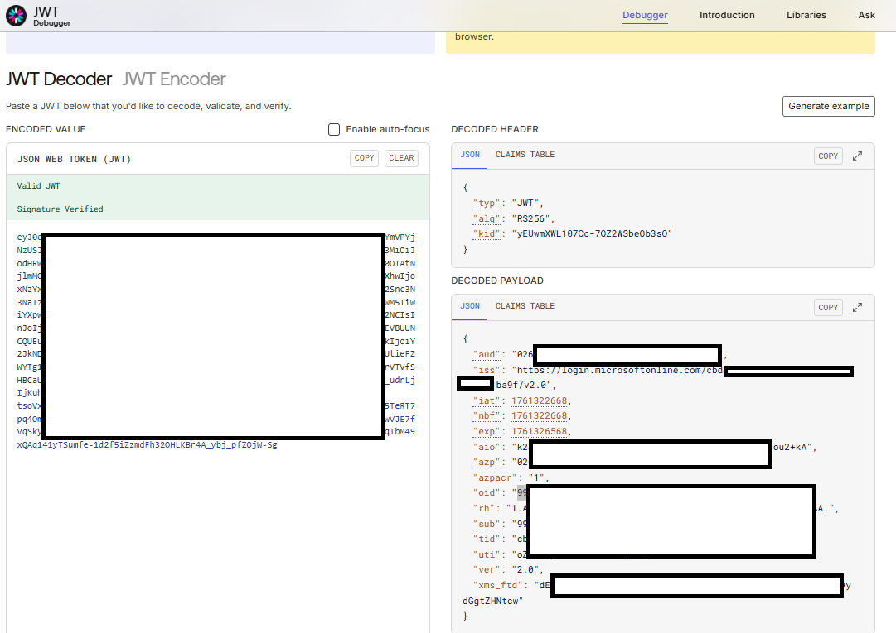


# Management identity / Web Modeler / Optimize

```yaml
global:
  ingress:
    enabled: true
    tls:
      enabled: true
      secretName: camunda-platform
  security:
    authentication:
      method: oidc
  identity:
    auth:
      enabled: true
      issuer: https://login.microsoftonline.com/<Microsoft Entra tenant ID>/v2.0
      issuerBackendUrl: https://login.microsoftonline.com/<Microsoft Entra tenant ID>/v2.0
      tokenUrl: https://login.microsoftonline.com/<Microsoft Entra tenant ID>/oauth2/v2.0/token
      jwksUrl: https://login.microsoftonline.com/<Microsoft Entra tenant ID>/discovery/v2.0/keys
      authUrl: https://login.microsoftonline.com/<Microsoft Entra tenant ID>/oauth2/v2.0/authorize
      publicIssuerUrl: https://login.microsoftonline.com/<Microsoft Entra tenant ID>/v2.0
      type: "MICROSOFT"
      identity:
        clientId: <Client ID from Step 2>
        audience: <Audience from Step 2>
        secret:
          existingSecret: camunda-client-credentials
          existingSecretKey: client-secret
        # emma oid
        initialClaimValue: <Initial claim value>
        initialClaimName: "oid"
        redirectUrl: <See the Helm value in the table below>
      optimize:
        clientId: <Client ID from Step 2>
        audience: <Client ID from Step 2>
        secret:
          existingSecret: camunda-client-credentials
          existingSecretKey: client-secret
        redirectUrl: <See the Helm value in the table below>
      webModeler:
        clientId: <Client ID of Web Modeler's UI from Step 2>
        clientApiAudience: <Client ID of Web Modeler's UI from Step 2>
        publicApiAudience: <Client ID of Web Modeler's API from Step 2>
        redirectUrl: <See the Helm value in the table below>
      console:
        wellKnown: https://login.microsoftonline.com/<Microsoft Entra tenant ID>/v2.0/.well-known/openid-configuration
        clientId: <Client ID from Step 2>
        audience: <Client ID from Step 2>
        secret:
          existingSecret: camunda-client-credentials
          existingSecretKey: client-secret
        tokenScope: <Client ID from Step 2>/.default
        redirectUrl: <See the Helm value in the table below>
      orchestration:
        clientId: <Client ID from Step 2>
        audience: <Client ID from Step 2>
        secret:
          existingSecret: camunda-client-credentials
          existingSecretKey: client-secret
        redirectUrl: <See the Helm value in the table below>

identity:
  contextPath: "/identity"
  enabled: true
  env:
    - name: CAMUNDA_IDENTITY_AUDIENCE
      value: <Client ID from Step 2>

identityPostgresql:
  enabled: true
  auth:
    existingSecret: camunda-client-credentials
    secretKeys:
      userPasswordKey: postgres-password
      adminPasswordKey: postgres-password

console:
  enabled: false
  env:
    - name: CAMUNDA_IDENTITY_JWKS_URL
      value: https://login.microsoftonline.com/<Microsoft Entra tenant ID>/discovery/v2.0/keys

webModeler:
  contextPath: "/modeler"
  enabled: true
  restapi:
    mail:
      # This value is required, otherwise the restapi pod wouldn't start.
      fromAddress: noreply@example.com
    env:
      - name: CAMUNDA_MODELER_CLUSTERS_0_ID
        value: "local-cluster"
      - name: CAMUNDA_MODELER_CLUSTERS_0_NAME
        value: "Local Cluster"
      - name: CAMUNDA_MODELER_CLUSTERS_0_VERSION
        value: "8.8.0"
      - name: CAMUNDA_MODELER_CLUSTERS_0_AUTHENTICATION
        value: "BEARER_TOKEN"
        # Might be able to omit the .svc.local
      - name: CAMUNDA_MODELER_CLUSTERS_0_URL_GRPC
        value: "grpc://camunda-zeebe-gateway.orchestration.svc.cluster.local:26500"
        # Internal cluster REST reference
      - name: CAMUNDA_MODELER_CLUSTERS_0_URL_REST
        value: "http://camunda-zeebe-gateway.orchestration.svc.cluster.local"
        # External REST reference for example
      #      - name: CAMUNDA_MODELER_CLUSTERS_0_URL_REST
      #        value: "http://local.distro.ultrawombat.com/orchestration"
      - name: CAMUNDA_MODELER_CLUSTERS_0_URL_WEBAPP
        value: "http://local.distro.ultrawombat.com/orchestration"
      - name: CAMUNDA_MODELER_CLUSTERS_0_AUTHORIZATIONS_ENABLED
        value: "true"
      - name: LOGGING_LEVEL_IO_GRPC
        value: "TRACE"
      - name: LOGGING_LEVEL_IO_CAMUNDA_MODELER
        value: "DEBUG"
      - name: SPRING_PROFILES_INCLUDE
        value: "default-logging"

# WebModeler Database.
webModelerPostgresql:
  enabled: true
  auth:
    existingSecret: "camunda-client-credentials"
    secretKeys:
      adminPasswordKey: postgres-password
      userPasswordKey: postgres-password

orchestration:
  enabled: false
optimize:
  enabled: false
elasticsearch:
  enabled: false
connectors:
  enabled: false
```


Replace all values

| Value                                        | Origin              | Value               |
|----------------------------------------------|---------------------|---------------------|
| <Microsoft Entra tenant ID>                  | TenantId            | cbd...ba9           |
| <Audience from Step 2>                       | is the ClientId     | 026...1c9           |
| <Initial claim value>                        | ObjectId of user    | ef6...312           |
| <Client ID from Step 2>                      | Client Id           | 026...1c9           |
| <Client secret from Step 5>                  | Value of the secret | fzR...ueP.apy_Kc.7  |
| <Client ID of Web Modeler's API from Step 2> | ClientId            | 026...1c9           |
| <Client ID of Web Modeler's UI from Step 2>  | Value of the secret | fzR...ueP.apy_Kc.7  |

Secrets are store in a Secret file

```yaml
# kubectl apply -f em_camunda-client-credentials.yaml
apiVersion: v1
kind: Secret
metadata:
  name: camunda-client-credentials
type: Opaque
stringData:
  client-secret: "<Client secret from Step 5>"
  postgres-password: "postgres"
```