# 8.8 EntraID

Configure Helm

Copy the Helm from the template in the documentation
https://docs.camunda.io/docs/8.7/self-managed/identity/configuration/connect-to-an-oidc-provider/


> Note: this section is used to connect the orchestration server. The Management Identity is after. 
 


```yaml
global:
  identity:
    auth:
      authUrl: https://login.microsoftonline.com/<Microsoft Entra tenant ID>/oauth2/v2.0/authorize
      issuer: https://login.microsoftonline.com/<Microsoft Entra tenant ID>/v2.0
      # this is used for container to container communication
      issuerBackendUrl: https://login.microsoftonline.com/<Microsoft Entra tenant ID>/v2.0
      tokenUrl: https://login.microsoftonline.com/<Microsoft Entra tenant ID>/oauth2/v2.0/token
      jwksUrl: https://login.microsoftonline.com/<Microsoft Entra tenant ID>/discovery/v2.0/keys
      type: "MICROSOFT"
      publicIssuerUrl: https://login.microsoftonline.com/<Microsoft Entra tenant ID>/v2.0

      webModeler:
        clientId: <Client ID of Web Modeler's UI from Step 2>
        clientApiAudience: <Client ID of Web Modeler's UI from Step 2>
        publicApiAudience: <Client ID of Web Modeler's API from Step 2>
        redirectUrl: <See the Helm value in the table below>
      console:
        clientId: <Client ID from Step 2>
        audience: <Client ID from Step 2>
        redirectUrl: <See the Helm value in the table below>
        wellKnown: <Found in the "Endpoints" section of the app registrations page>
      connectors:
        clientId: <Client ID from Step 2>
        existingSecret: <Client secret from Step 5>

orchestration:
  clusterSize: "1"
  partitionCount: "1"
  replicationFactor: "1"

  security:
    authorizations:
      enabled: true
      oidc:
        secret:
          inlineSecret: <Client secret from Step 5>

        redirectUrl: http://localhost:8080
        usernameClaim: oid
        groupsClaim: groups
        clientId: <Client ID from Step 2>
        audience: <Client ID from Step 2> 
    initialization:
      defaultRoles:
        admin:
          users:
            - <UserObjectId>
          

```


Replace all values:

| Value                                         | Origin                 | Value              |
|-----------------------------------------------|------------------------|--------------------|
| <Microsoft Entra tenant ID>                   | TenantId               | cbd...ba9          |
| <Audience from Step 2>                        | is the ClientId        | 026...1c9          |
| <Initial claim value>                         | ObjectId of user       | ef6...312          |
| <Client ID from Step 2>                       | ClientId               | 026...1c9          |
| <Client secret from Step 5>                   | Value of the secret    | fzR...ueP.apy_Kc.7 |
| <Client ID of Web Modeler's API from Step 2>  | ClientId               | 026...1c9          |
| <Client ID of Web Modeler's UI from Step 2>   | Value of the secret    | fzR...ueP.apy_Kc.7 |
| <UserObjectId>                                | Oid of the admin user  | ef6...312          |


# Start the cluster

```shell
helm upgrade --install --namespace camunda camunda camunda/camunda-platform -f camunda-values_entraid_88.yaml --skip-crds --version 13.2.1
```


# Connection

## Check the connection
port forward identity and operate.
```shell
kubectl -n camunda port-forward service/camunda-zeebe-gateway 8080:8080
kubectl -n camunda port-forward service/camunda-zeebe-gateway 26500:26500
```
Try to access Operate via `localhost:8080`
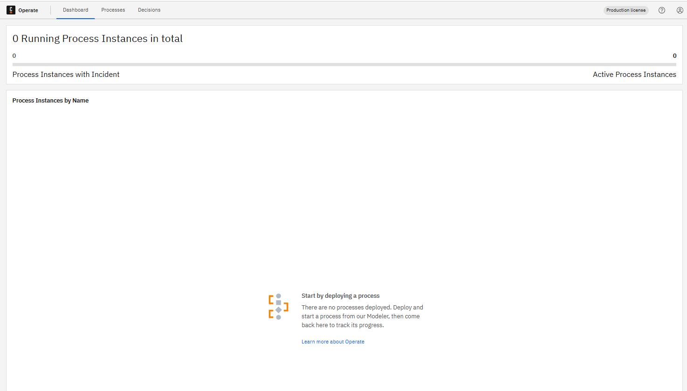


## How does it work?

Orchestration connect directly to the EntraId server.
It used the `orchesteration.security.oidc.clientId` and `orchesteration.security.oidc.audience`.

Entra Id detect the user is not connected and display the login page, or use any method to authentify the user.
Or the user is already connected.
In all the situation, OIDC return and "authorization code" to the browser, and redirect to orchestration.

Orchestration receive the "authorization code" and use the `tokenUrl` to get token.
* id_token (who the user is),
* access_token (JWT used as bearer for APIs),
* optionally refresh_token.


These tokens are not visible in the browser of in the trace, which is not simple 

In the token's header, the field `kid` is present. This key must be present in the JWKS repository, This enforced the security: the token must be provided by the correct issuer.

The JWKS repository is accessible by
* the `well-known` configuration.
The URL `<global.identity.auth.issuer>/.well-known/openid-configuration`.
In our example, `https://login.microsoftonline.com/<Microsoft Entra tenant ID>/v2.0/.well-known/openid-configuration` is used.

The JSON contains a `jwks-uri` field, which is the JWKS repository


* Explicitly given via the variable `global.identity.auth.jwksUrl`

When the token is validated. then Orchestration can verify the user connection.

## If is not working

Check the debugging session to run manually all steps


# Identify users in applications

To allow a user in the application (Tasklist or Operate), two options are possible
* directly map a user
* map a EntraID group where the user is registered

Both are via the Role Mapping function in Identity


## Role mapping for a user

1. Identify the Object ID of the User in EntraID
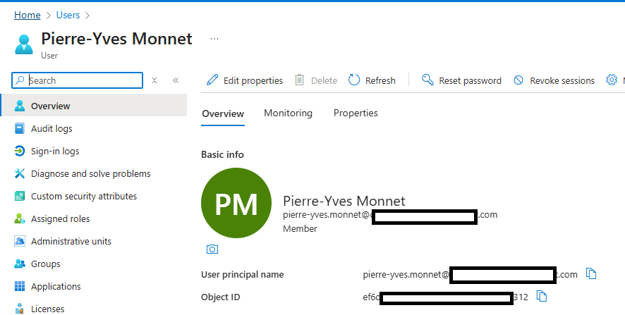

| Value         | Value      |
|---------------|------------|
| User ObjectId | ef6...312  |

2. Create a role mapping

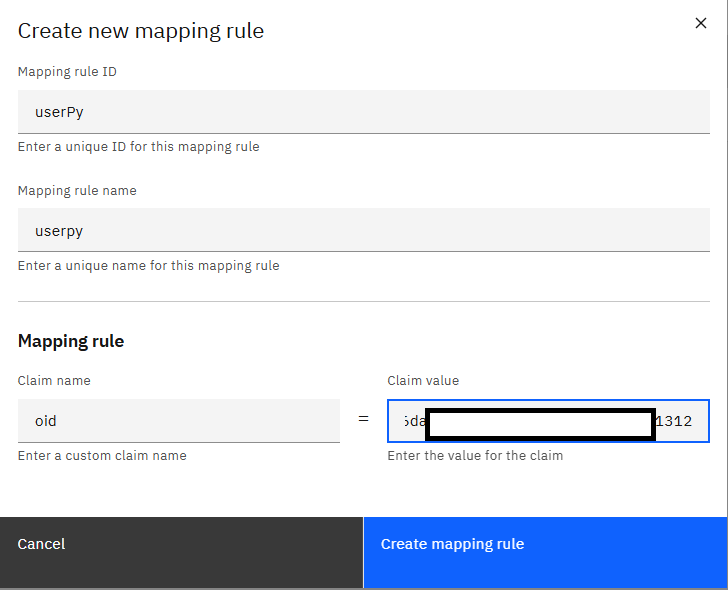

3. Give the authorisation to the role mapping

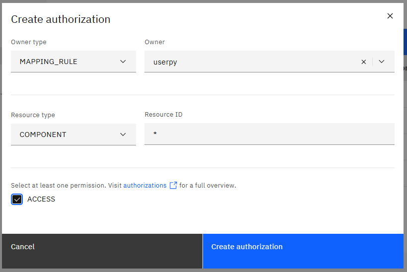

4. Connect to Operate works.

## Role mapping for a group


First, add the Security check in the application

1. In the application registration, access `manage/token configuration`

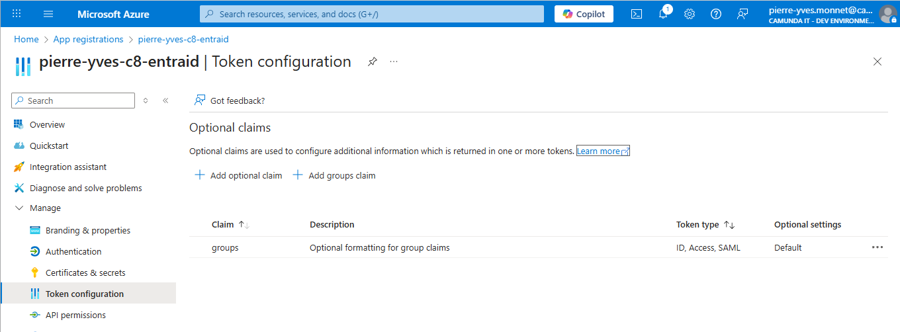

2. Click on `Add groups claim` and select `Security groups`

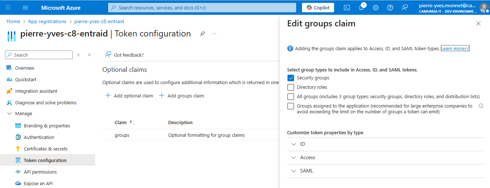

3. Find a group ID. in `Groups`, search a group like `Postsales consulting`
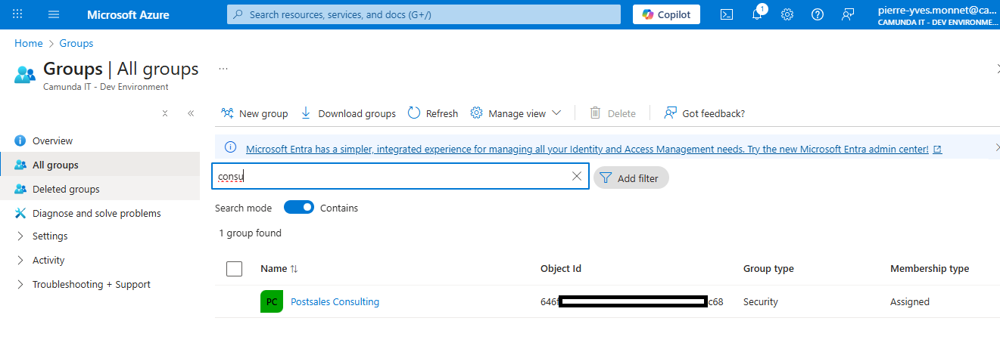

4. Identify the ObjectId
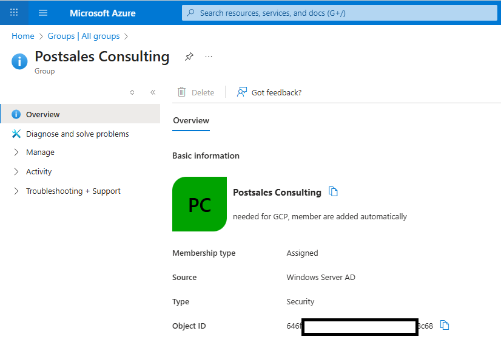

| Value           | Value      |
|-----------------|------------|
| Group ObjectId  | 646...c68  |

5. In the role, register the group

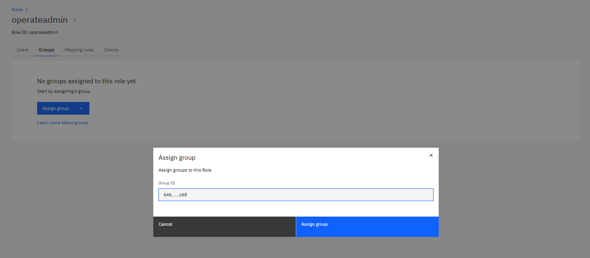

6. Register the role in the authorisation

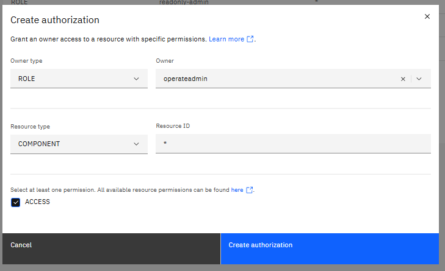

7. Access the application with your user


## Use a group as Candidate group

The candidate group has no impact on tasklist
https://docs.camunda.io/docs/components/tasklist/api-versions/#candidate-groups-and-users

# Token and client

To authorize the REST API or the desktop modeler access the cluster, the object behind the token must be accepted.

1. Check the token generated:


```shell
curl --location --request POST 'https://login.microsoftonline.com/<Microsoft Entra Tenant ID>/oauth2/v2.0/token' 
  --header 'Content-Type: application/x-www-form-urlencoded' 
  --data-urlencode "client_id=<ClientID>" 
  --data-urlencode "client_secret=<ClientSecret>" 
  --data-urlencode "scope=<ClientID>/.default" 
  --data-urlencode 'grant_type=client_credentials'


```

Replace variables

| Name                       | Origin                    | Value              |
|----------------------------|---------------------------|--------------------|
| Microsoft Entra tenant ID  | Tenand ID                 | cbd...a9f          |           
| ClientID                   | App Registration.ClientId | 026...1c9          |
| ClientSecret               | App Registration.Value    | fzR...ueP.apy_Kc.7 |

The result in the payload is

```
{"token_type":"Bearer","expires_in":3599,"ext_expires_in":3599,"access_token":"eyJ0eXAiO...flmA"}

```
2. Set the token in a variable
```shell
$ ACCESS_TOKEN="eyJ0eXAiO...flmA"
```

or use
```shell
ACCESS_TOKEN=$(curl -s curl --location --request POST 'https://login.microsoftonline.com/<Microsoft Entra Tenant ID>/oauth2/v2.0/token' 
  --header 'Content-Type: application/x-www-form-urlencoded' 
  --data-urlencode "client_id=<ClientID>" 
  --data-urlencode "client_secret=<ClientSecret>" 
  --data-urlencode "scope=<ClientID>/.default" 
  --data-urlencode 'grant_type=client_credentials' | jq -r '.access_token')
```

3. Use jwt.io to get a full description of the token


Header:
```yaml
{
  "typ": "JWT",
  "alg": "RS256",
  "kid": "rtsFT-b-7LuY7DVYeSNKcIJ7Vnc"
}
```


Payload:

```yaml
{
  "aud": "fa...789c0",
  "iss": "https://login.microsoftonline.com/cbd4...a9f/v2.0",
  "iat": 1765825135,
  "nbf": 1765825135,
  "exp": 1765829035,
  "aio": "k2J...zcA",
  "azp": "fa78...39c0",
  "azpacr": "1",
  "oid": "4a71...8f4",
  "rh": "1.AYE...AA.",
  "sub": "4a71...b8f4",
  "tid": "cbd...ba9f",
  "uti": "iNn...86AA",
  "ver": "2.0",
  "xms_ftd": "mM292...1kc21z"
}
```

4. Is this token is considered as a user or as a client?  Run
```shell
 curl -s \
  -H "Authorization: Bearer ${ACCESS_TOKEN}" \
  http://localhost:8080/v2/authentication/me | jq
{
  "username": "4a71...b8f4",
  "authorizedComponents": [],
  "tenants": [],
  "groups": [],
  "roles": [],
  "salesPlanType": "",
  "c8Links": {},
  "canLogout": true
}
```

This token is identified as user (username).The username is retrieved from the "sub" attributes. It's possible to configure Identity to resolve this as a Client
The token as an OID and a AZP attribute. 

5. Add this configuration.

```yaml
orchestration:
  security:
    authentication:
      oidc:
        clientIdClaim: azp                  # Entra puts client ID here
        preferUsernameClaim: true           # user tokens win if both present
```
  
> Note: the token can still be considered as a user


If the object is a username, add it in as admin role as a user


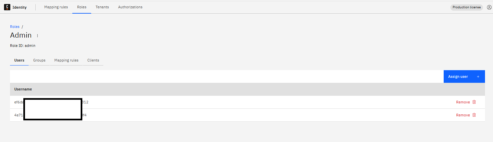

6. Now, it's possible to deploy a process via the desktop modeler or the REST API

https://docs.camunda.io/docs/apis-tools/orchestration-cluster-api-rest/orchestration-cluster-api-rest-authentication/#using-a-token-oidcjwt

# Desktop Modeler

Connect via the desktop modeler using the `OAuth` authentication.
The ClientID and Client Secret come from the App Registration.
The OAuthScope comes from the camunda-value.yaml

| Name           | Origin                                 | Value                                                                                    |
|----------------|----------------------------------------|------------------------------------------------------------------------------------------|
| Authentication |                                        | OAuth                                                                                    |
| ClientID       | App Registration                       | 026...1c9                                                     |
| ClientSecret   | App Registration                       | fzR...ueP.apy_Kc.7                                                 |
| OAuthTokentURL | global.identity.auth.tokenUrl          | https://login.microsoftonline.com/cbd...ba9f/oauth2/v2.0/token |
| OAuth audience |                                        | zeebe-api                                                                                |
| OAuthScope     | global.identity.auth.zeebe.tokenScope  | 026...1c9/.default                                            |

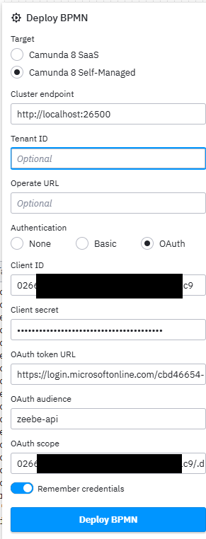


This is not enough: the object behind the token need to be authorized. See before to get the user ID

Add this user in the role `admin`

> How the Desktop Modeler reference a user? 
> * Desktop Modeler use the information ClientId/Client Secret to ask EntraID to generate a token.
> * The token is sent to Zeebe/Identity.
> * The token is decoded, and using the "usernameClaims" attribute, a value is retrieved. 
> * This value is considered to ba a USERID.
> * This USERID must have the authorization to deploy processes.


Deploy a process, and create a process instance. Verify both are visible in Operate.

# Worker

## Connection
Use this value.yaml to connect the worker


```yaml
camunda:
  client:
    mode: self-managed
#    tenant-ids:
#      - blue

    auth:
      client-id: <ClientID>
      client-secret: <ClientSecret>
      token-url: <OAuthTokenUrk>>

    zeebe:
      scope: <ClientID>/.default
      enabled: true
      preferRestOverGrpc: false

      audience: zeebe-api
      gatewayUrl: http://localhost:26500
      # restAddress: http://localhost:8088
      request-timeout: PT25S

```


Replace variables

| Name           | Origin                                | Value                                                                                    |
|----------------|---------------------------------------|------------------------------------------------------------------------------------------|
| ClientID       | App Registration.ClientId             | 026...1c9                                                     |
| ClientSecret   | App Registration.Value                | fzR...ueP.apy_Kc.7                                                 |
| OAuthTokentURL | global.identity.auth.tokenUrl         | https://login.microsoftonline.com/cbd...ba9f/oauth2/v2.0/token |
| OAuthScope     | global.identity.auth.zeebe.tokenScope | 026...1c9/.default                                            |

for example:
```
camunda:
  client:
    mode: self-managed

    auth:
      client-id: 026...1c9
      client-secret: fzR...ueP.apy_Kc.7
      token-url: https://login.microsoftonline.com/cbd...ba9f/oauth2/v2.0/token

    zeebe:
      scope: 026...1c9/.default
```

## Authorization

The worker reference a user. This user must have authorizations READ_PROCESS_DEFINITION, READ_PROCESS_INSTANCE, UPDATE_PROCESS_INSTANCE on the PROCESS_DEFINITION objects

> How the worker reference a user? 
> * the Worker use the information ClientId/Client Secret to ask EntraID to generate a token.
> * The token is sent to Zeebe/Identity.
> * The token is decoded, and using the "usernameClaims" attribute, a value is retrieved.
> * This value is considered to ba a USERID.
> * This USERID must have the authorization to deploy processes.

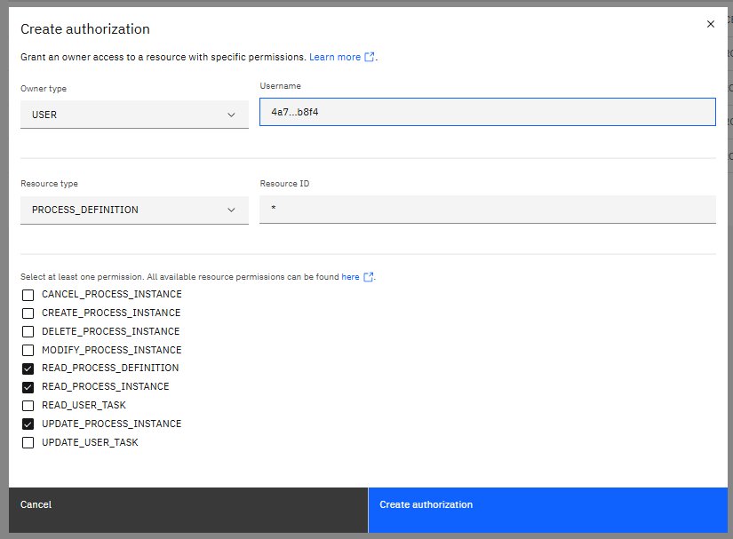

if the worker need to manipulate documents, it must have authorization too

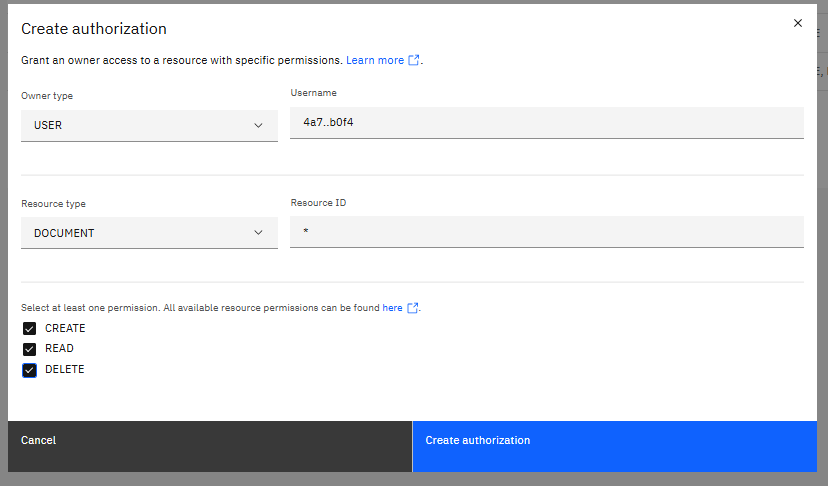

if the worker need to manipulate messages, give authorization

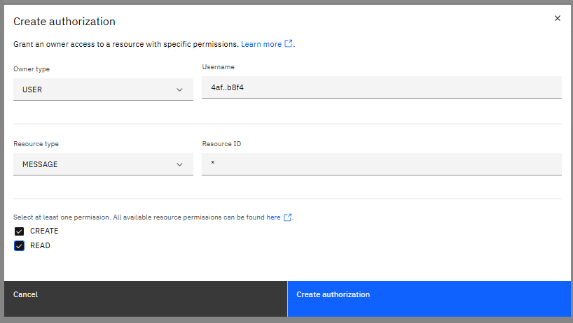

## unprotected API

You can turn on the unprotected API mode by adding
```yaml
orchestration:
  env:
    - name: CAMUNDA_SECURITY_AUTHENTICATION_UNPROTECTED_API
      value: "true"
```

Attention:
* the API is not protected
* but a worker need autorization to access jobs. Doing that, the connection does not have any user, so any authorization: the worker does not get any jobs to process.


# REST API

Get the access token (see before)

Then call any API:

```shell
curl --header "Authorization: Bearer ${ACCESS_TOKEN}" localhost:8080/v2/topology
```

# Management Identity, Web Modeler, Optimize

## configuration


```yaml
  identity:
    auth:
      enabled: true
      issuer: https://login.microsoftonline.com/<Microsoft Entra tenant ID>/v2.0
      # this is used for container to container communication
      issuerBackendUrl: https://login.microsoftonline.com/<Microsoft Entra tenant ID>/v2.0
      tokenUrl: https://login.microsoftonline.com/<Microsoft Entra tenant ID>/oauth2/v2.0/token
      jwksUrl: https://login.microsoftonline.com/<Microsoft Entra tenant ID>/discovery/v2.0/keys
      publicIssuerUrl: https://login.microsoftonline.com/<Microsoft Entra tenant ID>/v2.0
      type: "MICROSOFT"
      identity:
        clientId: <Client ID from Step 2>
        audience: <Client ID from Step 2>
        secret:
          existingSecret: camunda-client-credentials
          existingSecretKey: client-secret
        initialClaimValue: <Initial claim value>
        initialClaimName: "oid"
        redirectUrl: "http://localhost:8084"
      optimize:
        clientId: <Client ID from Step 2>
        audience: <Client ID from Step 2>
        secret:
          existingSecret: camunda-client-credentials
          existingSecretKey: client-secret
        redirectUrl: "http://localhost:8085/optimize"
      webModeler:
        clientId: <Client ID from Step 2>
        audience: <Client ID from Step 2>
        clientApiAudience: <Client ID from Step 2>
        publicApiAudience: <Client ID from Step 2>
        redirectUrl: "http://localhost:8090"


identity:
    #  contextPath: "/identity"
  enabled: true
  env:
    - name: CAMUNDA_IDENTITY_AUDIENCE
      value: <Client ID from Step 2>


identityPostgresql :
  enabled: true
  auth:
    existingSecret: camunda-client-credentials
    secretKeys:
      userPasswordKey: postgres-password
      adminPasswordKey: postgres-password

  # kubectl port
webModeler:
  #  contextPath: "/modeler"
  enabled: true
  webapp:

  restapi:
    mail:
      # This value is required, otherwise the restapi pod wouldn't start.
      fromAddress: pierre-yves.monnet@camunda.com
    env:
      - name: CAMUNDA_MODELER_CLUSTERS_0_ID
        value: "local-cluster"
      - name: CAMUNDA_MODELER_CLUSTERS_0_NAME
        value: "Local Cluster"
      - name: CAMUNDA_MODELER_CLUSTERS_0_VERSION
        value: "8.8.0"
      - name: CAMUNDA_MODELER_CLUSTERS_0_AUTHENTICATION
        value: "BEARER_TOKEN"
        # Might be able to omit the .svc.local
      - name: CAMUNDA_MODELER_CLUSTERS_0_URL_GRPC
        value: "grpc://camunda-zeebe-gateway.camunda.svc.cluster.local:26500"
        # Internal cluster REST reference
      - name: CAMUNDA_MODELER_CLUSTERS_0_URL_REST
        value: "http://camunda-zeebe-gateway.camunda.svc.cluster.local"
      - name: CAMUNDA_MODELER_CLUSTERS_0_URL_WEBAPP
        value: "http://localhost:8080/"
      - name: CAMUNDA_MODELER_CLUSTERS_0_AUTHORIZATIONS_ENABLED
        value: "true"
      - name: SPRING_PROFILES_INCLUDE
        value: "default-logging"

# WebModeler Database.
webModelerPostgresql:
  enabled: true
  auth:
    existingSecret: "camunda-client-credentials"
    secretKeys:
      adminPasswordKey: postgres-password
      userPasswordKey: postgres-password


optimize:
  enabled: true
  contextPath: "/optimize"

```

Replace all values

| Value                                        | Origin              | Value               |
|----------------------------------------------|---------------------|---------------------|
| <Microsoft Entra tenant ID>                  | TenantId            | cbd...ba9           |
| <Initial claim value>                        | ObjectId of user    | ef6...312           |
| <Client ID from Step 2>                      | Client Id           | 026...1c9           |


Secrets are store in a Secret file

```yaml
# kubectl apply -f em_camunda-client-credentials.yaml
apiVersion: v1
kind: Secret
metadata:
  name: camunda-client-credentials
type: Opaque
stringData:
  client-secret: "<Client secret from Step 5>"
  postgres-password: "postgres"
```
# ContextPath or not ContextPath?

When an ingres is used, the context path is mandatory. Else, the context Path **must not be set**.


## Management Identity

Connect to the Management Identity

```shell
$ kubectl -n camunda port-forward service/camunda-identity 8084:80
```

Then use the url `localhost:9084` (or `localhost:9084/identity` if a contextPath is given)

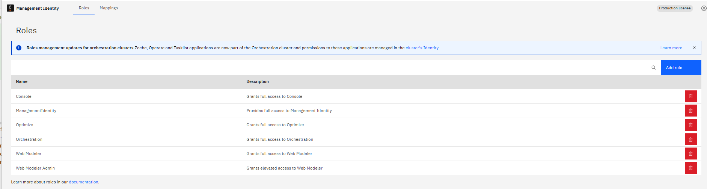

Access the Mapping tab

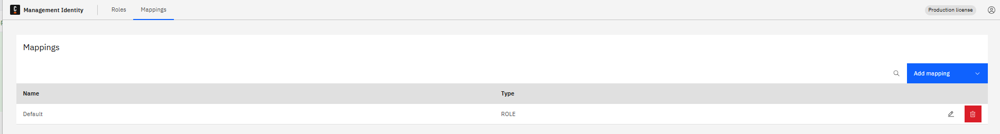


Click on Edit on the Default role, and add in the role `Web Modeler`and `Òptimize` 

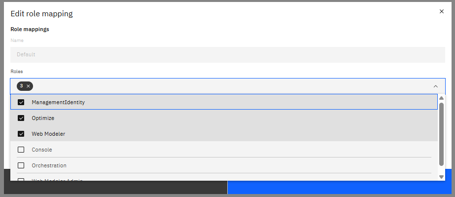

> Management Identity does not cumulate roles. If you create a different mapping based on the same users, it will not cumumlate roles. Check existing mapping.


## Web Modeler

 

1. Forward the port
```shell
$ kubectl -n camunda port-forward service/camunda-web-modeler-webapp 8090:80
```

2. Add the redirect URL `localhost:9084` (or `localhost:9084/identity` if a contextPath is given)


If the webModeler loop on the token authentication, check the redirection 
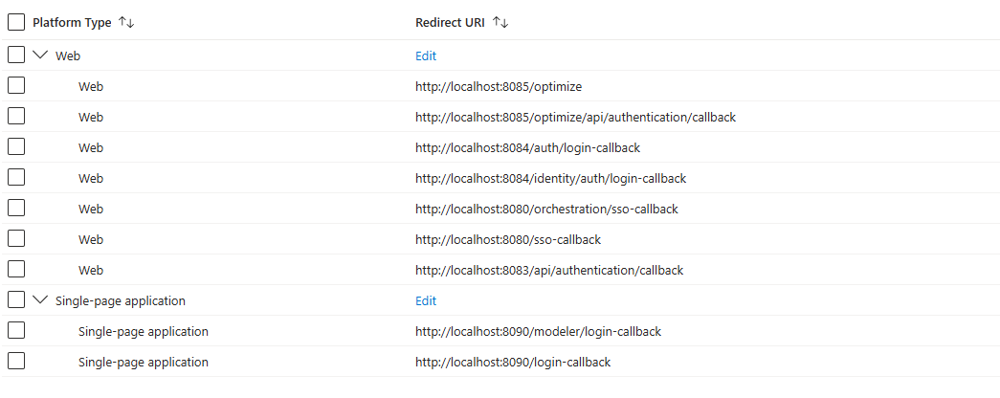

The redirection **must be** under the category  `single Page Application`


Visit https://docs.camunda.io/docs/self-managed/deployment/helm/configure/authentication-and-authorization/microsoft-entra/#redirect-uris-per-camunda-component 

3. Create a project, and inside a project, a simple BPMN Diagram


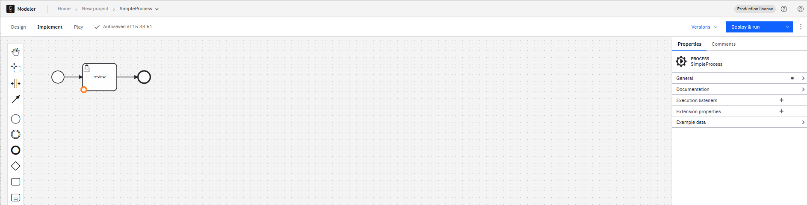

4. Deploy the diagram: name `Local Cluster` come from the variables.

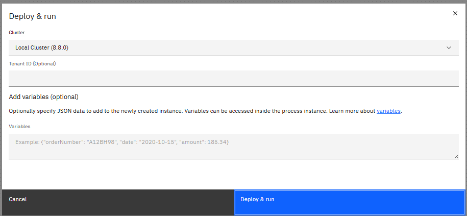

5. Verify the process appears on Operate

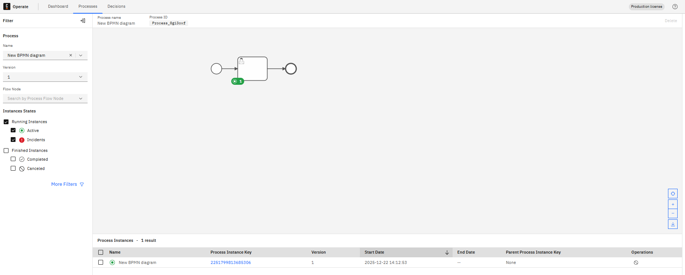


## Optimize

1. Forward the Optimize port

```shell
$ kubectl -n camunda port-forward service/camunda-optimize 8085:80
```
2. Add the redirect URL `http://localhost:8085/api/authentication/callback` (or `http://localhost:8085/optimize/api/authentication/callback` if a contect path `optimize` is provided)


3. Access `localhost:8085` (or `localhost:8085/optimize` if a context path is provided) 

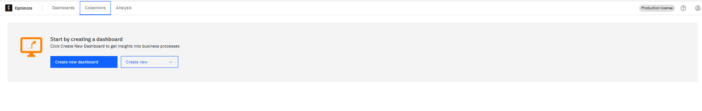


# Multi tenancy


```
global:
  multitenancy:
    enabled: true
  
```

> Note: enable multi tenant implie to enable Identity Management

==> Multi tenancy is not enable, but it is visible in Idenity and possible to create a tenant!


## Create tenant in Identity
 
Go to Identity, then select "tenant". Create a tenant `blue`

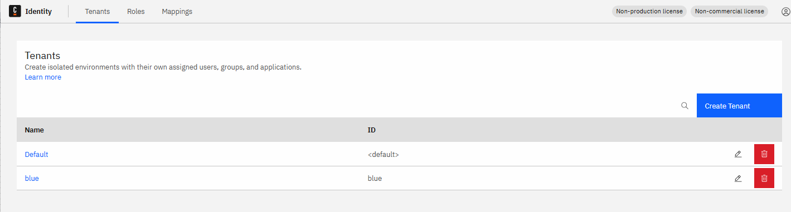

Users has to be validated in that tenant. Go to Role, and add the role `admin`

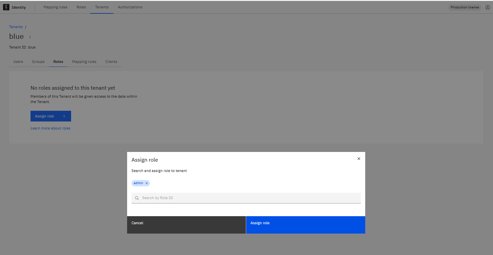

Check in Operate: the tenant `blue` is visible.

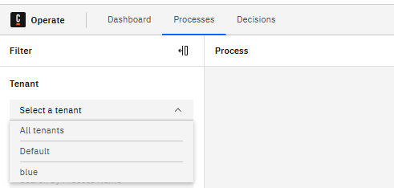

## Deploy process in a tenant via WebModeler

WebModeler use the application registration ID.

This client must have access in the tenant. Decode the token and get the `oid` value. It may be on another attribute used in the token: check the value `orchestration.security.authentication.oidc.usernameClaim`

1. Access Identity/Tenants

2. Add the user in the tenant

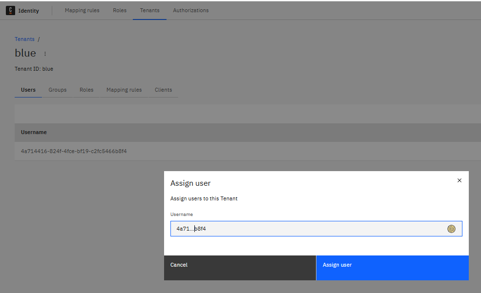

3. in Authorization/Tenant, add the user

> This step is not mandatory, but it's better to give access to the user in this authorization.

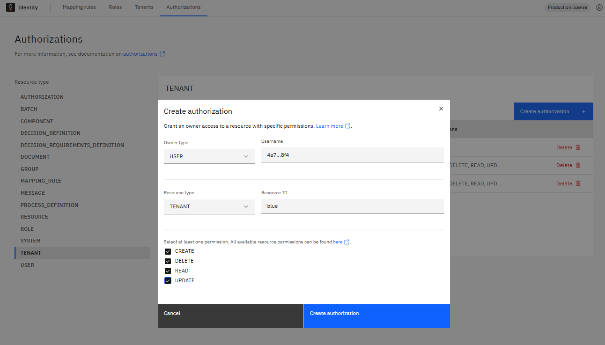

4. In Authorization/Resource, add the user

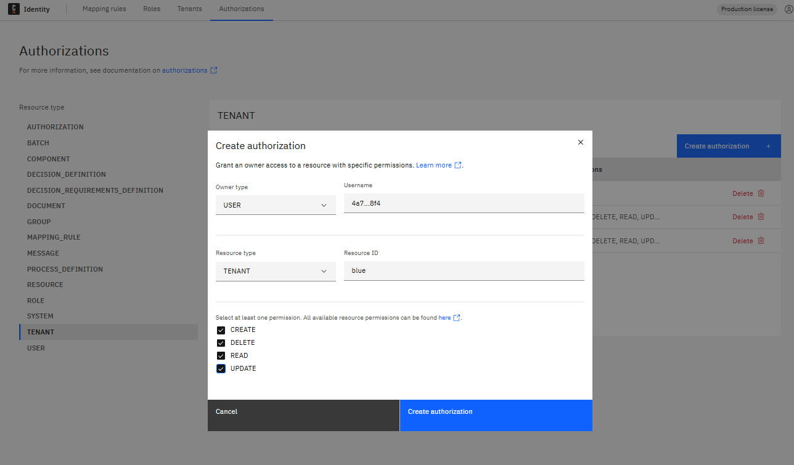

5. Deployment works : check the REST API

```shell

curl --header "Authorization: Bearer ${ACCESS_TOKEN}" -L 'http://localhost:8080/v2/deployments' \
-H 'Accept: application/json' \
-F resources=@ReviewCandidateGroup.bpmn \
-F 'tenantId=blue'
```

6. Check from the Web Modeler 


## Worker

Add the tenant in the tenant list.
 
The API must be protected (CAMUNDA_SECURITY_AUTHENTICATION_UNPROTECTED_API **must not** be true)

```yaml
camunda:
  client:
    mode: self-managed
    tenant-ids:
      - blue

```

Restart the worker

> Check the workers section before to give authorization to workers


## Debugging

Verify the token retrieved, and verify it. 

## orchestration token

The orchestration retrieve the token via an access code.
It asked the SSO and get an authorization code. Then, from the authorization code, it access a token.

1. Ask the authorization code

Create the URL and ask it in a browser

```
https://login.microsoftonline.com/<Microsoft Entra tenant ID>/oauth2/v2.0/authorize?client_id=<ClientId>>&response_type=code&redirect_uri=<redirectUrl>&response_mode=query&scope=openid%20profile%20offline_access&state=12345

```

| Value                       | value.yaml                                                     | Origin       | Value                  |
|-----------------------------|----------------------------------------------------------------|--------------|------------------------|
| <Microsoft Entra tenant ID> | global.identity.auth.authUrl                                   | TenantId     | cbd...ba9              |
| <ClientId>                  | orchestration.security.authorizations.oidc.clientId            | ClientId     | 026...1c9              | 
| <ClientSecret>              | orchestration.security.authorizations.oidc.secret.inlineSecret | ClientId     | 026...1c9              | 
| <redirectUrl>               | orchestration.security.authorizations.oidc.redirectUrl>        | RedirectUrl  | http://localhost:8080  | 

It's important to use the url in a browser, to get back the result. Curl does not work, because when the URL is accessed, the SSO will redirect the browser to the login mechanism, and when the login is success, it will redirect to the redirectUrl.
This redirect URL must be correct, else the SSO will refuse to redirect to this URL and you will not see the code.
Last, it's important to stop the orchestration: the code has an uniq usage, and must be use quickly (in the minute). if the redict works, then orchestration will use the code to access token, and the code is not usefully: the second step will fail. 

The browser must return an error, which is perfect. The authorization code is in the URL.


Code is
```
http://localhost:8080/sso-callback?code=1.AYEAVGbUy3RPMkOkkGnw8HG6n004ePrOWoRNqt0A7FXqOcAAAACBAA.BQABBAIAAAADAOz_BQD0_0V2b1N0c0FydGlmYWN0cwIAAAAAAB8UZMcSWVCRB6TbQUW9exddmhgAGokgNIN3bA78YSaN-dB1pLPgCWk31XYE7t0tJtfARz7JnatguYN4KEaFqEelqUkTZjRvqqaVBXgNebMrvDHLR45xbX6sNd7jd1p5RzxLQ6STtwwbjnApxtGsh-42_CP9C3WzLic0gR0x3GHfazxtFPMqMF7zr6bjR2Voa8dORpZsjSNs-TejMl3rwO4kIbxfvhdol-1k1onQaXTKpkf5mtYUPo1uZp0FUECs4nwRsrw6upFzGGEU0udHFp5ip_8QxtO97F83Pnp9QVgiHib3CU1tsfzWN73j1F4IsY1CUjwxN8y2E6TwB0WVk8ba_rihyOkZMAJJi435DERatCuLLPse0VJ4QkXk3fAhItT9DsqRqkHMRAv8bG9904AFRUd2_zMK4XvH1chxoCYsv2-zWhxpxwZu5EF81gXWMgp70LjqGus8DnQTJbE8hkL3In9R1I21wsiB-QKy9plRdnrc4w_jNh4IFkf8gVMLJAEDkgY9KCl6akvz7VKpb9DBFpxL53xXvGcE4MixVUbi9oRFI4E4awQrOhLfZtyYhsn5ontXLU-AV4pGpNBI3UgQ_rP4oGLa8iSQHXuaem-b9YllLp4xN3PfVxUbjGPYnx4io4ckvVj_iDAdhv8D7sA8vccpaRYFDfoM-ln9wvjVUHe5NO3gdhYHxNlPoeJb886hhaynxdcQ8H7tgnkV0l_aK0bKy4LMWYUphA8Zsb3cfdswRP0Esvprg2xZr9jEZLS8yNZdqXiKLzXZ_hqZqVWxGuX7HLEgcpCkc6ooxucmA1vsFflfO1HzdDKpicV1VYto8KBCGIG-nRQgNWIX61hveATbZSSdC58eN53nbLBllTlwYaMjGBk4WCQeN6TOBGvSBdAHLfZE4bN2pmSvmqGlIDxtX78T9PCiJHu8OieFhHNPFhhwvHEbbZuvi0TX0HJ3YAUVgdaX2RFguOQwyfCY5z_qKHC95hvK4yVmBLjwME9AkBv2DLqH98F3etjEiU1MVSIO36Ec2cx8h9A1UaBVmianXsnnGCaZjK4vD5EZ_VcaCR-G7jF1CuPmtcjJ3D8Mc4ntDUD0Z1ML6uGAn6AQFd9_5XnZjSig2-TcjwGFaOyElClf2QpdPn11CN6ku-42ilmILJL2s0FmLUDkgufZXlfDsxIirID5_2CuCaPIBfuvt08vyquWOb69P3BWKssIbiTBD2RPzEkpDCv-csrTElgVmmTLPG2fti7u4H0cgqWPtMtd6mI1CvrWWSfHAFqtBP6gqD6eF7O4vqMusbOMuw&state=12345&session_state=002199aa-cf96-e0d0-0c43-51757fda033b#
```

2. use the authorization code to get tokens

Use the 

```shell

curl -X POST "https://login.microsoftonline.com/<Microsoft Entra tenant ID>/oauth2/v2.0/token" \
  -H "Content-Type: application/x-www-form-urlencoded" \
  -d "client_id=<ClientId>" \
  -d "scope=openid profile" \
  -d "code=<Code Retrieved Step 1>" \
  -d "redirect_uri=<redirectUrl>" \
  -d "grant_type=authorization_code" \
  -d "client_secret=<ClientSecret>"
```

> The code must be use quickly, in the minute.

```yaml

{
  "token_type":"Bearer",
  "scope":"openid profile email",
  "expires_in":3838,
  "ext_expires_in":3838,
  "access_token":"eyJ...ckg",
  "id_token":"eyJ...Cxg"}
```


## M2M token


1. Ask for a token via this call

```shell
curl --location --request POST '${TOKENURL}' \
--header 'Content-Type: application/x-www-form-urlencoded' \
--data-urlencode "client_id=${CLIENT_ID}" \
--data-urlencode "client_secret=${CLIENT_SECRET}" \
--data-urlencode "scope=${SCOPE}" \
--data-urlencode 'grant_type=client_credentials'
```
For example

```shell
curl --location --request POST 'https://login.microsoftonline.com/cbd...ba9f/oauth2/v2.0/token' \
--header 'Content-Type: application/x-www-form-urlencoded' \
--data-urlencode "client_id=026...1c9" \
--data-urlencode "client_secret=fzR...ueP.apy_Kc.7" \
--data-urlencode "scope=026...1c9/.default" \
--data-urlencode 'grant_type=client_credentials'
{"token_type":"Bearer","expires_in":3599,"ext_expires_in":3599,"access_token":"eyJ0eXAiO.....xxuH9RS6pH_zscNSMff_wVJE7fvqSkyi_T5pgM3AJj9yuTeYPuJ6HC6_AKkqsA_gVVxPqnKG8GFTn2TXaPYRdhfwBc5DwZIPF3qIbM49xQAq141yTSumfe-1d2f5iZzmdFh32OHLKBr4A_ybj_pfZOjW-Sg"}
```

## Decode a token

Copy the token in https://www.jwt.io/. See the detail in terms of object used by EntraId

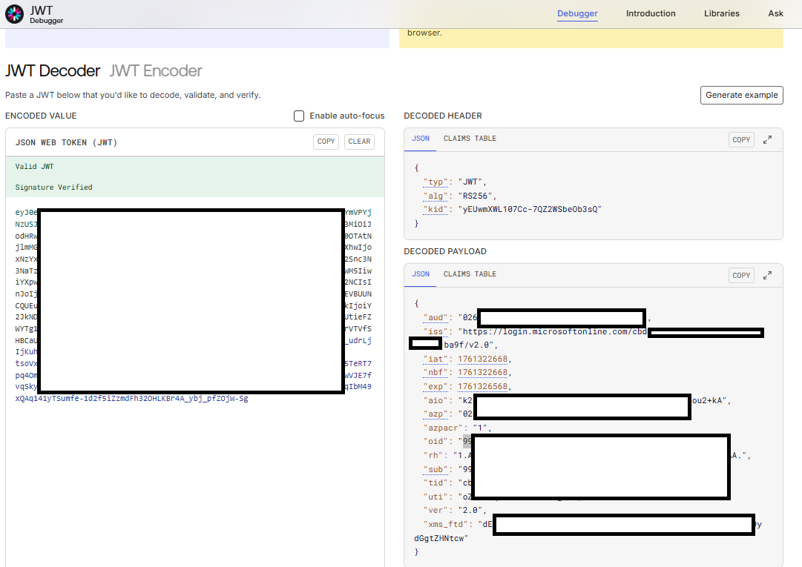

The result is something like 

Header:
```yaml
{
  "typ": "JWT",
  "alg": "RS256",
  "kid": "rtsFT-b-7LuY7DVYeSNKcIJ7Vnc"
}
```

Payload:

```yaml
{
  "aud": "fa...789c0",
  "iss": "https://login.microsoftonline.com/cbd4...a9f/v2.0",
  "iat": 1765825135,
  "nbf": 1765825135,
  "exp": 1765829035,
  "aio": "k2J...zcA",
  "azp": "fa78...39c0",
  "azpacr": "1",
  "oid": "4a71...8f4",
  "rh": "1.AYE...AA.",
  "sub": "4a71...b8f4",
  "tid": "cbd...ba9f",
  "uti": "iNn...86AA",
  "ver": "2.0",
  "xms_ftd": "mM292...1kc21z"
}
```

The header contains two important information: `alg` (algorithm use to decode) and `kid` (key accepted for the application)


* `token.aud` == (value.yaml) `orchestration.security.authentication.oidc.audience`

* `token.iss` == (value.yaml) `global.identity.auth.publicIssuerUrl`

* `token.kid` (header) == is present in (value.yaml) `global.identity.auth.jwksUrl` : on one the `keys[].kid`

* `token.alg` (header) == `RS256`

## Check KID

To check the KID, the JWKS repository must be accessed.

The JWKS repository is accessible by
* the `well-known` configuration.
  The URL `<global.identity.auth.issuer>/.well-known/openid-configuration`.
  In our example, `https://login.microsoftonline.com/<Microsoft Entra tenant ID>/v2.0/.well-known/openid-configuration` is used.

The JSON contains a `jwks-uri` field, which is the JWKS repository


* Explicitly given via the variable `global.identity.auth.jwksUrl`

```shell
 curl https://login.microsoftonline.com/<TenantId>/discovery/v2.0/keys
```

Then, access it via a browser.

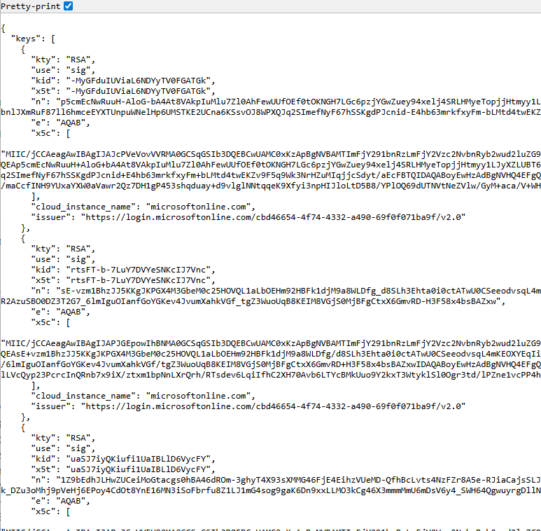

The result contains a list of keys. Each key has a `kid`. The `kid` present in the token must be referenced in the list.

> ATTENTION: Camunda manage only one JWKS repository. All tokens generated contains a kid. All kids must be visible in the JWKS.