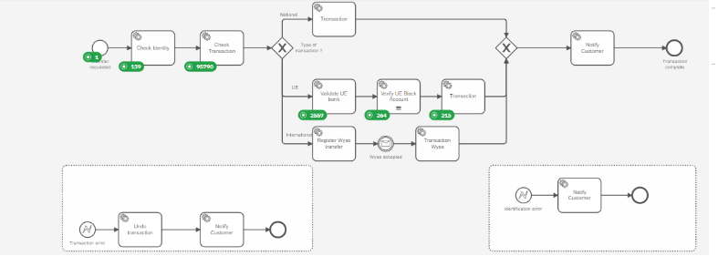
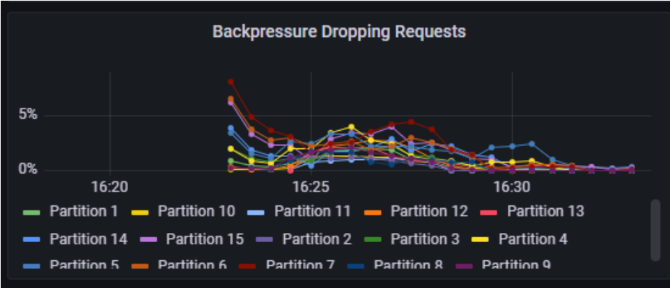
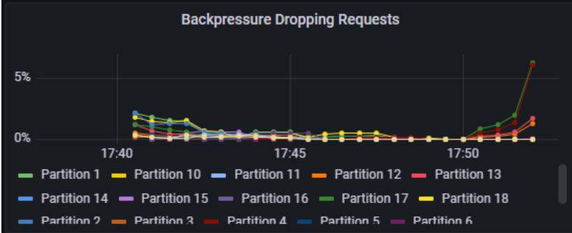
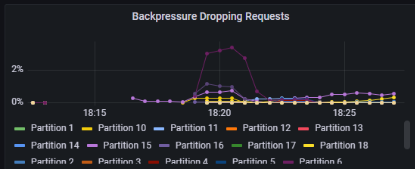
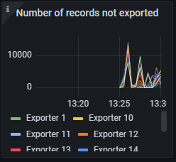

# Load Test Challenge Explanation

# Introduction

This challenge aims to find the correct configuration to handle the load test of the Bank of Andorra.

# Estimate the load

According to the specifications:
Number of service tasks per second:

| label                                 |          Value |
|---------------------------------------|---------------:|
| Number of PI/hour                     |   800,000 PI/h |
| Number of PI/s                        |       223 PI/s |
| Number of service task/PI             |    5 + 1*2 = 7 |
| Number of service tasks/s             |  1,561 Tasks/s |
| Number of service tasks/partition (*) |            150 |
| Number of partitions                  |             11 |


(*) Where come this number? SaaS environment explain a Large Saas Environment can handle 500 services tasks per second, with 3 partitions.
Visit https://docs.camunda.io/docs/components/best-practices/architecture/sizing-your-environment/#camunda-8-saas
So, the metric is 500/3 = 166 services task/partition. We use 150 as a conservative way. We will see during this load test that multiple factors impact the number of partitions. 
But this value is a good starting point.


So, the idea is to start with 11 partitions.

Next steps consist of identifying the number of worker threads.

The method is the following:
* calculate the CAPACITY of one thread
* calculate the LOAD of the worker


The calculation is based on a period of time. The minute is a good candidate if the service task run under the minute. Else, choose a larger base, like the hour.

In hour situation, all service task is around the second, so we consider the minute as a good candidate.

The CAPACITY is the work one thread can handle. For example, if a task need 20 seconds to proceed, the capacity for a thread in a minute is 3: the thread can run 3 tasks in the minute
How to calculate that? 

````
Capacity/minute = 60 / DurationOfOneTaskInSecond
````

The LOAD is the work the cluster need to provide. For example, if there is 20 tasks to execute per second, that's mean the load is 20*60 tasks per minute.

````
Load/minute = numberOfTask in the minute 
````

The number of threads is then the Load/Capacity. If you have to perform 5 task per minute, and one thread can handle 3 tasks per minute, you need 2 threads

At the end, number of worker is an estimation. In Camunda 8, a worker can host multiple threads. It's really depends on the work itself, and the implementation.
A service which need to turn a JPEG image is very CPU consuming, and maybe the worker can handle only 10 threads before it overload the CPU of the pod.
On the other range, when the worker just send a REST API to an external service, the worker can handle 300 threads, and if it implement the Reactiv programmation, maybe 1000 jobs at a time.


Capacity per worker:

| Service                  |  Execution (ms) | Capacity/mn |
|--------------------------|----------------:|------------:|
| check-identity           |              30 |        2000 |
| check-transaction        |             100 |         600 |
| national-transaction     |            1200 |          50 |
| validate-UE-bank         |             300 |          20 |
| ue-transaction           |            1300 |          46 | 
| wyse-registration        |            1200 |          50 |
| wyse-transaction         |            1400 |          42 |
| notify-customer          |              80 |         750 |
| undo-transaction         |            4300 |          13 |

Load per worker:

| Service                  | Nb tasks/process |Number of task/s |  Load/mn |
|--------------------------|-----------------:|----------------:|---------:|
| check-identity           |                1 |             223 |    13380 |
| check-transaction        |                1 |             223 |    13380 |
| national-transaction     |                1 |             223 |    13380 |
| validate-UE-bank         |                1 |             223 |    13380 |
| verify-accreditation-org |                2 |             446 |    26760 |
| ue-transaction           |                1 |             223 |    13380 |
| wyse-registration        |                1 |             223 |    13380 |
| wyse-transaction         |                1 |             223 |    13380 |
| notify-customer          |                1 |             223 |    13380 |
| undo-transaction         |                1 |             223 |    13380 |


Calculation:
For an average, we use the value of 250 threads per worker.


| Service                  | Capacity/mn |   Load/mn | Nb threads (Load/Capacity) | Workers |
|--------------------------|------------:|----------:|---------------------------:|--------:|
| check-identity           |        2000 |     13380 |                       6.69 |       1 |
| check-transaction        |         600 |     13380 |                       22.3 |       1 |
| national-transaction     |          50 |     13380 |                      267.6 |       2 |
| validate-UE-bank         |          20 |     13380 |                       66.9 |       1 |
| verify-accreditation-org |         150 |     26760 |                      178.4 |       1 |
| ue-transaction           |          46 |     13380 |                      289.9 |       2 |
| wyse-registration        |          50 |     13380 |                      267.6 |       2 |
| wyse-transaction         |          42 |     13380 |                      312.2 |       2 |
| notify-customer          |         750 |     13380 |                      17.84 |       1 |
| undo-transaction         |          13 |     13380 |                      958.9 |       4 |


# Goal
We want to run a small test:

Running a 3-minute test, and a warmup 1 mn, we expect
* To create 223*60*(3+1)=53520
* To process 223*60*3=40140 PI
* To reach 1561 tasks/s

# Scenario
The `process-execution-automator` is used to run a load test.

One Kubernetes deployment is started for each service task.

According to the rule “one pod host 250 threads worker”, ue-transaction will start 2 deployments.

# Pre-requisite

## Enable metrics

Create the Grafana environment in the `camunda-8-helm-profiles` (https://github.com/camunda-community-hub/camunda-8-helm-profiles)

````shell
cd metrics
make metrics
kubectl get service metrics-grafana-loadbalancer --namespace default
NAME                       	   TYPE       	  CLUSTER-IP 	  EXTERNAL-IP 	 PORT(S)    	AGE
metrics-grafana-loadbalancer   LoadBalancer   10.32.12.168   34.148.16.113   80:32264/TCP
````

Open a browser, access the external IP ( http://34.148.16.113), Login: camunda/camunda

# Execute the scenario

## 1. Create the cluster
Deploy the cluster (replace _1 by the correct test execution)

````shell
kubectl create namespace camunda
helm install --namespace camunda  camunda camunda/camunda-platform -f test_1/C8_BankOfAndora-1.yaml
````


## 2. Upload the process from the modeler

Upload the process
````shell
kubectl port-forward svc/camunda-zeebe-gateway 26500:26500 -n camunda
````

On the modeler, deploy the process `BankOfAndora.bpmn`

## 3. Load the scenario

Load the scenario in a config map

````shell
cd solution
kubectl create configmap bankscn --from-file=SCN_BankOfAndora.json
````

## 4. Start the test
Start the test:

````shell
kubectl create -f test_1/LoadTest_BankOfAndora-1.yaml
kubectl get pods
kubectl logs -f pa-creation-55f4467c96-z5j5j
````

and to stop it, use
````shell
kubectl delete -f test_1/LoadTest_BankOfAndora-1.yaml
````

# Test 1
Create the cluster with 11 partitions:
````yaml
global:
  identity:
    auth:
      enabled: false

identity:
  enabled: true

identityKeycloak:
  enabled: false

tasklist:
  enabled: true


optimize:
  enabled: false

connectors:
  enabled: false

zeebe:
  clusterSize: 11
  partitionCount: 11
  replicationFactor: 3
  pvcSize: 10Gi

zeebe-gateway:
  replicas: 2

elasticsearch:
  master:
    replicaCount: 1
    persistence:
      size: 15Gi

prometheusServiceMonitor:
  enabled: true
````


Install it:
````shell
kubectl create namespace camunda

helm install --namespace camunda camunda camunda/camunda-platform -f test_1/C8_BankOfAndora-1.yaml
````


Run the different port-forward on Zeebe
Result:
On Operate:



On Grafana


Result:

| Item       |  Goal | Result |
|------------|------:|-------:|
| Creation   | 53520 | 129037 |
| Process    | 40140 |   9319 |
| Throughput |  1561 |    250 |


There is a lot of backpressure, and the task `checkTransition` is a bottleneck, with more than 96790 jobs waiting here. 

# Test 2
To avoid backpressure, let's increase the number of partitions to 15. 
The number of workers behind `checkTransition` has increased to 3.

````shell
kubectl create namespace camunda


helm install --namespace camunda camunda camunda/camunda-platform -f test_2/C8_BankOfAndora-2.yaml
````
Start the test

````shell
kubectl create configmap bankscn --from-file=SCN_BankOfAndora.json
kubectl create -f test_2/LoadTest_BankOfAndora-2.yaml
kubectl get pods | grep crea
kubectl logs -f pa-creation-55f4467c96-z5j5j
````

At the end, stop the test by 

````shell
kubectl delete -f test_2/LoadTest_BankOfAndora-2.yaml
````

Result





| Item       |  Goal | Result |
|------------|------:|-------:|
| Creation   | 53520 | 113564 |
| Process    | 40140 |   5792 |
| Throughput |  1561 |   1200 |

There is still some backpressure. The `checkTransition` is no longer a bottleneck, but now the next task appears as bottleneck


# Test 3
Still some backpressure: increase the number of partitions to 18. Increase the ES CPU to 5

Increase the number of workers:

check-transaction to 5 (+1)
Validate-ue-bank to 6 (+2)
Verify-accreditation to 6 (+2)
Transaction to 5 (+4)

````shell
kubectl create namespace camunda

helm install --namespace camunda camunda camunda/camunda-platform -f test_4/C8_BankOfAndora-4.yaml
````

Start the test

````shell
kubectl create configmap bankscn --from-file=SCN_BankOfAndora.json
kubectl create -f test_3/LoadTest_BankOfAndora-3.yaml
````
Stop the test by

````shell
kubectl delete -f test_3/LoadTest_BankOfAndora-3.yaml
````

Result
Have some overload during the creation
2024-06-06T00:45:13.247Z  INFO 1 --- [      Tran_BOA3] o.c.a.e.flow.RunScenarioFlowStartEvent   : Step #29-STARTEVENT Tran_BOA(StartEvent)] Create (real/scenario)[1769/2223 OVERLOAD] Failed[0] in 10995 ms




The backpressure is now tackled, but the number of process instances created does not follow correctly now.
Still, some tasks stay in the process.

# Test 4

Update
Creation: set the number of threads to 120 (+20)
check-transaction to 4 (+1)
Validate-ue-bank to 4 (+2)
Verify-acreditation to 4 (+2)


````shell
kubectl create namespace camunda

helm install --namespace camunda camunda camunda/camunda-platform -f test_4/C8_BankOfAndora-4.yaml
````

Start the test

````shell
kubectl create configmap bankscn --from-file=SCN_BankOfAndora.json
kubectl create -f test_4/LoadTest_BankOfAndora-4.yaml
````
Stop the test by

````shell
kubectl delete -f test_4/LoadTest_BankOfAndora-4.yaml
````

Result



| Item       |  Goal |          Result |
|------------|------:|----------------:|
| Creation   | 53520 |          131817 |
| Process    | 40140 | More than 10000 |
| Throughput |  1561 |            1600 |

The goal is now reach! But there is one concern. Operate does not show the same result as Grafana. 
After stopping the test, still after 10 mn, Operate value still change. 
This is a sign Operate import is far away the reality


# Test 5 - Scale Operate

Check first the Number Of Record not exported



It must be stable.

Does the operate follow the throughput?


To investigate that situation, MonitorApplication helps

Run the command as a pod
```
kubectl create -f camunda-8-monitor-exporters.yaml
```

A new pod is created.Identify it, and access the log

```
kubectl get pods
```
Search the pods `camunda-8-monitor-exporters-*`

```
kubectl logs -f camunda-8-monitor-exportersxxxxxxxx
```

Output is something like:


```
:       2024-12-06 19:59:27 | ZeebeSequence        | ZeebeDelta           | OperateSequence      | OperateDelta         | SequenceDelta        | Status               | ZeebeThroughput      | OperateThroughput
: PROCESS_INSTANCE          |   159877786774272622 |               126327 |   236438980437043681 |                 1000 |   -76561193662771059 | inpr;INC. 125,327    |    473,726 rec/mn    |      3,750 rec/mn
: PROCESS                   |   123848989752688680 |                    0 |   236438980436951096 |                    0 |  -112589990684262416 | inpr;                |          0 rec/mn    |          0 rec/mn
: VARIABLE                  |   159877786771868918 |                10748 |   236438980437028357 |                 2800 |   -76561193665159439 | inpr;INC. 7,948      |     40,305 rec/mn    |     10,500 rec/mn
: JOB                       |   159877786772254519 |                28862 |   236438980437034323 |                 1600 |   -76561193664779804 | inpr;INC. 27,262     |    108,232 rec/mn    |      6,000 rec/mn
```

It's clear that Zeebe produce more data than Operate can process. The Zeebe throughput is about 473, 726 records per minutes, when Operation import only 3,750 records per minute. Note this is a photography at a moment.

The second parameter is the backlog: it's only 125, 327 at this moment, but it was increasing (INC. tag).


This is acceptable if Zeebe face a peak, and after a while, stop to export. Then Operate importer can speed up the throughput. We know this should be the standard througput for multiple hour, so actions must be taken here.

## Multi-threaded the operate importer

Change the Operate configuration:

````yaml
operate:
  env:
    - name: CAMUNDA_OPERATE_IMPORTER_THREADSCOUNT
      value: "18"
    - name: CAMUNDA_OPERATE_IMPORTER_READERTHREADSCOUNT
      value: "18"

````

Run the same test again.


Operations are better: the delta at the end of the execution is about -193654783973520529 records (which is negative, which make no sense)

````
:       2024-12-06 21:36:53 | ZeebeSequence        | ZeebeDelta           | OperateSequence      | OperateDelta         | SequenceDelta        | Status               | ZeebeThroughput      | OperateThroughput
: PROCESS_INSTANCE          |   191402984167113759 |                49663 |   385057768140634288 |                 8200 |  -193654783973520529 | inpr;INC. 41,463     |    186,236 rec/mn    |     30,750 rec/mn
: PROCESS                   |   123848989752688643 |                    0 |   385057768140177426 |                    0 |  -261208778387488783 | inpr;                |          0 rec/mn    |          0 rec/mn
: VARIABLE                  |   191402984163564790 |                 4734 |   385057768140585522 |                 7800 |  -193654783977020732 | inpr;dec. -3,066     |     17,752 rec/mn    |     29,250 rec/mn
: JOB                       |   191402984164138440 |                11451 |   385057768140623505 |                 8200 |  -193654783976485065 | inpr;INC. 3,251      |     42,941 rec/mn    |     30,750 rec/mn
````


## Deploy multiple Operate pods

Use the `C8_BankOfAndora-5.2.yaml`

This environment starts an Operate, without the importer

````
operate:
  env:
    - name: CAMUNDA_OPERATE_IMPORTERENABLED
      value: "false"
````

Start the three importers

Run manual Operate deployment with 3 Operate imports. Since there are 18 partitions, running 3 importers means each Operate will deal with 18/3=6 partitions.

```
kubectl apply -f operate-importer-0.yaml -n camunda
kubectl apply -f operate-importer-1.yaml -n camunda
kubectl apply -f operate-importer-2.yaml -n camunda
```

> Note: this step does not work.


Check the logs on one importer

```
2024-04-17 17:17:02.546  INFO 7 --- [           main] i.c.o.z.RecordsReaderHolder              : Starting import for partitions: [1,2,3,4,5,6]
```

# Test 6 - Check ElasticSearch shard

Run the test for 10 minutes,
Estimate the size of the data for one month, assuming the customer wants to keep the history for 1 month
Check if the sharding will be enough. The guideline from ElasticSearch is to keep a shard from 10 to 50 Gb

## Run a 10-minute load test
This is necessary to populate the different indexes in ElasticSearch.

## Check the size on each index

6.1 Port forward the ElasticSearch port

```shell
kubectl port-forward svc/camunda-elasticsearch 9200:9200 -n camunda
```

6.2 Check indexes
```shell
$ curl -X GET localhost:9200/_cat/indices
green open operate-flownode-instance-8.3.1_                        CrnBBtCkTfufbVPYe0J9pA 1 0  1419132  84776 363.8mb 363.8mb 363.8mb
green open operate-incident-8.3.1_                                 9Imn_mqaRH2gcAyOOtjusQ 1 0        0      0    249b    249b    249b
green open zeebe-record_command-distribution_8.6.9_2025-02-20      sjUL1-ZiQtGdTDQizusazQ 1 0       36      0    24kb    24kb    24kb
green open operate-user-task-8.5.0_                                had8hsqyS2iJvWVrrNoZHA 1 0        0      0    249b    249b    249b
green open zeebe-record_job_8.6.9_2025-02-20                       IXTSi4qwS0-LrulcHOCwng 3 0  4070459  12206 659.6mb 659.6mb 659.6mb
green open operate-sequence-flow-8.3.0_2025-02-20                  2d3_NMFZTXeX4DtnaK5TEQ 1 0     1800      0 127.7kb 127.7kb 127.7kb
green open operate-process-8.3.0_                                  ng-XXymHRf2yk-k8GXz3dA 1 0        1      5 140.7kb 140.7kb 140.7kb
green open tasklist-process-instance-8.3.0_                        yZJhxvR1QMOXxAeYRqpYhA 1 0   284398   2800  20.2mb  20.2mb  20.2mb
```

## Estimate the size

According to ElasticSearch, a shard should stay between 10 Gb to 50 Gb
For this exercise, we choose the first index, `operate-flownode-instance-8.3.1_`.

363.8 Mb was generated in 10 minutes. For one hour, it's 363/10*60.

The business said we have to run 10 hours a day, and a process instance lives 5 days before completion.
The calculation is 
```
  Size = 363 / 10 * 60 (1 h) * 10 (10 h/day) * 5 (days)= 108900 Mb =106 Gb
```
The best is to create a minimum of 3 shards for this index.

## Change the sharding

Stop the importer from operating. For a 200 Gb index, it may take 2 hours to proceed. So, in that situation, it's better to stop the importer and let operate run.

To stop the importer, update the environment variable, and run a Helm upgrade.
```
CAMUNDA_OPERATE_IMPORTERENABLED=false
```
In the other situation, just stopping Operate is fine.

6.3 Stop Operate

Operate is a deployment, so scale it to 0.

```shell
kubectl scale deployment camunda-operate --replicas=0
```

6.4 Get the details of the index


```shell
$ curl -X GET localhost:9200/operate-flownode-instance-8.3.1_?pretty=true
{
  "operate-flownode-instance-8.3.1_" : {
    "aliases" : {
      "operate-flownode-instance-8.3.1_alias" : {
        "is_write_index" : false
      }
    },
    "mappings" : {
      "dynamic" : "strict",
      "properties" : {
        "bpmnProcessId" : {
          "type" : "keyword"
        },
        "endDate" : {
          "type" : "date",
          "format" : "date_time || epoch_millis"
        },
        "flowNodeId" : {
          "type" : "keyword"
        },
        "id" : {
          "type" : "keyword"
        },
        "incident" : {
          "type" : "boolean"
        },
        "incidentKey" : {
          "type" : "long"
        },
        "key" : {
          "type" : "long"
        },
        "level" : {
          "type" : "long"
        },
        "partitionId" : {
          "type" : "integer"
        },
        "position" : {
          "type" : "long"
        },
        "processDefinitionKey" : {
          "type" : "long"
        },
        "processInstanceKey" : {
          "type" : "long"
        },
        "scopeKey" : {
          "type" : "long"
        },
        "startDate" : {
          "type" : "date",
          "format" : "date_time || epoch_millis"
        },
        "state" : {
          "type" : "keyword"
        },
        "tenantId" : {
          "type" : "keyword"
        },
        "treePath" : {
          "type" : "keyword"
        },
        "type" : {
          "type" : "keyword"
        }
      }
    },
    "settings" : {
      "index" : {
        "routing" : {
          "allocation" : {
            "include" : {
              "_tier_preference" : "data_content"
            }
          }
        },
        "number_of_shards" : "1",
        "blocks" : {
          "read_only" : "false",
          "write" : "true"
        },
        "provided_name" : "operate-flownode-instance-8.3.1_",
        "creation_date" : "1740086217441",
        "number_of_replicas" : "0",
        "uuid" : "CrnBBtCkTfufbVPYe0J9pA",
        "version" : {
          "created" : "8512000"
        }
      }
    }
  }
}
```

Save the response on the main parameters

| Parameter           | Section               |                                 Values |
|---------------------|-----------------------|---------------------------------------:|
| Aliases name        | `aliases`             |  operate-flownode-instance-8.3.1_alias |
| Number of shards    | `number_of_shards`    |                                      1 |
| Number of replicas  | `number_of_replicas`  |                                      0 |

6.5 Move the index as read-only

```shell
$ curl -X PUT localhost:9200/operate-flownode-instance-8.3.1_/_settings \
-H "Content-Type: application/json" \
-d '{    
  "index": {
    "blocks.read_only": false,
    "blocks.write": true
  }
}
'
```
The response should be

```
{"acknowledged":true}
```

6.6 Clone the index

> Note: this information must be strictly identical on this index, not the moment to change the sharding
 

`Aliases`, `Number of shards`, and `Number of replicas` come from values saved before

```shell
$ curl -X PUT localhost:9200/operate-flownode-instance-8.3.1_/_clone/tmp_operate-flownode-instance-8.3.1 \
 -H "Content-Type: application/json" \
 -d '{        
       "aliases": {
         "operate-flownode-instance-8.3.1_alias": {
         "is_write_index": false
         }
       },
       "settings": {
         "index.number_of_shards": 1,
         "index.number_of_replicas": 0
       }
    }
'
```
Response is
```
{"acknowledged":true,"shards_acknowledged":true,"index":"tmp_operate-flownode-instance-8.3.1"}p
```


6.7 Wait until the end of the operation

> Note: Attention, this is an asynchronous command. Monitor the end of the execution

```shell
$ curl -X GET "localhost:9200/_cat/recovery/tmp_operate-flownode-instance-8.3.1/?format=json&s=target_node&active_only=true&pretty=true"
```

Wait, the result returns an empty array

```
[ ]
```

6.8 Delete the original index

This is the moment to delete the original index

```shell
$ curl -X DELETE "http://localhost:9200/operate-flownode-instance-8.3.1_"
```

must return

```
{"acknowledged":true}
```

6.9 Split the index

In the Split command, give the target number of shards.

> Note: Use the alias name in the command, and the number of replicas must match.

```shell
$ curl -X POST http://localhost:9200/tmp_operate-flownode-instance-8.3.1/_split/operate-flownode-instance-8.3.1_ \
 -H "Content-Type: application/json" \
 -d '{        
  "aliases": {
    "operate-flownode-instance-8.3.1_alias": {
      "is_write_index": false
    }
  },
  "settings": {
    "index.number_of_shards": 3,
    "index.number_of_replicas": 0
  }
}
'
```

Response is 
```
{"acknowledged":true,"shards_acknowledged":true,"index":"operate-flownode-instance-8.3.1_"}
```

But the command is asynchronous.

6.10 Monitor the advancement 

```shell
$ curl -X GET "localhost:9200/_cat/recovery/operate-flownode-instance-8.3.1_/?format=json&s=target_node&active_only=true&pretty=true"
```
Wait for the empty array answer
```
[ ]
```

6.11 Make the index readable

```shell
$ curl -X PUT localhost:9200/operate-flownode-instance-8.3.1_/_settings \
-H "Content-Type: application/json" \
-d '{
  "index": {
    "blocks.read_only": false,
    "blocks.write": false
  }
}
'
```

6.1Z Delete the temporary index

```shell
$ curl -X DELETE "http://localhost:9200/tmp_operate-flownode-instance-8.3.1" 
```

6.13 Check the index

```shell
curl -X GET localhost:9200/_cat/indices?v=true

health status index                                                   uuid                   pri rep docs.count docs.deleted store.size pri.store.size dataset.size
green  open   operate-flownode-instance-8.3.1_                        3BKYVlOmRKOe_Q76e8W02g   3   0    2130521        63421    400.4mb        400.4mb      400.4mb
```

The `pri` column is the number of shards


6.14 Scale up Operate

```shell
kubectl scale deployment camunda-operate --replicas=1
```
Check the log and verify if Operate is up and running. 
