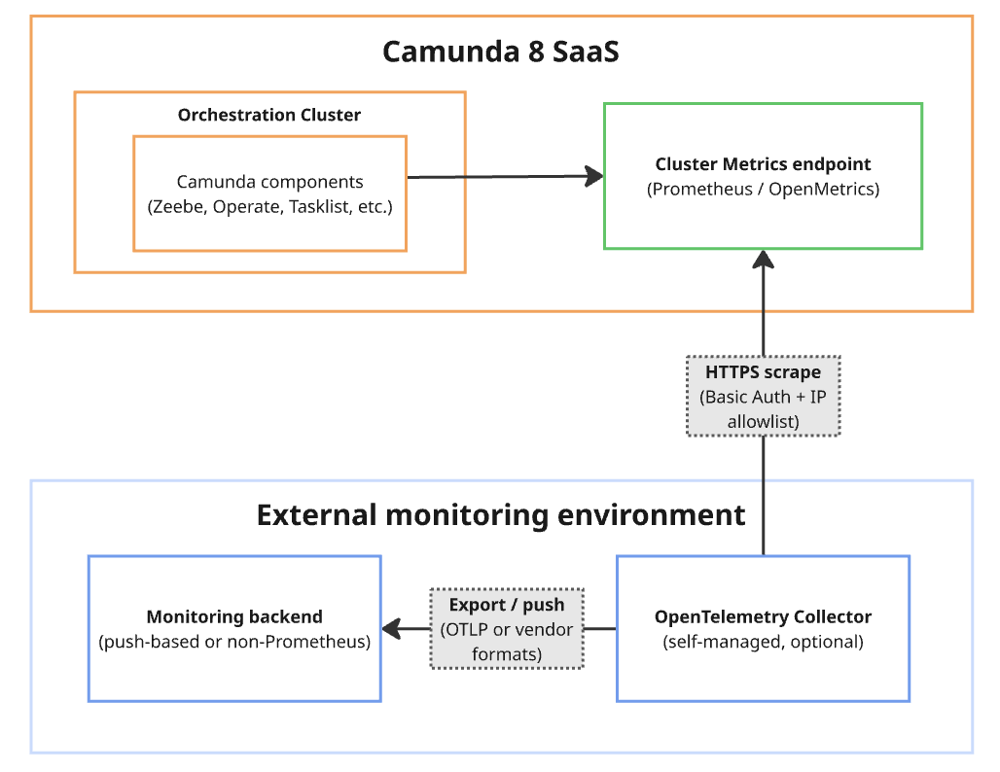

# Monitoring Camunda 8 SaaS with OpenTelemetry

## Objective

Integrate Camunda 8 SaaS Cluster Metrics with OpenTelemetry and forward them to your observability backend (Datadog, Prometheus, Grafana Cloud, etc.) using a vendor-neutral pipeline.

---

## Architecture Overview



```
Camunda 8 SaaS (Cluster Metrics Endpoint)
        ↓  HTTPS + Basic Auth (scrape)
OpenTelemetry Collector
        ↓
Overservation Backend (DataDog Metrics)

```

---

## Components

### 1. Camunda 8 SaaS — Metrics Source

Located in **Camunda Console → Monitoring → Cluster Metrics**.

- Exposes metrics in **OpenMetrics / Prometheus format**
- Authentication via **Basic Auth**
- Metrics are **pulled** (not pushed) — the collector scrapes the endpoint

Key metrics exposed:

| Metric | Description |
|---|---|
| `zeebe_health` | Partition health (1 = healthy, 0 = unhealthy) |
| `zeebe_stream_processor_records_total` | Total processed records |
| `zeebe_pending_incidents` | Number of pending incidents |

### 2. OpenTelemetry Collector — The Bridge

Acts as the central pipeline:

- **Receives** metrics via Prometheus receiver (scrapes Camunda endpoint)
- **Processes** metrics (batching, filtering, enrichment)
- **Exports** metrics to any observability backend

---

## Setup

### Step 1 — Enable Camunda Cluster Metrics

1. Go to **Camunda Console → Monitoring → Cluster Metrics**
2. Create monitoring credentials
3. Note the following:
    - **Monitoring Endpoint URL**: `https://<cluster-id>.monitoring.camunda.io/metrics`
    - **Username**
    - **Password**

### Step 2 — Configure the OpenTelemetry Collector

Create `otel-collector-config.yaml`:

```yaml
receivers:
  prometheus:
    config:
      global:
        scrape_interval: 30s
        scrape_timeout: 5s
        scrape_protocols: [OpenMetricsText1.0.0, PrometheusText0.0.4]
      scrape_configs:
        - job_name: "camunda_lhr"
          scheme: https
          metrics_path: "/3a20587e-9917-4be0-9fe6-87f90224c9ea"
          static_configs:
            - targets:
                - "lhr-1.monitoring.camunda.io"
          basic_auth:
            username: "${CAMUNDA_METRICS_USERNAME}"
            password: "${CAMUNDA_METRICS_PASSWORD}"

processors:
  batch:
    timeout: 10s
    send_batch_size: 1000

exporters:
  otlp_http:
    endpoint: "http://dd-agent:4318"
    compression: gzip
    tls:
      insecure: true

service:
  pipelines:
    metrics:
      receivers: [prometheus]
      processors: [batch]
      exporters: [otlp_http]
```

---

## Exporter Reference

| Backend | Exporter | Protocol |
|---|---|---|
| Datadog | `datadog` exporter | Datadog API |
| Prometheus | `prometheus` exporter | Pull endpoint |
| OTLP backend | `otlp` exporter | gRPC / HTTP |
| Grafana Cloud | `otlp` exporter | OTLP |

**Example — OTLP exporter:**

```yaml
exporters:
  otlp_http:
    endpoint: "http://dd-agent:4318"
    compression: gzip
    tls:
      insecure: true
```

---

## Metric Flow

When the collector scrapes Camunda, raw Prometheus metrics are converted to OpenTelemetry format internally:

**Raw Camunda metric:**
```
zeebe_health{partition="1", broker="0"} 1
```

**Converted to OpenTelemetry format:**
```
Metric:
  Name: zeebe_health
  Attributes:
    partition=1
    broker=0
  Value: 1
```

The exporter then maps this to the target backend's native format.

---

## Deployment Options

### Option A - Docker

```bash
docker compose up -d
```

### Option B — Kubernetes

Use the OpenTelemetry Operator or Helm chart. Recommended production topology:

```
Camunda SaaS → Central OTel Collector (per cluster) → Observability Backend
```

---

## Security Considerations

- Always use **HTTPS** (default for Camunda SaaS)
- Never store credentials in plaintext YAML in production
- Store credentials using:
    - Kubernetes Secrets
    - Docker secrets
    - Environment variables

---

## Comparison: OpenTelemetry vs. Datadog Agent

| Approach | Setup |
|---|---|
| **Datadog Agent (OpenMetrics)** | Camunda → Datadog Agent → Datadog |
| **OpenTelemetry (this guide)** | Camunda → OTel Collector → Any backend |

**Why OpenTelemetry?**

- Vendor-neutral — switch backends without reconfiguring Camunda
- Multi-backend export from a single collector
- Unified pipeline for metrics, traces, and logs
- Better suited for multi-environment architectures

---

## Summary

| Layer | Responsibility |
|---|---|
| Camunda 8 SaaS | Exposes `/metrics` endpoint |
| OpenTelemetry Collector | Scrapes, processes, and exports metrics |
| Exporter | Sends data to observability backend |
| Backend | Visualizes metrics and triggers alerts |

---

## Next Steps
- [Camunda components metrics](https://docs.camunda.io/docs/self-managed/operational-guides/monitoring/metrics/#use-a-different-monitoring-system)
- [Integrate non-Prometheus monitoring systems](https://docs.camunda.io/docs/next/components/saas/monitoring/cluster-metrics-endpoint/configure-monitoring-systems-to-scrape-metrics/#integrate-non-prometheus-monitoring-systems)