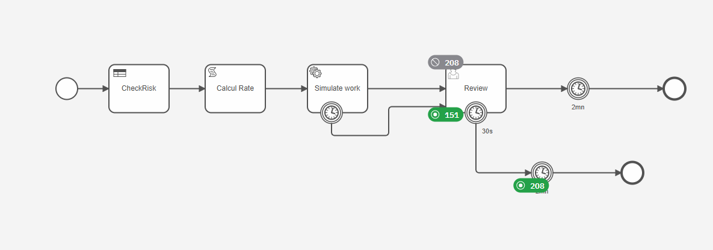
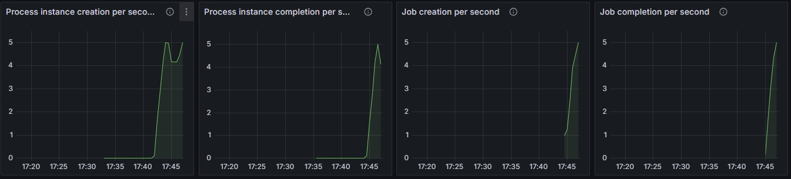
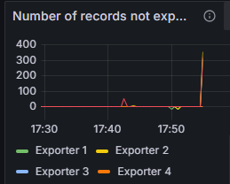
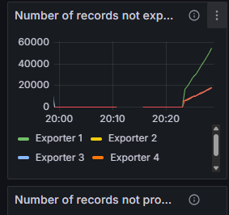

# Multi Region disaster

# Install a multi region
Install a multi region cluster. Use the [README.md](../../c8-multi-region/solution/README.md)

Install Grafana metric

# Deploy a process

Deploy the process `SimpleRateProcess.bpmn`  and `AmountCountry.dmn`




# Run the benchmark tool

use the benchmark tool to generate some traffic in the cluster. This scenario generate 5 process instance per seconds

```shell
$ kubectl create configmap payload --from-file=resources/payload.json -n blue-west
$ kubectl apply -f resources/benchmark.yaml -n blue-west
```

Check Operate: it must have some data waiting in front of task

Check Grafana: the throughput is visible. 



In Grafana, the number of "not exported record" is zero


> Grafana, benchmark are deployed in region "blue".

# Simulate a disaster

Go to region green, and stop it. Benchmark and Grafana are deployed in region blue, so the toll will continue to try to create process instance and execution

```shell
$ kubectl config use-context gke_pierre-yves_us-east1_green-east

$ kubectl scale statefulset camunda-elasticsearch-master --replicas=0; kubectl scale statefulset camunda-zeebe --replicas=0
```


At this moment:


Throughout fail down


The number of not exported record have records, but then it's stable: ElasticSearch is not reachable, but no new creation is accepted



Operate is still accessible, but the number of task is frozen.


# Downsize to one region

To have a running cluster on a single region, two options exist:
* Downsize the replication factor, then surviving region can process. But the exporter is frozen, because the second ElasticSearch is not available. Via this way, the two ElasticSearch stay synchronized, and when the region is back, the exporter will restart.
* use the Fail-over procedure. This procedure downsize the cluster to one region, and remove the second exporter. The second Elasticsearch will not be synchronized, and the FailBack will integrate a resynchronization of the second ElasticSearch.


As downsize, we will reduce the number of brokers, sending to the cluster the existing situation.

Via this command, the cluster will automatically adapt the replication factor: there is only 2 actives brokers, the replication will be down to 2.

```shell
curl -u demo:demo \
--request POST 'http://localhost:9600/actuator/cluster/brokers?force=true' \
-H 'Content-Type: application/json' \
-d '["0","2"]'
```
To know the Node Id, this information must be known in advance. See the "how to get the topology" chapter.

At this moment:
* cluster process jobs as expected
* Operate is frozen. New process instance created are not visible.
* Replication factor is downsized to 2
* Exporter does not work (second ElasticSearch are not reachable), so the number of non exported records grows up.
* The throughput may be affected: the complete Zeebe cluster groups all Leaders on one region, and pods may be overbooked.



# Restart the second region


1. Restart the pods in the green region.

```shell
$ kubectl config use-context gke_pierre-yves_us-east1_green-east

$ kubectl scale statefulset camunda-elasticsearch-master --replicas=1;kubectl scale statefulset camunda-zeebe --replicas=2
```

2. Check advancement

Pods must be up and running before proceeding to the next step

Execute this command to check the advancement

```shell
$ curl -u demo:demo http://localhost:8080/v2/topology | jq '.brokers[] | {nodeId, host, port}'
```

It's possible to check the topology

```shell
$  curl -u demo:demo 'http://localhost:8080/v2/topology' | jq
{
  "brokers": [
    {
      "nodeId": 1,
      "host": "camunda-zeebe-0.camunda-zeebe.green-east.svc",
      "port": 26501,
      "partitions": [],
      "version": "8.8.9"
    },
    {
      "nodeId": 2,
      "host": "camunda-zeebe-1.camunda-zeebe.blue-west.svc",
      "port": 26501,
      "partitions": [
        {
          "partitionId": 1,
          "role": "leader",
          "health": "healthy"
        },
        {
          "partitionId": 2,
          "role": "leader",
          "health": "healthy"
        },
        {
          "partitionId": 3,
          "role": "follower",
          "health": "healthy"
        },
        {
          "partitionId": 4,
          "role": "leader",
          "health": "healthy"
        },
        {
          "partitionId": 5,
          "role": "follower",
          "health": "healthy"
        }
      ],
      "version": "8.8.9"
    },
    {
      "nodeId": 3,
      "host": "camunda-zeebe-1.camunda-zeebe.green-east.svc",
      "port": 26501,
      "partitions": [],
      "version": "8.8.9"
    },
    {
      "nodeId": 0,
      "host": "camunda-zeebe-0.camunda-zeebe.blue-west.svc",
      "port": 26501,
      "partitions": [
        {
          "partitionId": 1,
          "role": "follower",
          "health": "healthy"
        },
        {
          "partitionId": 2,
          "role": "follower",
          "health": "healthy"
        },
        {
          "partitionId": 3,
          "role": "leader",
          "health": "healthy"
        },
        {
          "partitionId": 4,
          "role": "follower",
          "health": "healthy"
        },
        {
          "partitionId": 5,
          "role": "leader",
          "health": "healthy"
        }
      ],
      "version": "8.8.9"
    }
  ],
  "clusterSize": 2,
  "partitionsCount": 5,
  "replicationFactor": 2,
  "gatewayVersion": "8.8.9",
  "lastCompletedChangeId": "8"
}
```

Brokers 1 and 3 are back in the cluster, but does not host any representative. The replication factor is still 2.


3. Add brokers in the cluster

```shell
curl -u demo:demo \
-X 'PATCH' 'http://localhost:9600/actuator/cluster' \
-H 'accept: application/json' \
-H 'Content-Type: application/json' \
-d '{
"brokers": {
    "add": [1, 3]
  }
}'
```

Check the advancement of the action

```shell
curl -u demo:demo 'http://localhost:9600/actuator/cluster' | jq .pendingChange
```

4. Restart all pods

Operation never finished. To restart the cluster, stop all camnuda-zeebe pods. Kubernetes will start them immediately

```shell
$ kubernetes delete pod camunda-zeebe-0 camunda-zeebe-1
```

Check the result on cluster management: all pods are back in the cluster

```shell
$  curl -u demo:demo 'http://localhost:8080/v2/topology' | jq
```

Open question to skip this step
https://camunda.slack.com/archives/C08MRKHJ0CD/p1770417475388699

5. Set back the replication factor to 4

```shell
curl -u demo:demo \
  -X 'PATCH' 'http://localhost:9600/actuator/cluster' \
  -H 'accept: application/json' \
  -H 'Content-Type: application/json' \
  -d '{
    "partitions": {
      "replicationFactor": 4
    }
  }'
```


This command may take time, it depends on the data to transfer.
Check the advancement of the action

```shell
curl -u demo:demo 'http://localhost:9600/actuator/cluster' | jq .pendingChange
```


# How to get the topology?

There is two topology:

* the description in terms of brokers
Run the command

```shell
$ curl -u demo:demo http://localhost:8080/v2/topology | jq '.brokers[] | {nodeId, host, port}'
```
Answer is

```yaml
{
  "nodeId": 1,
  "host": "camunda-zeebe-0.camunda-zeebe.green-east.svc",
  "port": 26501
}
{
  "nodeId": 2,
  "host": "camunda-zeebe-1.camunda-zeebe.blue-west.svc",
  "port": 26501
}
{
  "nodeId": 3,
  "host": "camunda-zeebe-1.camunda-zeebe.green-east.svc",
  "port": 26501
}
{
  "nodeId": 0,
  "host": "camunda-zeebe-0.camunda-zeebe.blue-west.svc",
  "port": 26501
}
```

cluster Blue host node 0,2 (even nodes) when green host 1,3 (odd nodes)

* the topology in terms of cluster management
This is the main one, which describe which broker are effectively active

```shell
$ curl -u demo:demo 'http://localhost:9600/actuator/cluster'
```


# Usefull commands

Replication factor:

```shell
$ curl -u demo:demo 'http://localhost:8080/v2/topology' | jq .replicationFactor
```

Get the pending change:

```shell
$ curl -u demo:demo 'http://localhost:9600/actuator/cluster' | jq .pendingChange
```
