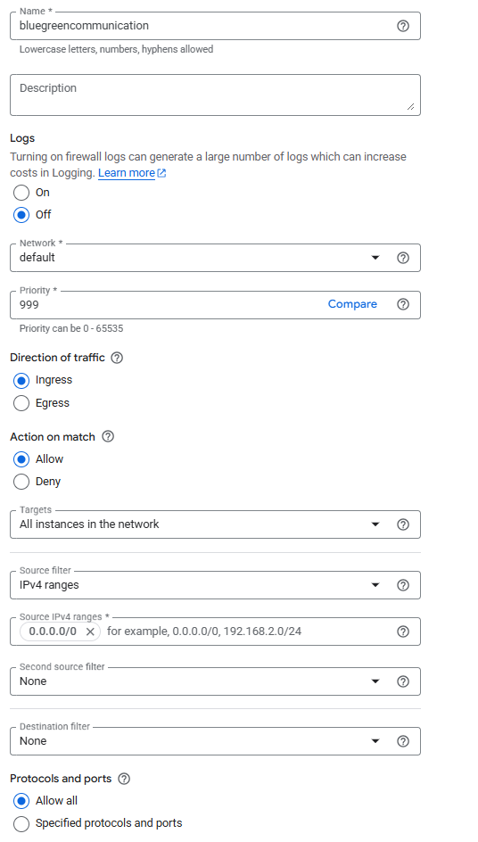

# Set up a multi-region cluster


# Cluster creation

1. Create two clusters on Google, named `blue-west` and `green-east`

To switch between region, use the

```shell
$ kubectl config get-contexts
````

This give the list of context. Switch to a specific context via

```shell
$ kubectl config use-context gke_pierre-yves_us-east1_green-east
````


# Kubernetes Cross-Cluster Communication
A multi-region setup in Kubernetes really means a multi-cluster setup and that comes with a networking challenge: 
How to manage connectivity between my pods across different Kubernetes clusters? 
You should setup proper firewall rules and correctly route traffic among the pods. For that you have many options (in nor particular order):

See the different options:

* [DNS Chainging with kube-dns](KubeDns.md)
* Istio
* Skupper
* Linkerd multi-cluster communication
* Submariner
* KubeStellar
* Google Kubernetes Engine (GKE) Fleet Management
* Azure Kubernetes Fleet Manager
* SIG Multicluster


# Firewall

Any firewall must be open between the two cluters

## Google
In GKE, select the firewall and create a rule to allow cluster `blue` to communicate to cluster `green` in both direction.


Create a Firewall rule:


Set

| Parameter            | name                        |
|----------------------|-----------------------------|
| Name                 | bluegreencommunication      |
| Priority             | 999                         | 
| Direction of traffic | ingress                     |
| Targets              | All instance in the network |
| Source IPv4 ranges   | 0.0.0.0/0                   | 
| Protocols and ports  | Allow all                   | 


Result is


Click on `Create`


# Test the configuration

On `green-east`

```shell
$ kubectl config use-context gke_pierre-yves_us-east1_green-east
$ kubectl run dns-test --rm -it --image=busybox -- sh
/# ping 34.26.200.157
PING 34.26.200.157 (34.26.200.157): 56 data bytes
64 bytes from 34.26.200.157: seq=0 ttl=114 time=0.379 ms
/# exit
```

The communcation is possible is open.

```shell
$ kubectl run dns-test --rm -it --image=busybox -- nslookup blue-west.svc.cluster.local
```

On `blue-west`

```shell
$ kubectl config use-context gke_pierre-yves_us-east1_blue-west
$ kubectl run dns-test --rm -it --image=busybox -- sh
/ # ping 35.237.32.136
PING 35.237.32.136 (35.237.32.136): 56 data bytes
64 bytes from 35.237.32.136: seq=0 ttl=114 time=0.435 ms
```


```shell
$ kubectl run dns-test --rm -it --image=busybox -- nslookup green-east.svc.cluster.local
```

> the communication failed, but the cluster is working correctly, so can communicate.

# Create Camunda clusters

Attention, each cluster must be in different namespace: the namespace must be different. Do not use `camunda`


## 1. Edit camunda-value.yaml

Add the multi region setting

```yaml
global:
  multiregion:
    # number of regions that this Camunda Platform instance is stretched across
    regions: 2
    # unique id of the region. Should start at 0 for easy computation. With 2 regions, you would have region 0 and 1.
    regionId: 0
```

In blue, set the regionId to 0, in Green, to 1.

## 2. Add the list of Initial Contact points

When a broker start, it needs to contact all other broker to share the partition distribution, elect a leader.
After the start, any new broker will ise the same list to contact one other broker, which will share all new brokers.

```yaml
orchestration:
  clusterSize: "4"
  partitionCount: "3"
  replicationFactor: "4"

  env:
    - name: ZEEBE_BROKER_DATA_SNAPSHOTPERIOD
      value: "5m"
    - name: ZEEBE_BROKER_DATA_DISKUSAGECOMMANDWATERMARK
      value: "0.85"
    - name: ZEEBE_BROKER_DATA_DISKUSAGEREPLICATIONWATERMARK
      value: "0.87"
    - name: ZEEBE_BROKER_CLUSTER_INITIALCONTACTPOINTS
      value: "camunda-zeebe-0.camunda-zeebe.green-east.svc.cluster.local:26502,
      camunda-zeebe-1.camunda-zeebe.green-east.svc.cluster.local:26502,
      camunda-zeebe-0.camunda-zeebe.blue-west.svc.cluster.local:26502,
      camunda-zeebe-1.camunda-zeebe.blue-west.svc.cluster.local:26502"
    - name: ZEEBE_BROKER_EXPORTERS_ELASTICSEARCH0_CLASSNAME
      value: io.camunda.zeebe.exporter.ElasticsearchExporter
    - name: ZEEBE_BROKER_EXPORTERS_ELASTICSEARCH0_ARGS_URL
      value: http://camunda-elasticsearch-master-hl.green-east.svc.cluster.local:9200
    - name: ZEEBE_BROKER_EXPORTERS_ELASTICSEARCH1_CLASSNAME
      value: io.camunda.zeebe.exporter.ElasticsearchExporter
    - name: ZEEBE_BROKER_EXPORTERS_ELASTICSEARCH1_ARGS_URL
      value: http://camunda-elasticsearch-master-hl.blue-west.svc.cluster.local:9200
```

Create the cluster in Region 0 `blue-west`. The name blue-west is used in the INITIAL_CONTACT point so, this is the name of the namespace.

```shell
$ kubectl config use-context gke_pierre-yves_us-east1_blue-west
$ kubectl create namespace blue-west
$ kubens blue-west
$ helm upgrade --install --namespace blue-west camunda camunda/camunda-platform -f region0/camunda-value-88.yaml --skip-crds --version 13.1.2
```

Create the cluster in Region 1 `green-east`. The name green-east is used in the INITIAL_CONTACT point so, this is the name of the namespace.

```shell
$ kubectl config use-context gke_pierre-yves_us-east1_green-east
$ kubectl create namespace green-east
$ kubens green-east
$ helm upgrade --install --namespace green-east camunda camunda/camunda-platform -f region1/camunda-value-88.yaml --skip-crds --version 13.1.2
```

## 3. Setup the timeout

Latency between region may be important, and when a broker cannot contact another broker on the second region. Increase the timeout

```yaml

- name: ZEEBE_BROKER_CLUSTER_MEMBERSHIP_PROBEINTERVAL
  value: 5s
- name: ZEEBE_BROKER_CLUSTER_MEMBERSHIP_PROBETIMEOUT
  value: 10s
- name: ZEEBE_BROKER_CLUSTER_MEMBERSHIP_SUSPECTPROBES
  value: 5s
- name: ZEEBE_BROKER_CLUSTER_MEMBERSHIP_FAILURETIMEOUT
  value: 30s
- name: ZEEBE_BROKER_CLUSTER_MEMBERSHIP_SYNCINTERVAL
  value: 30s
- name: ZEEBE_BROKER_CLUSTER_MESSAGINGTIMEOUT
  value: 30s
- name: ZEEBE_BROKER_CLUSTER_REQUESTTIMEOUT
  value: 45s
```

