# PingFederate

To get a Free trial, go to pingfederate.com and ask for a free trial

You will arrived on this page
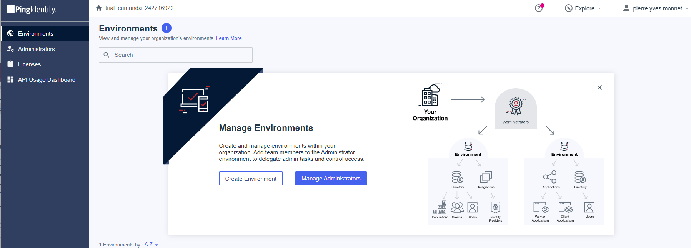

## Environment

Create an environment

## Application 

1. Under Applications, click on the +. 
2. On the panel, give a name and select `OIDC Web App`

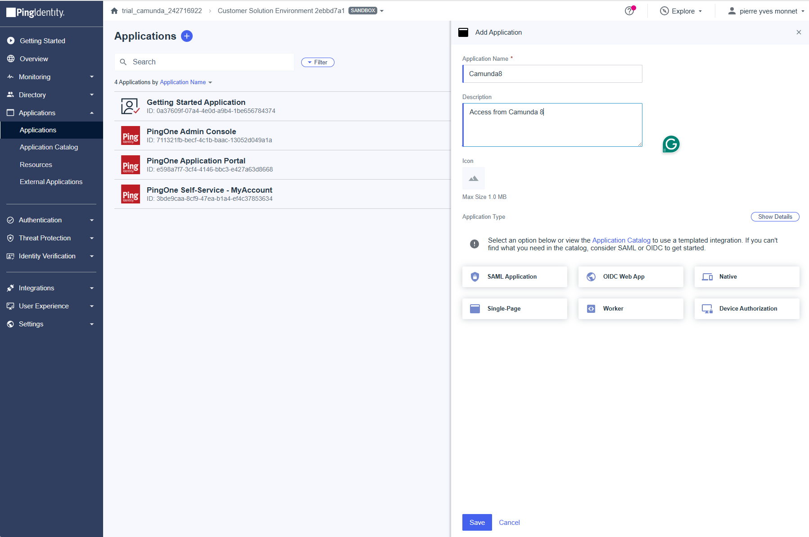

3. click on Save

You get this information 

| Fieldid                           | value                                                                                                   |
|-----------------------------------|---------------------------------------------------------------------------------------------------------| 
| EnvironmentId                     | 82abc49d-f6a1-46f6-9956-9d186bcd9aac                                                                    |
| ClientID                          | 7dd6ee91-1df6-4cc1-8808-edba1e441023                                                                    |
| ClientSecret                      | fP2UODLi7FgvjQfZjWzHJ9yuBgKoK0sSxCjD8y9zTRc9gNW5hehD4K9o4KzMLD-q                                        |
| IssuerID                          | https://auth.pingone.com/82abc49d-f6a1-46f6-9956-9d186bcd9aac/as                                        |
| Authorization URL                 | https://auth.pingone.com/82abc49d-f6a1-46f6-9956-9d186bcd9aac/as/authorize                              | 
| Pushed Authorization Request URL  | https://auth.pingone.com/82abc49d-f6a1-46f6-9956-9d186bcd9aac/as/par                                    |
| Token Endpoint                    | https://auth.pingone.com/82abc49d-f6a1-46f6-9956-9d186bcd9aac/as/token                                  |
| Token Introspection Endpoint      | https://auth.pingone.com/82abc49d-f6a1-46f6-9956-9d186bcd9aac/as/introspect                             |
| Token Revocation Endpoint         | https://auth.pingone.com/82abc49d-f6a1-46f6-9956-9d186bcd9aac/as/revoke                                 |
| JWKS Endpoint                     | https://auth.pingone.com/82abc49d-f6a1-46f6-9956-9d186bcd9aac/as/jwks                                   |
| User Info Endpoint                | https://auth.pingone.com/82abc49d-f6a1-46f6-9956-9d186bcd9aac/as/userinfo                               |
| Signoff Endpoint                  | https://auth.pingone.com/82abc49d-f6a1-46f6-9956-9d186bcd9aac/as/signoff                                |
| OIDC Discovery Endpoint           | https://auth.pingone.com/82abc49d-f6a1-46f6-9956-9d186bcd9aac/as/.well-known/openid-configuration       |
| OAuth Server Metadata Endpoint    | https://auth.pingone.com/.well-known/oauth-authorization-server/82abc49d-f6a1-46f6-9956-9d186bcd9aac/as |


4. Activate the application

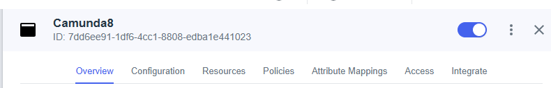


7. On Configuration click Edit

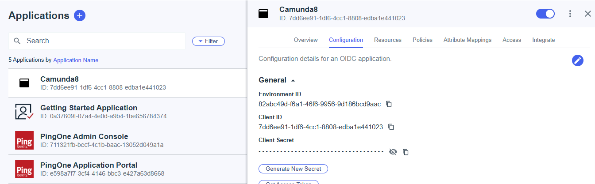

8. Go down to Add Redirect URI

Give the same value as `orchestration.security.authentication.oidc.redirectUrl` : check the contextPath of the application


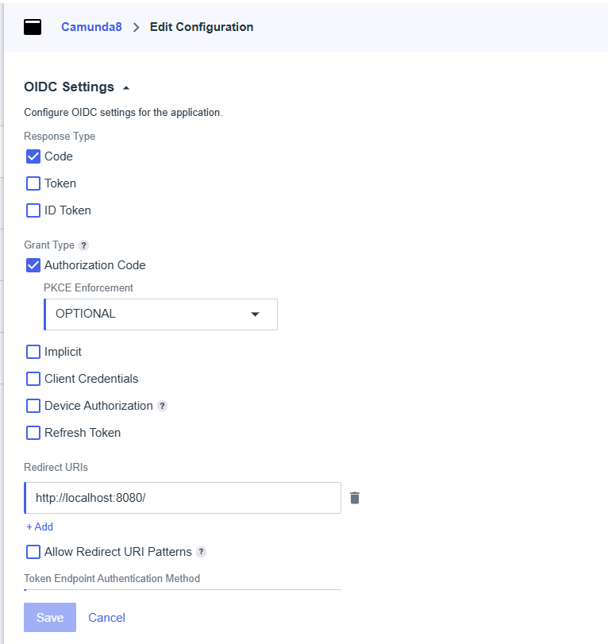


9. Check parameters:
* token
* implicit
* client-credential


## Create a user

1. Under Directory, select Users and click on the +
2. On the panel, give names, username.

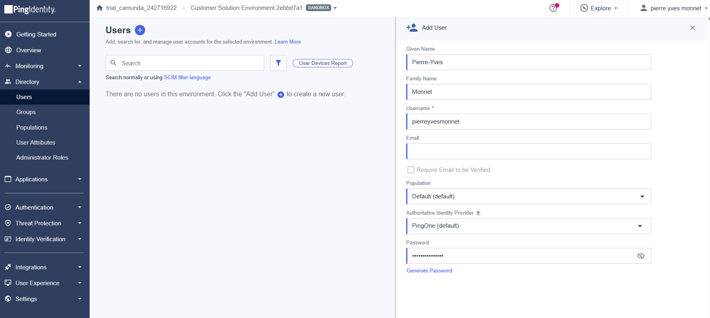

My password generated:

| Fieldid   | value            |
|-----------|------------------|
| Username  | pierreyvesmonnet |
| Password  | pass4Py          |

# Prepare value.yaml

Determine in information

Access
```
https://auth.pingone.com/82abc49d-f6a1-46f6-9956-9d186bcd9aac/as/.well-known/openid-configuration

```


```yaml
global:
  identity:
    auth:
      issuer: https://auth.pingone.com/<EnvironmentId>/as
      issuerBackendUrl: https://auth.pingone.com/<EnvironmentId>/as
      tokenUrl: https://auth.pingone.com/<EnvironmentId>/oauth2/v2.0/token
      jwksUrl: https://auth.pingone.com/<EnvironmentId>/discovery/v2.0/keys
      type: "MICROSOFT"
      publicIssuerUrl: https://auth.pingone.com/<EnvironmentId>/v2.0

      webModeler:
        clientId: <Client ID of Web Modeler's UI from Step 2>
        clientApiAudience: <Client ID of Web Modeler's UI from Step 2>
        publicApiAudience: <Client ID of Web Modeler's API from Step 2>
        redirectUrl: <See the Helm value in the table below>
      console:
        clientId: <Client ID from Step 2>
        audience: <Client ID from Step 2>
        redirectUrl: <See the Helm value in the table below>
        wellKnown: <Found in the "Endpoints" section of the app registrations page>
      connectors:
        clientId: <Client ID from Step 2>
        existingSecret: <Client secret from Step 5>

orchestration:
  clusterSize: "1"
  partitionCount: "1"
  replicationFactor: "1"

  security:
    authorizations:
      enabled: true
      oidc:
        secret:
          inlineSecret: <Client secret from Step 5>

        redirectUrl: http://localhost:8080
        usernameClaim: username
        groupsClaim: memberOf
        clientId: <Client ID from Step 2>
        audience: https://api.pingone.com 
    initialization:
      defaultRoles:
         # we get the value from the mapping rule, then we can control the attribute (memberOf is the one we want)
         admin:
            users:
               - pierreyvesmonnet
```


Replace all values:

| Value                                        | Origin               | Value               |
|----------------------------------------------|----------------------|---------------------|
| <EnvironmentId>                              | TenantId             | cbd...ba9           |
| <Audience from Step 2>                       | is the ClientId      | 026...1c9           |
| <Initial claim value>                        | ObjectId of user     | ef6...312           |
| <Client ID from Step 2>                      | ClientId             | 026...1c9           |
| <Client secret from Step 5>                  | Value of the secret  | fzR...ueP.apy_Kc.7  |
| <Client ID of Web Modeler's API from Step 2> | ClientId             | 026...1c9           |
| <Client ID of Web Modeler's UI from Step 2>  | Value of the secret  | fzR...ueP.apy_Kc.7  |


# Start the cluster

```shell
helm upgrade --install --namespace camunda camunda camunda/camunda-platform -f camunda-values_entraid_88.yaml --skip-crds --version 13.2.1
```


# Connection

port forward identity and operate.
```shell
kubectl -n camunda port-forward service/camunda-zeebe-gateway 8080:8080
kubectl -n camunda port-forward service/camunda-zeebe-gateway 26500:26500
```
Try to access Operate via `localhost:8080/operate`
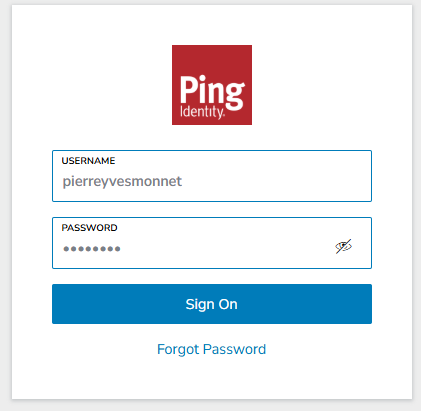

Operate is accessible:


# Identify users in applications

To allow a user in the application (Tasklist or Operate), two options are possible
* directly map a user
* map a PingFederate group where the user is registered

Both are via the Role Mapping function in Identity


## Role mapping for a user

1. Identify the Object ID of the User in EntraID
   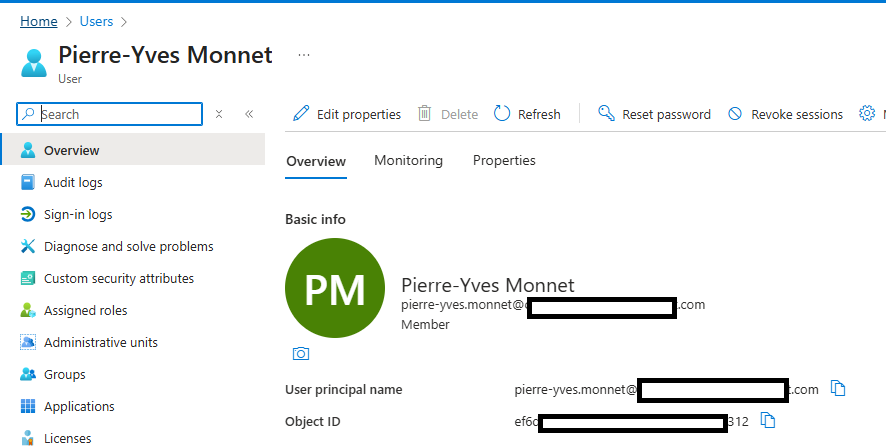

| Value         | Value      |
|---------------|------------|
| User ObjectId | ef6...312  |

2. Create a role mapping


3. Give the authorisation to the role mapping


4. Connect to Operate works.

## Role mapping for a group


First, add the Security check in the application

1. In the application registration, access `manage/token configuration`

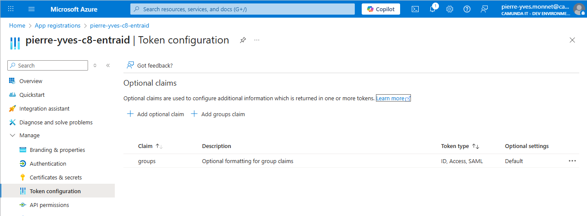

2. Click on `Add groups claim` and select `Security groups`


3. Find a group ID. in `Groups`, search a group like `Postsales consulting`
   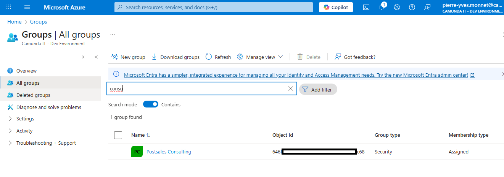

4. Identify the ObjectId
   

| Value           | Value      |
|-----------------|------------|
| Group ObjectId  | 646...c68  |

5. In the role, register the group


6. Register the role in the authorisation


7. Access the application with your user


## Use a group as Candidate group

The candidate group has no impact on tasklist
https://docs.camunda.io/docs/components/tasklist/api-versions/#candidate-groups-and-users

# Token and client

To authorize the REST API or the desktop modeler access the cluster, the object behind the token must be accepted.

1. Check the token generated:


```shell
curl --location --request POST 'https://auth.pingone.com/<EnvironmentId>/oauth2/v2.0/token' 
  --header 'Content-Type: application/x-www-form-urlencoded' 
  --data-urlencode "client_id=<ClientID>" 
  --data-urlencode "client_secret=<ClientSecret>" 
  --data-urlencode "scope=<ClientID>/.default" 
  --data-urlencode 'grant_type=client_credentials'


```

Replace variables

| Name                       | Origin                    | Value              |
|----------------------------|---------------------------|--------------------|
| EnvironmentId  | Tenand ID                 | cbd...a9f          |           
| ClientID                   | App Registration.ClientId | 026...1c9          |
| ClientSecret               | App Registration.Value    | fzR...ueP.apy_Kc.7 |

The result in the payload is

```
{"token_type":"Bearer","expires_in":3599,"ext_expires_in":3599,"access_token":"eyJ0eXAiO...flmA"}

```
2. Set the token in a variable
```shell
$ ACCESS_TOKEN="eyJ0eXAiO...flmA"
```

or use
```shell
ACCESS_TOKEN=$(curl -s curl --location --request POST 'https://auth.pingone.com/<EnvironmentId>/oauth2/v2.0/token' 
  --header 'Content-Type: application/x-www-form-urlencoded' 
  --data-urlencode "client_id=<ClientID>" 
  --data-urlencode "client_secret=<ClientSecret>" 
  --data-urlencode "scope=<ClientID>/.default" 
  --data-urlencode 'grant_type=client_credentials' | jq -r '.access_token')
```

3. Use jwt.io to get a full description of the token


Header:
```yaml
{
  "typ": "JWT",
  "alg": "RS256",
  "kid": "rtsFT-b-7LuY7DVYeSNKcIJ7Vnc"
}
```


Payload:

```yaml
{
  "aud": "fa...789c0",
  "iss": "https://auth.pingone.com/cbd4...a9f/v2.0",
  "iat": 1765825135,
  "nbf": 1765825135,
  "exp": 1765829035,
  "aio": "k2J...zcA",
  "azp": "fa78...39c0",
  "azpacr": "1",
  "oid": "4a71...8f4",
  "rh": "1.AYE...AA.",
  "sub": "4a71...b8f4",
  "tid": "cbd...ba9f",
  "uti": "iNn...86AA",
  "ver": "2.0",
  "xms_ftd": "mM292...1kc21z"
}
```

4. Is this token is considered as a user or as a client?  Run
```shell
 curl -s \
  -H "Authorization: Bearer ${ACCESS_TOKEN}" \
  http://localhost:8080/v2/authentication/me | jq
{
  "username": "4a71...b8f4",
  "authorizedComponents": [],
  "tenants": [],
  "groups": [],
  "roles": [],
  "salesPlanType": "",
  "c8Links": {},
  "canLogout": true
}
```

This token is identified as user (username).The username is retrieved from the "sub" attributes. It's possible to configure Identity to resolve this as a Client
The token as an OID and a AZP attribute.

5. Add this configuration.

```yaml
orchestration:
  security:
    authentication:
      oidc:
        clientIdClaim: azp                  # Entra puts client ID here
        preferUsernameClaim: true           # user tokens win if both present
```

> Note: the token can still be considered as a user


If the object is a username, add it in as admin role as a user


6. Now, it's possible to deploy a process via the desktop modeler or the REST API

https://docs.camunda.io/docs/apis-tools/orchestration-cluster-api-rest/orchestration-cluster-api-rest-authentication/#using-a-token-oidcjwt

# Desktop Modeler

Connect via the desktop modeler using the `OAuth` authentication.
The ClientID and Client Secret come from the App Registration.
The OAuthScope comes from the camunda-value.yaml

| Name           | Origin                                 | Value                                                                                    |
|----------------|----------------------------------------|------------------------------------------------------------------------------------------|
| Authentication |                                        | OAuth                                                                                    |
| ClientID       | App Registration                       | 026...1c9                                                     |
| ClientSecret   | App Registration                       | fzR...ueP.apy_Kc.7                                                 |
| OAuthTokentURL | global.identity.auth.tokenUrl          | https://auth.pingone.com/cbd...ba9f/oauth2/v2.0/token |
| OAuth audience |                                        | zeebe-api                                                                                |
| OAuthScope     | global.identity.auth.zeebe.tokenScope  | 026...1c9/.default                                            |

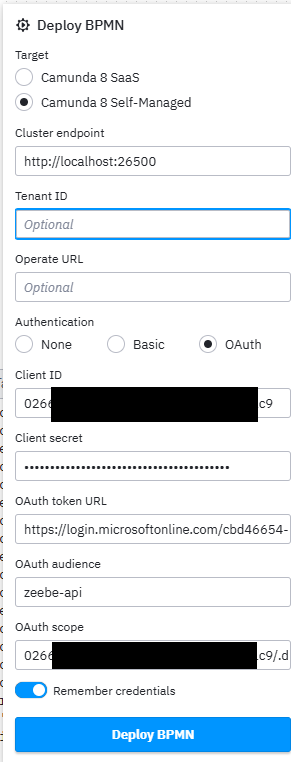


This is not enough: the object behind the token need to be authorized. See before to get the user ID

Add this user in the role `admin`

> How the Desktop Modeler reference a user?
> * Desktop Modeler use the information ClientId/Client Secret to ask EntraID to generate a token.
> * The token is sent to Zeebe/Identity.
> * The token is decoded, and using the "usernameClaims" attribute, a value is retrieved.
> * This value is considered to ba a USERID.
> * This USERID must have the authorization to deploy processes.


Deploy a process, and create a process instance. Verify both are visible in Operate.

# Worker

## Connection
Use this value.yaml to connect the worker


```yaml
camunda:
  client:
    mode: self-managed
#    tenant-ids:
#      - blue

    auth:
      client-id: <ClientID>
      client-secret: <ClientSecret>
      token-url: <OAuthTokenUrk>>

    zeebe:
      scope: <ClientID>/.default
      enabled: true
      preferRestOverGrpc: false

      audience: zeebe-api
      gatewayUrl: http://localhost:26500
      # restAddress: http://localhost:8088
      request-timeout: PT25S

```


Replace variables

| Name           | Origin                                | Value                                                                                    |
|----------------|---------------------------------------|------------------------------------------------------------------------------------------|
| ClientID       | App Registration.ClientId             | 026...1c9                                                     |
| ClientSecret   | App Registration.Value                | fzR...ueP.apy_Kc.7                                                 |
| OAuthTokentURL | global.identity.auth.tokenUrl         | https://auth.pingone.com/cbd...ba9f/oauth2/v2.0/token |
| OAuthScope     | global.identity.auth.zeebe.tokenScope | 026...1c9/.default                                            |

for example:
```
camunda:
  client:
    mode: self-managed

    auth:
      client-id: 026...1c9
      client-secret: fzR...ueP.apy_Kc.7
      token-url: https://auth.pingone.com/cbd...ba9f/oauth2/v2.0/token

    zeebe:
      scope: 026...1c9/.default
```

## Authorization

The worker reference a user. This user must have authorizations READ_PROCESS_DEFINITION, READ_PROCESS_INSTANCE, UPDATE_PROCESS_INSTANCE on the PROCESS_DEFINITION objects

> How the worker reference a user?
> * the Worker use the information ClientId/Client Secret to ask EntraID to generate a token.
> * The token is sent to Zeebe/Identity.
> * The token is decoded, and using the "usernameClaims" attribute, a value is retrieved.
> * This value is considered to ba a USERID.
> * This USERID must have the authorization to deploy processes.


if the worker need to manipulate documents, it must have authorization too

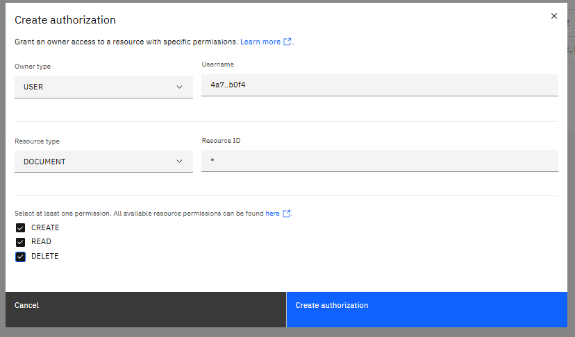

if the worker need to manipulate messages, give authorization


## unprotected API

You can turn on the unprotected API mode by adding
```yaml
orchestration:
  env:
    - name: CAMUNDA_SECURITY_AUTHENTICATION_UNPROTECTED_API
      value: "true"
```

Attention:
* the API is not protected
* but a worker need autorization to access jobs. Doing that, the connection does not have any user, so any authorization: the worker does not get any jobs to process.


# REST API

Get the access token (see before)

Then call any API:

```shell
curl --header "Authorization: Bearer ${ACCESS_TOKEN}" localhost:8080/v2/topology
```

# Management Identity, Web Modeler, Optimize

## configuration


```yaml
  identity:
    auth:
      enabled: true
      issuer: https://auth.pingone.com/<EnvironmentId>/v2.0
      # this is used for container to container communication
      issuerBackendUrl: https://auth.pingone.com/<EnvironmentId>/v2.0
      tokenUrl: https://auth.pingone.com/<EnvironmentId>/oauth2/v2.0/token
      jwksUrl: https://auth.pingone.com/<EnvironmentId>/discovery/v2.0/keys
      publicIssuerUrl: https://auth.pingone.com/<EnvironmentId>/v2.0
      type: "MICROSOFT"
      identity:
        clientId: <Client ID from Step 2>
        audience: <Client ID from Step 2>
        secret:
          existingSecret: camunda-client-credentials
          existingSecretKey: client-secret
        initialClaimValue: <Initial claim value>
        initialClaimName: "oid"
        redirectUrl: "http://localhost:8084"
      optimize:
        clientId: <Client ID from Step 2>
        audience: <Client ID from Step 2>
        secret:
          existingSecret: camunda-client-credentials
          existingSecretKey: client-secret
        redirectUrl: "http://localhost:8085/optimize"
      webModeler:
        clientId: <Client ID from Step 2>
        audience: <Client ID from Step 2>
        clientApiAudience: <Client ID from Step 2>
        publicApiAudience: <Client ID from Step 2>
        redirectUrl: "http://localhost:8090"


identity:
    #  contextPath: "/identity"
  enabled: true
  env:
    - name: CAMUNDA_IDENTITY_AUDIENCE
      value: <Client ID from Step 2>


identityPostgresql :
  enabled: true
  auth:
    existingSecret: camunda-client-credentials
    secretKeys:
      userPasswordKey: postgres-password
      adminPasswordKey: postgres-password

  # kubectl port
webModeler:
  #  contextPath: "/modeler"
  enabled: true
  webapp:

  restapi:
    mail:
      # This value is required, otherwise the restapi pod wouldn't start.
      fromAddress: pierre-yves.monnet@camunda.com
    env:
      - name: CAMUNDA_MODELER_CLUSTERS_0_ID
        value: "local-cluster"
      - name: CAMUNDA_MODELER_CLUSTERS_0_NAME
        value: "Local Cluster"
      - name: CAMUNDA_MODELER_CLUSTERS_0_VERSION
        value: "8.8.0"
      - name: CAMUNDA_MODELER_CLUSTERS_0_AUTHENTICATION
        value: "BEARER_TOKEN"
        # Might be able to omit the .svc.local
      - name: CAMUNDA_MODELER_CLUSTERS_0_URL_GRPC
        value: "grpc://camunda-zeebe-gateway.camunda.svc.cluster.local:26500"
        # Internal cluster REST reference
      - name: CAMUNDA_MODELER_CLUSTERS_0_URL_REST
        value: "http://camunda-zeebe-gateway.camunda.svc.cluster.local"
      - name: CAMUNDA_MODELER_CLUSTERS_0_URL_WEBAPP
        value: "http://localhost:8080/"
      - name: CAMUNDA_MODELER_CLUSTERS_0_AUTHORIZATIONS_ENABLED
        value: "true"
      - name: SPRING_PROFILES_INCLUDE
        value: "default-logging"

# WebModeler Database.
webModelerPostgresql:
  enabled: true
  auth:
    existingSecret: "camunda-client-credentials"
    secretKeys:
      adminPasswordKey: postgres-password
      userPasswordKey: postgres-password


optimize:
  enabled: true
  contextPath: "/optimize"

```

Replace all values

| Value                                        | Origin              | Value               |
|----------------------------------------------|---------------------|---------------------|
| <EnvironmentId>                  | TenantId            | cbd...ba9           |
| <Initial claim value>                        | ObjectId of user    | ef6...312           |
| <Client ID from Step 2>                      | Client Id           | 026...1c9           |


Secrets are store in a Secret file

```yaml
# kubectl apply -f em_camunda-client-credentials.yaml
apiVersion: v1
kind: Secret
metadata:
  name: camunda-client-credentials
type: Opaque
stringData:
  client-secret: "<Client secret from Step 5>"
  postgres-password: "postgres"
```
# ContextPath or not ContextPath?

When an ingres is used, the context path is mandatory. Else, the context Path **must not be set**.


## Management Identity

Connect to the Management Identity

```shell
$ kubectl -n camunda port-forward service/camunda-identity 8084:80
```

Then use the url `localhost:9084` (or `localhost:9084/identity` if a contextPath is given)

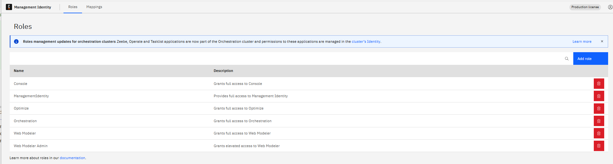

Access the Mapping tab

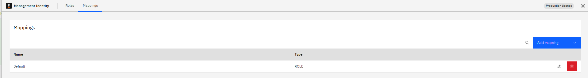


Click on Edit on the Default role, and add in the role `Web Modeler`and `Òptimize`


> Management Identity does not cumulate roles. If you create a different mapping based on the same users, it will not cumumlate roles. Check existing mapping.


## Web Modeler

Forward the port
```shell
$ kubectl -n camunda port-forward service/camunda-web-modeler-webapp 8090:80
```

2. Then use the url `localhost:9084` (or `localhost:9084/identity` if a contextPath is given)

If the webModeler loop on the token authentication, check the redirection
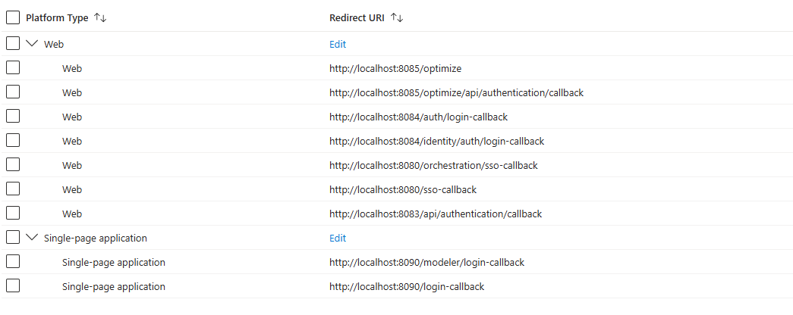

The redirection **must be** under the category  `single Page Application`


3. Create a procject, and inside a project, a simple BPMN Diagram


4. Deploy the diagram: name `Local Cluster` come from the variables.


5. Verify the process appears on Operate


## Optimize

1. Forward the Optimize port

```shell
$ kubectl -n camunda port-forward service/camunda-optimize 8085:80
```

2. Access `localhost:8085/optimize`

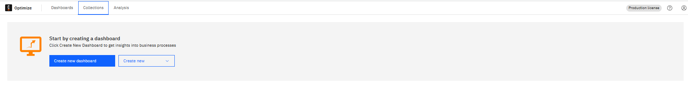


# Multi tenancy


```
global:
  multitenancy:
    enabled: true
  
```

> Note: enable multi tenant implie to enable Identity Management

==> Multi tenancy is not enable, but it is visible in Idenity and possible to create a tenant!


## Create tenant in Identity

Go to Identity, then select "tenant". Create a tenant `blue`

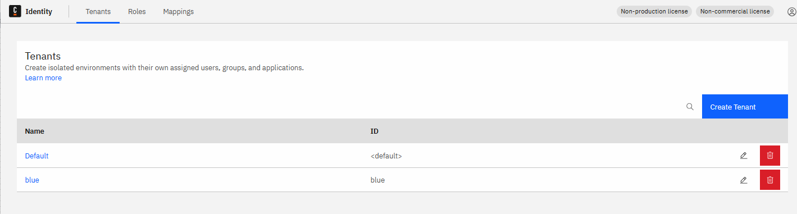

Users has to be validated in that tenant. Go to Role, and add the role `admin`


Check in Operate: the tenant `blue` is visible.

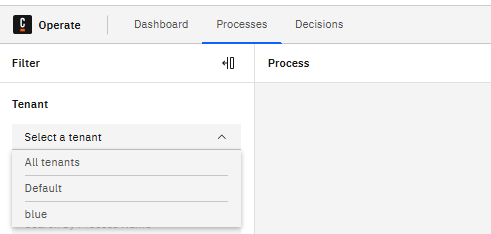

## Deploy process in a tenant via WebModeler

WebModeler use the application registration ID.

This client must have access in the tenant. Decode the token and get the `oid` value. It may be on another attribute used in the token: check the value `orchestration.security.authentication.oidc.usernameClaim`

1. Access Identity/Tenants

2. Add the user in the tenant


3. in Authorization/Tenant, add the user

> This step is not mandatory, but it's better to give access to the user in this authorization.

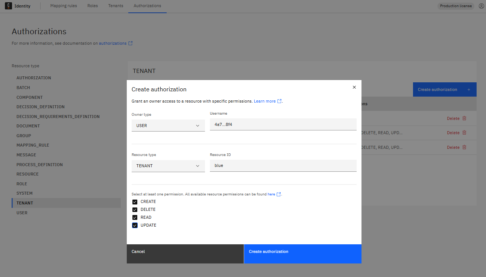

4. In Authorization/Resource, add the user


5. Deployment works : check the REST API

```shell

curl --header "Authorization: Bearer ${ACCESS_TOKEN}" -L 'http://localhost:8080/v2/deployments' \
-H 'Accept: application/json' \
-F resources=@ReviewCandidateGroup.bpmn \
-F 'tenantId=blue'
```

6. Check from the Web Modeler


## Worker

Add the tenant in the tenant list.

The API must be protected (CAMUNDA_SECURITY_AUTHENTICATION_UNPROTECTED_API **must not** be true)

```yaml
camunda:
  client:
    mode: self-managed
    tenant-ids:
      - blue

```

Restart the worker

> Check the workers section before to give authorization to workers


# Debugging

According to https://docs.camunda.io/docs/8.6/apis-tools/operate-api/operate-api-authentication/

1. Ask for a token via this call

```shell
curl --location --request POST '${TOKENURL}' \
--header 'Content-Type: application/x-www-form-urlencoded' \
--data-urlencode "client_id=${CLIENT_ID}" \
--data-urlencode "client_secret=${CLIENT_SECRET}" \
--data-urlencode "scope=${SCOPE}" \
--data-urlencode 'grant_type=client_credentials'
```
For example

```shell
curl --location --request POST 'https://auth.pingone.com/cbd...ba9f/oauth2/v2.0/token' \
--header 'Content-Type: application/x-www-form-urlencoded' \
--data-urlencode "client_id=026...1c9" \
--data-urlencode "client_secret=fzR...ueP.apy_Kc.7" \
--data-urlencode "scope=026...1c9/.default" \
--data-urlencode 'grant_type=client_credentials'
{"token_type":"Bearer","expires_in":3599,"ext_expires_in":3599,"access_token":"eyJ0eXAiO.....xxuH9RS6pH_zscNSMff_wVJE7fvqSkyi_T5pgM3AJj9yuTeYPuJ6HC6_AKkqsA_gVVxPqnKG8GFTn2TXaPYRdhfwBc5DwZIPF3qIbM49xQAq141yTSumfe-1d2f5iZzmdFh32OHLKBr4A_ybj_pfZOjW-Sg"}
```

2. Copy the token in https://www.jwt.io/. See the detail in terms of object used by EntraId


The result is something like

Header:
```yaml
{
  "typ": "JWT",
  "alg": "RS256",
  "kid": "rtsFT-b-7LuY7DVYeSNKcIJ7Vnc"
}
```

Payload:

```yaml
{
  "aud": "fa...789c0",
  "iss": "https://auth.pingone.com/cbd4...a9f/v2.0",
  "iat": 1765825135,
  "nbf": 1765825135,
  "exp": 1765829035,
  "aio": "k2J...zcA",
  "azp": "fa78...39c0",
  "azpacr": "1",
  "oid": "4a71...8f4",
  "rh": "1.AYE...AA.",
  "sub": "4a71...b8f4",
  "tid": "cbd...ba9f",
  "uti": "iNn...86AA",
  "ver": "2.0",
  "xms_ftd": "mM292...1kc21z"
}
```

The header contains two important information: `alg` (algorithm use to decode) and `kid` (key accepted for the application)

* `token.aud` == (value.yaml) `orchestration.security.authentication.oidc.audience`

* `token.iss` == (value.yaml) `global.identity.auth.publicIssuerUrl`

* `token.kid` (header) == is present in (value.yaml) `global.identity.auth.jwksUrl` : on one the `keys[].kid`

* `token.alg` (header) == `RS256`

**Check PID**
To check the KID, use the URL behind the `global.identity.auth.jwksUrl`

```shell
 curl https://auth.pingone.com/cbd<TenantId>a9f/discovery/v2.0/keys
```
or access it via a browser.


The result contains a list of keys. Each key has a `kid`. The `kid` present in the tocken must be referenced in the list.


** Control the token**

In the command used to get the token :

```shell

curl --location --request POST '${TOKENURL}' \
--header 'Content-Type: application/x-www-form-urlencoded' \
--data-urlencode "client_id=${CLIENT_ID}" \
--data-urlencode "client_secret=${CLIENT_SECRET}" \
--data-urlencode "scope=${SCOPE}" \
--data-urlencode 'grant_type=client_credentials'
```


* `TOKENURL` is the same as (value.yaml) `global.liense.identity.auth.tokenUrl`
* `CLIENT_ID` is the same as (value.yaml) `orchestration.security.authentication.oidc.clientId`
* `CLIENT_SECRET` :is the same as (value.yaml) `orchestration.security.authentication.oidc.secret` (different method to set up the secret)

> note: the secret used may be different in the token creation and in the cluster - this is what I have on my cluster

* `SCOPE` in EntraID must be "<CLIENTID>/.default" . It is used to build the audience in the token (see the previous verification)

## user token

Management Identity and Web Modeler works on a different way. Web Modeler redirect the URL to the EntraId server, and then the EntraId call back Web Modeler with a token.
This token is available in the URL

1. Open the Chrome Debbuger, access "network"

2. Access the Web Modeler URL

3. Search the URL `https://auth.pingone.com/cbd46654-4f74-4332-a490-69f0f071ba9f/oauth2/v2.0/token`

In the response, the payload is

```json
{
    "token_type": "Bearer",
    "scope": "fa78384d-5ace-4d84-aadd-00ec55ea39c0/.default",
    "expires_in": 4634,
    "ext_expires_in": 4634,
    "access_token": "eyJ0eXA...yqvw",
    "refresh_token": "1.AYE..hA",
    "id_token": "eyJ0eX..6tw"
}
```
The access token is visible here.

Note: in the next URL, `http://localhost:8090/modeler/internal-api/login?version=456b1bb64b88240be022f828b573d3531b614ce3&lastRefreshAge=0`,
the token is present in the Request Headers, as an Authorization, `Bearer` token

4. Copy the token in jwt.io

5. Check the decode payloads

This is what you have in the token generated for your user

```json
{
  "aud": "fa78384d-5ace-4d84-aadd-00ec55ea39c0",
  "iss": "https://auth.pingone.com/cbd...a9f/v2.0",
  "iat": 1768256757,
  "nbf": 1768256757,
  "exp": 1768261692,
  "aio": "AVQAq/8a...Kc=",
  "azp": "fa78384d-5ace-4d84-aadd-00ec55ea39c0",
  "azpacr": "0",
  "groups": [
    "646f768a-9a89-4d12-86d4-8832cdda8c68"
  ],
  "name": "Pierre-Yves Monnet",
  "oid": "ef6da5...312",
  "preferred_username": "pierre-yves.monnet@camundaittest.onmicrosoft.com",
  "rh": "1.AYE...AA.",
  "scp": ".aca2...78e",
  "sid": "001...3d5",
  "sub": "n3t...kdo",
  "tid": "cbd...a9f",
  "uti": "oSu...jAA",
  "ver": "2.0",
  "xms_ftd": "IS4T...21z"
}
```

All mappings must be related to any attribute present here.
