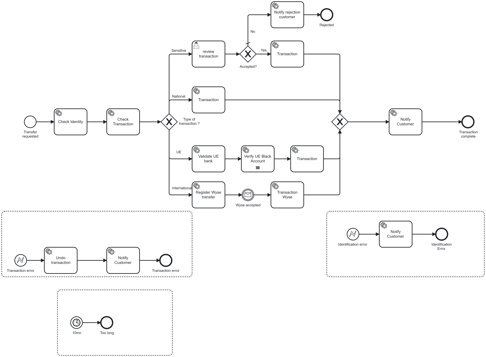
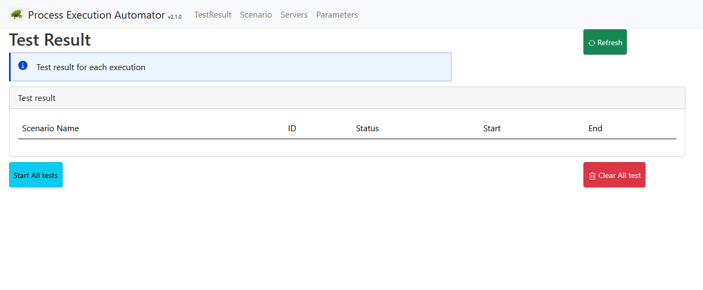
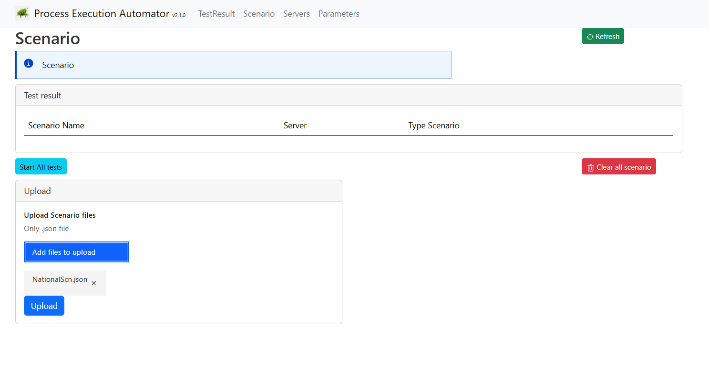
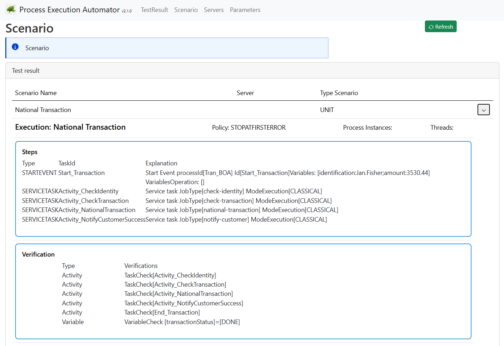
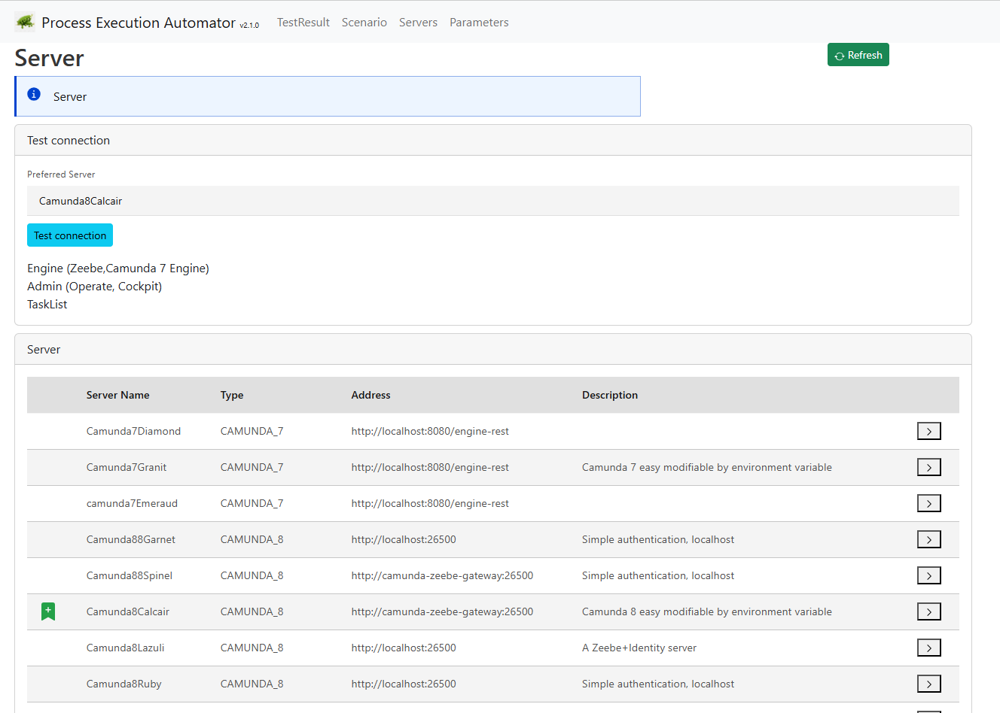

# Unit Test Challenge Explanation

# Introduction

The Process Execution Automator (https://github.com/camunda-community-hub/process-execution-automator)  is used to execute the unit test.

This tool allow:
* to describe each unit test as a scenario
* to run scenario on demand, or on scheduled
* have a UI to access the result
* can be start on demand via a REST API

# Build scenarii

The process is:


Multiple scenario will be used:

## Scenario National Transaction
In that scenario, the flow go to the National Transaction.

CheckTransaction task should return:
```
transaction="national"
```
Scenario must verify
* task `Check Identity` is pass
* task `Check Transaction` is pass
* task `Transaction` is pass 
* task `Notify Customer` is pass
* end event `Transaction complete` is pass

## Scenario UE
In that scenario, the flow go to the UE Transaction.

CheckTransaction task should return:
```
transaction = "UE"
```
Scenario must verify
* task `Check Identity` is pass
* task `Check Transaction` is pass
* task `Validate UE bank` is pass
* task `Validate UE bank` is pass
* task `Verify US Black account` is pass
* task `Transaction` is pass
* end event `Transaction complete` is pass

## Scenario International

In that scenario, the flow go to the International Transaction.

CheckTransaction task should return:
```
transaction = "INTER"
```

A message `Wyse accepted` is sent

Scenario must verify
* task `Check Identity` is pass
* task `Check Transaction` is pass
* task `Register Wyse transfer` is pass
* task `Transaction Wyse` is pass
* end event `Transaction complete` is pass


## Scenario Sensitive Accepted

The flow go to the sensitive section. The user acceptance is simulated, and the flow go to the transaction

CheckTransaction task should return:
```
transaction = "sensitive"
```
The user task accept the transaction
```
reviewAccepted = true
```

Scenario must verify
* task `Check Identity` is pass
* task `Check Transaction` is pass
* task `Review Transaction` is pass
* task `Transaction` is pass
* end event `Transaction complete` is pass


## Scenario Sensitive Rejected

The flow go to the sensitive section. The user acceptance is simulated, and the flow go to the transaction

CheckTransaction task should return:
```
transaction = "sensitive"
```
The user task accept the transaction
```
reviewAccepted = false
```

Scenario must verify
* task `Check Identity` is pass
* task `Check Transaction` is pass
* task `Review Transaction` is pass
* task `Notify rejection customer` is pass
* end event `Rejected` is pass


## Scenario Identification Error

The Check Identity throw a BPMN error `IdentificationError`


Scenario must verify
* task `Check Identity` is pass
* task `Notify Error Customer` is pass
* end event `Identification error` is pass


## Scenario Transaction error

CheckTransaction task return:
```
transaction = "national"
```
The Transaction throw a BPMN error `TransactionError`


Scenario must verify
* task `Check Identity` is pass
* task `Check Transaction` is pass
* task `Transaction` is pass with error
* task `Undo transaction` is pass
* task `Notify Transaction error to Customer` is pass 
* end event `Transaction error` is pass


## Scenario Performance

> The execution is simulated, so this scenario is not realistic in this method

The time to `check Identity` must be under 200 ms

The time to execute the sequence `Check Transaction` to `Transaction` must stay under 800 ms


CheckTransaction task should return:
```
transaction = "national"
```

# Setup the environment

## Deploy a cluster

Deploy a cluster. The cluster for this document is a Basic cluster, no special identification is needed, and user will connect using the login `demo`/`demo`

```yaml
global:
  identity:
    enabled: false
```

## Deploy the process on the server

Using the Desktop modeler, deploy the process [BankOfAndora.bpmn](../BankOfAndora.bpmn) on the server.

## Choose the Process Execution Automator configuration
A Camunda cluster can be deployed with different configuration: does the cluster require applicatoin to use a ClientId/Client Secret? Does the cluster does not check the API connection?

Process Execution automator provide a set of configuration "out of the box", or can be overrided.

The cluster does not have any identification, so the configuration `Camunda88Spinel` is defined for this usage.

If any change is necessary, then a new pea.yaml must be defined, and variable overrided. For example, to set a ClientId and ClientSecret, 
the complete configuration can be rewrite via


```yaml
apiVersion: apps/v1
kind: Deployment
metadata:
  name: pa-c7simpletask-creation
  labels:
    app: pa-c7simpletask-creation
spec:
  selector:
    matchLabels:
      app: pa-c7simpletask-creation
  replicas: 10
  template:
    metadata:
      labels:
        app: pa-c7simpletask-creation
      annotations:
        prometheus.io/scrape: "true"
        prometheus.io/port: "8088"
        prometheus.io/path: "/actuator/prometheus"
    spec:
      containers:
        - name: pa-c7simpletask-creation
          image: ghcr.io/camunda-community-hub/process-execution-automator:latest
          imagePullPolicy: Always
          env:
            - name: JAVA_TOOL_OPTIONS
              value: >-
                -Dautomator.servers.camunda8.name: "MyCamundaServer"
                -Dautomator.servers.camunda8.zeebeGrpcAddress: "http://camunda-zeebe-gateway:26500"
                -Dautomator.servers.camunda8.zeebeRestAddress: "http://camunda-zeebe-gateway:8080"
                -Dautomator.servers.camunda8.operateUserName=demo
                -Dautomator.servers.camunda8.operateUserPassword=demo
                -Dautomator.servers.camunda8.zeebeClientId: "TheClientid"
                -Dautomator.servers.camunda8.zeebeClientSecret: "TheClientId"
                -Dautomator.servers.camunda8.operateUrl=http://camunda-operate:80
                -Dautomator.servers.camunda8.taskListUrl=
```

The server name to use is `MyCamundaServer`

> In the following of the document, `Camunda88Spinel` is used.

## Deploy Process Execution Automator in the cluster

According to https://github.com/camunda-community-hub/process-execution-automator/blob/main/k8s/README.md#start-it 

Start the last Process Execution Automator using the command

````yaml
kubectl create -f pea.yaml -n camunda
````
The pea.yaml is available
https://github.com/camunda-community-hub/process-execution-automator/blob/main/k8s/pea.yaml

A public address can be created using the pea-public-balancer.yaml file. In the following part of this document, we will use this function.

````yaml
kubectl create -f pea-public-loadbalancer.yaml -n camunda
````

A public IP Address is created
````shell

$ kubernetes get svc
NAME                              TYPE           CLUSTER-IP       EXTERNAL-IP      PORT(S)                        AGE
pea-public                        LoadBalancer   34.118.230.84    34.148.237.214   8381:30098/TCP                 81m
pea-service                       ClusterIP      34.118.230.164   <none>           8381/TCP                       23s
````

In the following of this document, the IP adress `34.148.237.214` is used.
Access the Process Execution Tool via the URL http://34.148.237.214:8381




# Upload scenario

Different method exist to upload scenario in the tool. 

Scenario can be saved in a configmap can be used, and the PEA tool can be start referencing this config map.

The method chose here use curl command, which can bhe used in a CI deployment.

## Upload via Curl

Deploy the first scenario with a curl command:
```shell
$ curl -X POST http://34.148.237.214:8381/pea/api/content/add \
  -H "Content-Type: multipart/form-data" \
  -F "scenarioFiles=@NationalScn.json"
```

Verify the content of the service

```shell
curl -X GET "http://34.148.237.214:8381/pea/api/content/list?details=true" -H "Content-Type: application/json"
```

ip route | grep default
curl -X GET "http:// 172.20.192.1:8381/pea/api/content/list?details=true" -H "Content-Type: application/json"

## Upload via the UI

Go to the UI and upload it via the Upload  



The scenario is uploaded



# Execute the scenario

## Server to execute the test
Process Execution Automator onboard multiple server configuration. 
One default can be used, or a new server definition can be passed in the configuration, at startup.

The default configuration can be set during the creation with the parameter
````
-Dautomator.startup.serverName=
````
The default server used is visible in the UI, via the tab "server"



A scenario can be explicitly attached to a server name. If not, then the server to use must be set when the test start.
* In the curl command
* In the UI, by changing the default server.

## Execute the test
 
Execute the test:
```shell
curl -X POST "http://34.148.237.214:8381/pea/api/unittest/run?name=National%20Transaction&server=Camunda88Spinel"
```
Or start it from the UI

Check the result via the UI


## Upload all tests, and execute them

Via the IU

curl -X POST "http://172.20.192.1:8381/pea/api/unittest/run?name=National%20Transaction&server=Camunda88Spinel&wait=true"
