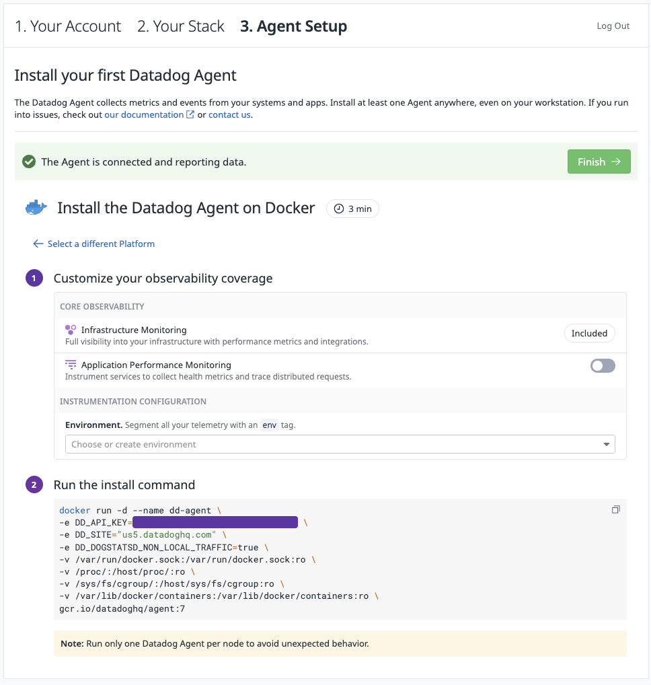
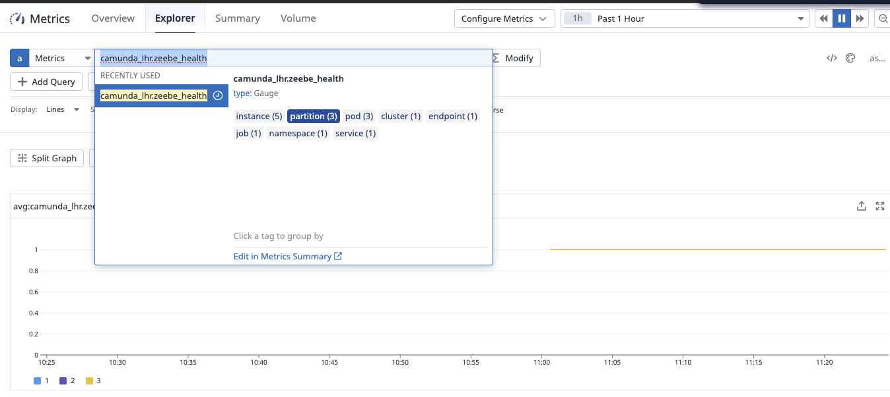
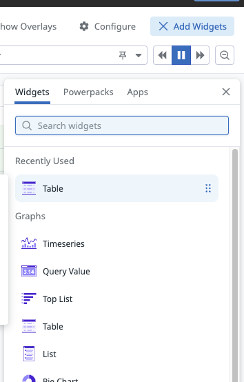
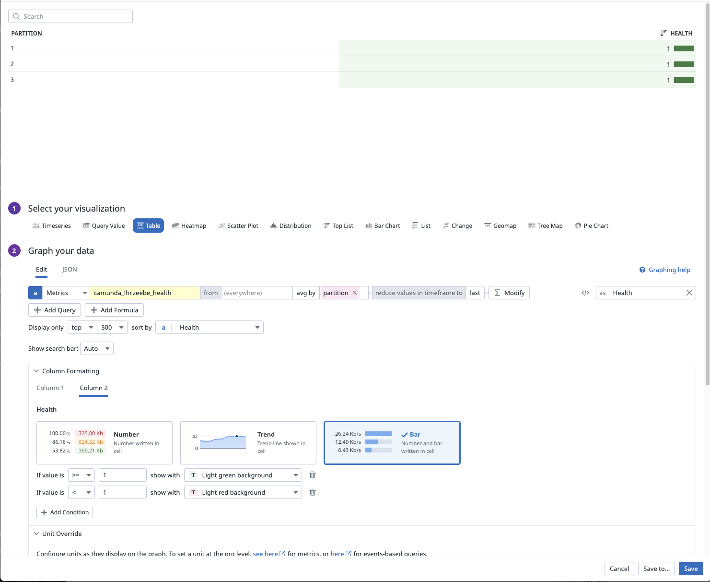
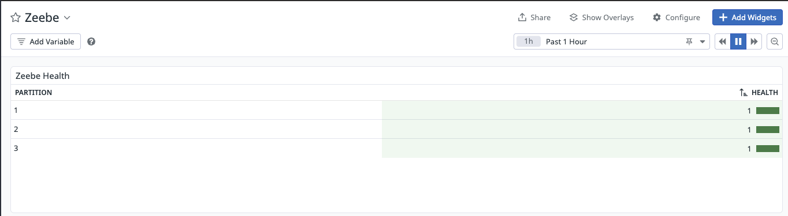


# Monitoring Camunda 8 SaaS with Datadog via Cluster Metrics Endpoint

### 🎯 Objective

The **Cluster Metrics endpoint** lets you expose metrics from a **Camunda 8 SaaS Orchestration cluster** and consume them in your own monitoring system.

This guide shows how to do that **when your organization uses Datadog instead of Prometheus/Grafana**:

- Enable and use the **Camunda 8 SaaS Cluster Metrics endpoint**.
- Scrape it with a **Datadog Agent (OpenMetrics integration)** running in Docker.
- Build a simple **Datadog dashboard** for Camunda metrics such as **partition health**.

Reference docs:

- Camunda: [Cluster Metrics endpoint](https://docs.camunda.io/docs/components/saas/monitoring/cluster-metrics-endpoint/)
- Datadog: [Prometheus and OpenMetrics metrics collection from a host](https://docs.datadoghq.com/integrations/guide/prometheus-host-collection/)

---

### ✅ Expected Outcome

By the end of this walkthrough, you will be able to:

- Spin up a **Datadog Agent** using Docker.
- Configure the Agent to **scrape the Camunda 8.8 SaaS Cluster Metrics endpoint** using the OpenMetrics integration.
- Verify that metrics such as **`zeebe_health`** are available in Datadog.
- Build a **Datadog dashboard** (table widget) that shows **Zeebe partition health** (1 = healthy, 0 = unhealthy).

---

### 🛠️ Tooling

This setup uses:

- **Datadog**
    - SaaS monitoring platform.
    - We use the **Datadog Agent** + **OpenMetrics integration** to scrape Prometheus-format metrics.
- **Camunda 8 SaaS**
    - **Orchestration cluster** with **Cluster Metrics endpoint** enabled.
- **Docker**
    - To run the Datadog Agent as a container on your local machine.

---

### 📋 Prerequisites

1. **Datadog account**
    - A 14‑day trial is sufficient: https://app.datadoghq.com

2. **Camunda 8 SaaS Orchestration cluster**
    - Access to **Camunda Console** for your organization.
    - A cluster where **Cluster Metrics** is available (Camunda 8 SaaS).

3. **Cluster Metrics endpoint enabled**
    - You (or someone) must **enable the endpoint** for your cluster in Console and create credentials.
    - See:
        - [Set up the Cluster Metrics endpoint](https://docs.camunda.io/docs/components/saas/monitoring/cluster-metrics-endpoint/set-up-cluster-metrics-endpoint/)
        - [Configure monitoring systems to scrape metrics](https://docs.camunda.io/docs/components/saas/monitoring/cluster-metrics-endpoint/configure-monitoring-systems-to-scrape-metrics/)

---

## 1. Set up Datadog Agent (Docker)

1. Log in to **Datadog**: https://app.datadoghq.com
2. Go to **Agent Setup** → **Install your first Datadog agent**.
3. Choose **Container** → **Docker**.

   

4. Copy the **Docker installation command** from the UI into a local text file (e.g., `dd-agent-install.txt`).  
   You’ll modify this command later to mount your OpenMetrics config.

---

## 2. Create a Camunda Monitoring User & Endpoint Details

1. In **Camunda Console** (SaaS):

    - Go to **Console → Monitoring → Cluster Metrics** for your orchestration cluster.

2. Click **Create new credentials**:

    - Choose a **username** (e.g. `datadog-monitoring`).
    - Copy:
        - **Monitoring endpoint URL**
        - **Username**
        - **Password**

   

You’ll use these values in the Datadog OpenMetrics config:

- `openmetrics_endpoint` → the **Monitoring endpoint URL**.
- `username` / `password` → the **Basic Auth credentials**.

---

## 3. Create the Datadog OpenMetrics Config (`conf.yaml`)

Datadog’s OpenMetrics integration is configured via `openmetrics.d/conf.yaml` under the Agent’s config directory.  
We’ll create it locally as `conf.yaml` and **mount** it into the container.

1. Create a file `conf.yaml` in your working directory:

   ```yaml
   init_config:

   instances:
     - openmetrics_endpoint: "<your-monitoring-endpoint>"
       namespace: "camunda_lhr"
       metrics:
         - "^zeebe_stream_processor_records_total$"
         - "^zeebe_pending_incidents$"
         - "^zeebe_health$"   # start broad to validate; then restrict to what you need
       auth_type: "basic"
       username: "<your-username-from-camunda-saas-monitoring>"
       password: "<your-password-from-camunda-saas-monitoring>"
   ```

    - `openmetrics_endpoint`
        - Use the Monitoring endpoint from **Camunda Console → Monitoring** (Cluster Metrics endpoint).
    - `namespace`
        - A prefix Datadog will add to your metrics, e.g. `camunda_lhr`.  
          Your metrics will look like `camunda_lhr.zeebe_health` in Datadog.
    - `metrics`
        - Start with a **small set of regexes** to confirm scraping works:
            - `zeebe_stream_processor_records_total`
            - `zeebe_pending_incidents`
            - `zeebe_health` (partition health indicator).
    - `auth_type`, `username`, `password`
        - Configure **Basic Authentication** as required by the Cluster Metrics endpoint.

Datadog’s generic example for OpenMetrics looks like this:

```yaml
init_config:

instances:
  - openmetrics_endpoint: 'localhost:<PORT>/<ENDPOINT>'
    namespace: '<NAMESPACE>'
    metrics:
      - '<METRIC_TO_FETCH>': '<DATADOG_METRIC_NAME>'
```

You’re simply replacing `localhost:<PORT>/<ENDPOINT>` with the **Camunda Cluster Metrics endpoint**, and specifying the metrics you care about.

---

## 4. Run the Datadog Agent

You have two main options:

1. **Direct `docker run`** (simple, one-off).
2. **`docker-compose`** (more reusable).

### 4.1. Option 1 – `docker run`

Start from the base Docker command from the Datadog UI:

```bash
docker run -d --name dd-agent \
  -e DD_API_KEY=<your-api-key> \
  -e DD_SITE="us5.datadoghq.com" \
  -e DD_DOGSTATSD_NON_LOCAL_TRAFFIC=true \
  -v /var/run/docker.sock:/var/run/docker.sock:ro \
  -v /proc/:/host/proc/:ro \
  -v /sys/fs/cgroup/:/host/sys/fs/cgroup:ro \
  -v /var/lib/docker/containers:/var/lib/docker/containers:ro \
  gcr.io/datadoghq/agent:7
```

Now **add a volume mount** for your `conf.yaml` so the Agent sees it as `openmetrics.d/conf.yaml`:

```bash
-v "$(pwd)/conf.yaml:/etc/datadog-agent/conf.d/openmetrics.d/conf.yaml:ro" \
```

Full example:

```bash
docker run -d --name dd-agent \
  -e DD_API_KEY=<your-api-key> \
  -e DD_SITE="us5.datadoghq.com" \
  -e DD_DOGSTATSD_NON_LOCAL_TRAFFIC=true \
  -v /var/run/docker.sock:/var/run/docker.sock:ro \
  -v /proc/:/host/proc/:ro \
  -v /sys/fs/cgroup/:/host/sys/fs/cgroup:ro \
  -v /var/lib/docker/containers:/var/lib/docker/containers:ro \
  -v "$(pwd)/conf.yaml:/etc/datadog-agent/conf.d/openmetrics.d/conf.yaml:ro" \
  gcr.io/datadoghq/agent:7
```

### 4.2. Option 2 – `docker-compose`

Create `docker-compose.yaml`:

```yaml
version: "3.8"

services:
  dd-agent:
    image: gcr.io/datadoghq/agent:7
    container_name: dd-agent
    restart: unless-stopped

    environment:
      DD_API_KEY: <api-key>
      DD_SITE: us5.datadoghq.com
      DD_DOGSTATSD_NON_LOCAL_TRAFFIC: "true"

    volumes:
      - /var/run/docker.sock:/var/run/docker.sock:ro
      - /proc/:/host/proc/:ro
      - /sys/fs/cgroup/:/host/sys/fs/cgroup:ro
      - /var/lib/docker/containers:/var/lib/docker/containers:ro
      - ./conf.yaml:/etc/datadog-agent/conf.d/openmetrics.d/conf.yaml:ro
```

Then start the agent:

```bash
docker compose up -d
```

---

## 5. Verify the OpenMetrics Configuration

To confirm the Agent has picked up your `conf.yaml` and is scraping metrics:

```bash
docker exec -it dd-agent agent status
```

In the output, search for **`openmetrics`**. You should see something similar:

```text
  openmetrics (7.2.0)
  -------------------
    Instance ID: openmetrics:camunda_lhr:45593b46827d4bcd [OK]
    Configuration Source: file:/etc/datadog-agent/conf.d/openmetrics.d/conf.yaml[0]
    Total Runs: 4
    Metric Samples: Last Run: 18, Total: 72
    Events: Last Run: 0, Total: 0
    Service Checks: Last Run: 1, Total: 4
    Average Execution Time : 2.282s
    Last Execution Date : 2026-02-17 17:01:34.635 UTC (1771347694635)
    Last Successful Execution Date : 2026-02-17 17:01:34 UTC (1771347694000)
    metadata:
      config.source: /etc/datadog-agent/conf.d/openmetrics.d/conf.yaml[0]
```

This confirms:

- The **OpenMetrics check is configured**.
- The Agent **successfully scrapes** metrics from your Camunda Cluster Metrics endpoint.

Once the container is healthy, go back to the Datadog UI and click **“Finish”** in the Agent setup flow.



---

## 6. Crafting Metrics in Datadog (Zeebe Partition Health)

One of the most useful metrics for Camunda is **partition health**. The metric **`zeebe_health`** is exposed per partition and broker and can be used to track whether partitions are healthy.

Because you used the `namespace: "camunda_lhr"` in your config, you’ll see it in Datadog as:

- `camunda_lhr.zeebe_health`

### 6.1. Explore the metric

1. In Datadog, go to **Metrics → Summary** (or **Metrics → Explorer**).
2. Search for **`zeebe_health`** and select **`camunda_lhr.zeebe_health`**.
3. Group by **`partition`** so you can see health per partition.



---

## 7. Build a Datadog Dashboard for Zeebe Health

### 7.1. Create a dashboard

1. In Datadog, go to **Dashboards → New Dashboard**.
2. Give it a name, e.g. **“Camunda Zeebe Health”**.



### 7.2. Add a Table widget for partition health

1. Click **Add Widget** → choose **Table**.

   

2. Configure the graph:

    - **Query**:

      ```text
      avg:camunda_lhr.zeebe_health{*} by {partition}
      ```

    - Optional: set an **Alias** for the value column to something like **Health**.

   

This will produce:

- **Rows**: one per `partition`.
- **Value**: `0` or `1` per partition.

### 7.3. Add conditional formatting (Healthy vs Unhealthy)

Datadog cannot change the literal numeric value `1` into the string `"Healthy"` or `0` into `"Unhealthy"` in the cell, but you can **visually encode** that meaning using **conditional formatting**:

1. In the widget editor, open the **Conditional formatting / Visual formatting rules** panel for the Health column.
2. Add rules like:

    - **Rule 1 – Healthy**
        - Comparator: `>=`
        - Value: `1`
        - Color: **green** (e.g., `white_on_green`)
        - Label: `Healthy`
    - **Rule 2 – Unhealthy**
        - Comparator: `<`
        - Value: `1`
        - Color: **red** (e.g., `white_on_red`)
        - Label: `Unhealthy`

   

The result:

- A partition with **value = 1** shows as **green “Healthy”**.
- A partition with **value = 0** shows as **red “Unhealthy”**.
- The numeric value remains, but the coloring & labels provide clear semantics.

3. Give your widget a descriptive title, e.g. **“Zeebe Partition Health”**, and save.

   

---

## 8. Final Result

Your dashboard now provides a **Camunda Zeebe Health view in Datadog**, driven entirely by the **Camunda 8 SaaS Cluster Metrics endpoint** and the **Datadog OpenMetrics integration**:



From here you can:

- Add more metrics (e.g. throughput, incidents, job counts).
- Create additional widgets (timeseries, toplists) for deeper visibility.
- Attach alerts/monitors based on `zeebe_health` and other metrics to proactively detect issues.

---

## Sources

- [Cluster Metrics endpoint | Camunda 8 Docs](https://docs.camunda.io/docs/components/saas/monitoring/cluster-metrics-endpoint/)
- [Prometheus and OpenMetrics metrics collection from a host](https://docs.datadoghq.com/integrations/guide/prometheus-host-collection/)
- [Integrate Camunda SaaS Metrics Into Your Observability Stack with Cluster Metrics](https://camunda.com/blog/2026/01/integrate-camunda-saas-metrics-into-your-observability-stack-with-cluster-metrics/)
- [Camunda components metrics](https://docs.camunda.io/docs/self-managed/operational-guides/monitoring/metrics/#use-a-different-monitoring-system)