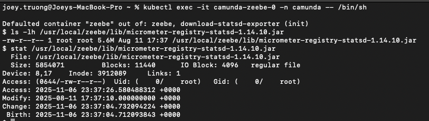
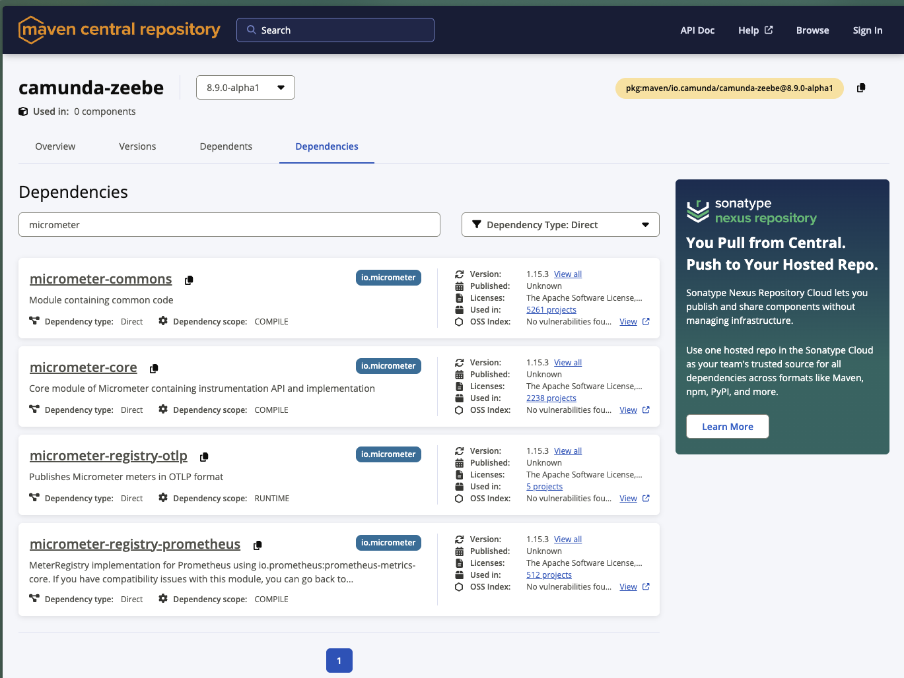

### 🎯 Objective
Your task is to configure StatsD metric export for Camunda 8 components and verify that metrics are successfully sent to Datadog.
This challenge will help you understand how to extend Camunda with external monitoring tools and how to use initContainers for dependency injection in Kubernetes.
---
### ✅ Expected Outcome

* By the end of this challenge, you should be able to:
* Enable StatsD metric export on Camunda 8 components.
* Inject the Micrometer StatsD JAR into Zeebe pods via an initContainer.
* Confirm metrics are successfully reaching Datadog.
* Verify integration through logs and file system checks.
___
### 🛠️ Tooling
This setup leverages the following tools:
* **StatsD**(Micrometer) – Metrics collection and export.
* **datadog** - Metrics visualization and monitoring.
* **Camunda Platform 8 Helm Chart** - Self-managed deployment of the Camunda components
* **Kubernetes Service (KS)** - Managed Kubernetes cluster
* **kubectl + Helm** - Kubernetes management and deployment
---
### Prerequisite
Make sure to have a standard Kubernetes cluster.
For help setup your Kubernetes cluster, please go to:
* [**Helm profile**](https://github.com/camunda-community-hub/camunda-8-helm-profiles)
* [**Camunda-Platform-local**](https://github.com/camunda/camunda-platform-local)
* [**Step by step setup Datadog**](datadog/DATADOG.md)
---
### 🏗️ Setup Overview

We use the following environment variables to configure the StatsD micrometer:

```bash
- name: MANAGEMENT_STATSD_METRICS_EXPORT_ENABLED
  value: "true"
- name: MANAGEMENT_STATSD_METRICS_EXPORT_HOST
  value: "datadog-agent.default.svc.cluster.local"
- name: MANAGEMENT_STATSD_METRICS_EXPORT_PORT
  value: "8125" # Your datadog port
- name: MANAGEMENT_STATSD_METRICS_EXPORT_FLAVOR
  value: "datadog"
- name: MANAGEMENT_STATSD_METRICS_EXPORT_PROTOCOL
  value: "udp"
```
* For more information [StatsD Spring Configuration](https://docs.spring.io/spring-boot/reference/actuator/metrics.html#actuator.metrics.export.statsd)

These variables should be added to all Camunda components:
* Operate 
* Tasklist
* Optimize
* Zeebe
* Zeebe Gateway

### ⚙️ InitContainer Configuration

Only Zeebe and Zeebe Gateway require the Micrometer StatsD dependency to be mounted into the pod.
Use the following initContainer definition to download the JAR dynamically at startup:
```bash
initContainers:
  - name: download-statsd-exporter
    image: maven:3.9-eclipse-temurin-21-alpine
    securityContext:
      runAsNonRoot: false
      runAsUser: 0
    command:
      - sh
      - -c
      - |
        mkdir -p /lib/micrometer /root/.m2 && \
        mvn -Dmaven.repo.local=/root/.m2 dependency:copy \
          -Dartifact=io.micrometer:micrometer-registry-statsd:<YOUR_MICROMETER_VERSION> \
          -Dtransitive=false \
          -DoutputDirectory=/lib/micrometer && \
        echo "Downloaded:" && ls -lh /lib/micrometer
    volumeMounts:
      - name: statsd-exporter-volume
        mountPath: /lib/micrometer
```
```
💡 Challenge:
Select the Camunda distribution version you are using, and filter for “micrometer” to find the correct Micrometer version that matches your setup.
Replace <YOUR_MICROMETER_VERSION> in the snippet above with the appropriate one you discover.
```
Extra Volumes and Mounts
```bash
extraVolumes:
  - name: statsd-exporter-volume
    emptyDir: {}

extraVolumeMounts:
  - name: statsd-exporter-volume
    mountPath: /usr/local/zeebe/lib/micrometer-registry-statsd-<YOUR_MICROMETER_VERSION>.jar
    subPath: micrometer-registry-statsd-<YOUR_MICROMETER_VERSION>.jar
```
---
### ⚠️ Important Implementation Details

* Pay attention to ```subPath``` in the volume mount — it ensures only the specific JAR file is mounted into the Zeebe /lib directory rather than overwriting the entire folder. Mounting without a subPath could erase Zeebe’s existing libraries. 
* Review the ```securityContext``` settings — the initContainer temporarily runs as root ```(runAsNonRoot: false, runAsUser: 0)``` to create directories and write files into ```/lib```. This is required only for initialization; all main application containers should continue running as non-root for security compliance.
---
### 🔍 Verification Steps
Once your deployment is up and running, verify that the JAR was successfully mounted and metrics are being exported:
```bash
# Access the Zeebe pod
kubectl exec -it <camunda-zeebe-0> -n camunda -- /bin/sh

# Verify that the JAR exists
ls -lh /usr/local/zeebe/lib/micrometer-registry-statsd-<YOUR_MICROMETER_VERSION>.jar
stat /usr/local/zeebe/lib/micrometer-registry-statsd-<YOUR_MICROMETER_VERSION>.jar

# Check logs for StatsD or Micrometer initialization
kubectl logs camunda-zeebe-0
```
Example screenshot verification of micrometer successfully mounted inside ```lib``` folder:



When you inside the logs of "camunda-zeebe" pod, you should see this printout:
```bash
Downloaded:
total 5.6M
-rw-r--r-- 1 root root 5.6M Aug 11 17:37 micrometer-registry-statsd-1.14.10.jar
```

---
### 🧠 Bonus Challenge
Reflect on why this setup uses an initContainer with Maven instead of building a custom Zeebe image.
* Would packaging the Micrometer JAR directly into a custom image be more efficient or reliable?
* Keep in mind that downloading artifacts at runtime creates a dependency on an external repository, which may not be suitable for a high-availability (HA) production environment.

Next, take it a step further:
* ✅ Validate observability — confirm that Datadog is receiving metrics from Zeebe.
* 🔧 Extend this setup to include additional Micrometer registries (e.g., Prometheus or OpenTelemetry).
* 📊 Create a Grafana dashboard using Datadog metrics to visualize workflow throughput or job success rate.
---
### 🪪 Notes
* The ```micrometer-registry-statsd``` dependency is not included in Camunda 8 by default.
* Datadog’s agent should be running in the same namespace and accessible via service ```datadog-agent.default.svc.cluster.local:8125```.
* The above setup uses UDP protocol and the Datadog flavor for StatsD.
---
### 🧩 Challenge Answer
To find the correct Micrometer dependency version for your Camunda setup:
👉 Visit [Maven Central](https://central.sonatype.com/artifact/io.camunda/camunda-zeebe/dependencies) – camunda-zeebe
Select the Camunda distribution version you’re using, then filter for “micrometer” in the dependencies list to locate the matching version of micrometer.

---
